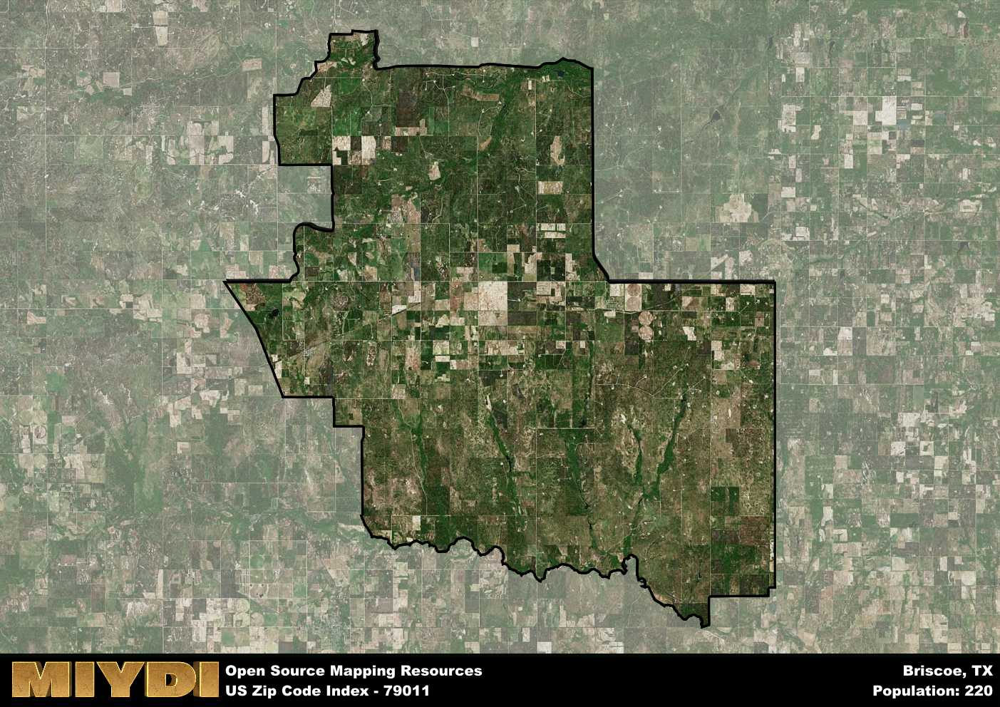

**Area Name:** Briscoe

**Zip Code:** 79011

**State:** TX

# Briscoe: A Historic Neighborhood in the Heart of West Texas

Located in the heart of West Texas, Briscoe is a small community that falls under the zip code 79011. Bordered by vast plains and rolling hills, Briscoe is situated just 30 miles east of the bustling city of Amarillo. This rural neighborhood is known for its close-knit community and its picturesque views of the surrounding countryside. Despite its small size, Briscoe plays an integral role in the fabric of the region, serving as a peaceful retreat for those looking to escape the hustle and bustle of city life.

Briscoe has a rich history dating back to the late 19th century when it was first established as a small farming community. Named after the prominent Briscoe family who were early settlers in the area, the neighborhood quickly grew as more families were drawn to the fertile land and abundant natural resources. Over the years, Briscoe has weathered economic ups and downs, but its resilient spirit and strong sense of community have helped it thrive and maintain its unique identity.

Today, Briscoe is a charming neighborhood that offers a mix of agricultural activities, small businesses, and recreational opportunities. The area is dotted with family-owned farms and ranches, providing a glimpse into the area's agricultural heritage. Residents and visitors can enjoy hiking and camping in the nearby Palo Duro Canyon State Park, or explore the local shops and restaurants that line the quaint main street. With its rich history, natural beauty, and tight-knit community, Briscoe continues to be a hidden gem in the vast landscape of West Texas.

# Briscoe Demographics

The population of Briscoe is 220.  
Briscoe has a population density of 0.93 per square mile.  
The area of Briscoe is 237.42 square miles.  

## Briscoe AI and Census Variables

The values presented in this dataset for Briscoe are AI-optimized, streamlined, and categorized into relevant buckets for enhanced utility in AI and mapping programs. These simplified values have been optimized to facilitate efficient analysis and integration into various technological applications, offering users accessible and actionable insights into demographics within the Briscoe area.

| AI Variables for Briscoe | Value |
|-------------|-------|
| Shape Area | 931906357.355469 |
| Shape Length | 168356.291466619 |

## How to use this free AI optimized Geo-Spatial Data for Briscoe, TX

This data is made freely available under the Creative Commons license, allowing for unrestricted use for any purpose. Users can access static resources directly from GitHub or leverage more advanced functionalities by utilizing the GeoJSON files. All datasets originate from official government or private sector sources and are meticulously compiled into relevant datasets within QGIS. However, the versatility of the data ensures compatibility with any mapping application.

## Data Accuracy Disclaimer
It's important to note that the data provided here may contain errors or discrepancies and should be considered as 'close enough' for business applications and AI rather than a definitive source of truth. This data is aggregated from multiple sources, some of which publish information on wildly different intervals, leading to potential inconsistencies. Additionally, certain data points may not be corrected for Covid-related changes, further impacting accuracy. Moreover, the assumption that demographic trends are consistent throughout a region may lead to discrepancies, as trends often concentrate in areas of highest population density. As a result, dense areas may be slightly underrepresented, while rural areas may be slightly overrepresented, resulting in a more conservative dataset. Furthermore, the focus primarily on areas within US Major and Minor Statistical areas means that approximately 40 million Americans living outside of these areas may not be fully represented. Lastly, the historical background and area descriptions generated using AI are susceptible to potential mistakes, so users should exercise caution when interpreting the information provided.
