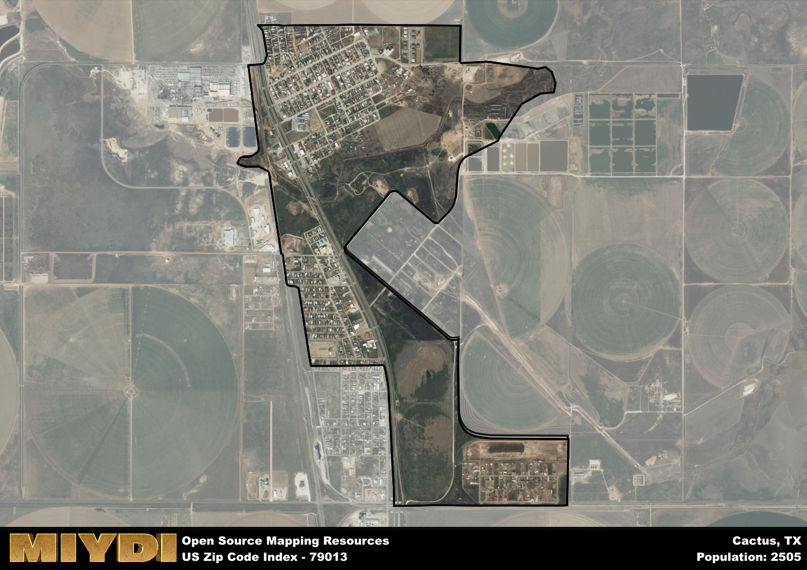

**Area Name:** Cactus

**Zip Code:** 79013

**State:** TX

Cactus is a part of the Dumas - TX Micro Area, and makes up 18.31% of the Metro's population.  

# Cactus: A Vibrant Community in the Texas Panhandle  

Located in the heart of the Texas Panhandle, zip code 79013 encompasses the town of Cactus. Situated in Moore County, Cactus is bordered by the city of Dumas to the north and the town of Sunray to the south. The area is an integral part of the larger Amarillo metropolitan area, providing a residential haven for those seeking a quieter pace of life while still enjoying close proximity to urban amenities.

Cactus has a rich historical background, originally established as a company town for the Southwestern Public Service Company in the early 1900s. Over the years, the town grew as more families settled in the area, drawn by opportunities in agriculture and energy industries. The town's unique name is said to have originated from the cactus plants that dotted the landscape, giving it a distinct and memorable identity.

Today, Cactus thrives as a close-knit community with a diverse economy that includes agriculture, energy production, and small businesses. Residents enjoy a range of neighborhood services, including schools, parks, and local businesses. The town is also home to cultural and historic sites, such as the Cactus Theater, which hosts live performances and events that celebrate the area's heritage. With its strong sense of community and economic vitality, Cactus continues to be a welcoming and vibrant place to call home in the Texas Panhandle.

# Cactus Demographics

The population of Cactus is 2505.  
Cactus has a population density of 1585.44 per square mile.  
The area of Cactus is 1.58 square miles.  

## Cactus Income and Economic Data

These demographic numbers are sourced from IRS return data, providing comprehensive insights into the population dynamics and economic trends within Cactus.

**Breakdown of return types for Cactus**

The table offers insight into the composition of tax returns filed with the IRS, categorizing them into three main types. Single returns represent filings by individuals, joint returns by married couples, and head of household returns by individuals who qualify as heads of households, typically having dependents. This breakdown provides an understanding of the different filing statuses adopted by taxpayers when submitting their tax documentation.

| Return Types filed for Cactus                              | Percentage          |
|----------------------------------------------------------|---------------------|
| Single Returns                                            | 0.47 |
| Joint Returns                                             | 0.27 |
| Head Household Returns                                    | 0.26 |

The income and economic data presented here is sourced from the IRS income brackets, utilized for categorizing tax returns by income levels. This table displays income ranges for both single filers and married couples, along with the corresponding number of returns and the percentage within each bracket, providing valuable insight into the distribution of taxes across various income groups.

| Bracket Name       | Single Filer Income Range | Married Couple Range | Number of Returns | Percentage of Returns |
|--------------------|----------------------------|----------------------|-------------------|-----------------------|
| 10% Bracket        | Up to $10,275              | Up to $20,550        | 390 | 0.3% |
| 12% Bracket        | $10,276 - $41,775          | $20,551 - $83,550    | 610 | 0.47% |
| 22% Bracket        | $41,776 - $89,075          | $83,551 - $178,150   | 220 | 0.17% |
| 24% Bracket        | $89,076 - $170,050         | $178,151 - $340,100  | 60 | 0.05% |
| 32% Bracket        | $170,051 - $215,950        | $340,101 - $431,900  | 30 | 0.02% |
| 35% Bracket        | $215,951 - $539,900        | $431,901 - $647,850  | 0 | 0% |

### Exploring Taxpayer Diversity: A Breakdown of Different Types of Tax Returns in Cactus

The table offers insights into various types of tax returns filed, reflecting different aspects of taxpayer activities and demographics. Categories include charitable returns for donations, dependent returns for claimed dependents, educator population, elderly population, real estate returns, self-employment returns, student loan returns, and unemployment returns, providing valuable insights into taxpayer behavior and demographics.

| Cactus Filing Types                    | Count | Percentage |
|--------------------------------------|-------|------------|
| Charitable Donations                 | 20 | 0.015% |
| Dependents Claimed                   | 0 | 0% |
| Educator Residents                   | 0 | 0% |
| Elderly Population                   | 150 | 0.11% |
| Farming Population                   | 0 | 0% |
| Real Estate Transactions             | 0 | 0% |
| Self-Employed Individuals            | 110 | 0.084% |
| Student Loan Cases                   | 0 | 0% |
| Unemployment Benefit Filings         | 60 | 0.05% |

### Exploring Real Estate Trends: A Comprehensive Analysis of the Cactus Area and its Neighbors

This table contains an in-depth examination of the real estate market in the Cactus area. Sourced from trusted real estate market firms, this dataset provides a wealth of raw data detailing the local real estate landscape, along with comparative analyses juxtaposing the market dynamics with those of neighboring areas. Explore the intricacies of the Cactus real estate market and gain valuable insights into its relationship with adjacent regions.

| Real Estate Data for Cactus                       | Value    |
|------------------------------------------------|----------|
| Real Estate Prices to Income Ratio           | 6.175 |

This table offers essential real estate data for the Cactus area, including average and median listing prices, median days on market, and property size. It also presents ratio metrics as percentages, providing insights into how the local market compares to the surrounding region. A ratio of 100% signifies performance in line with the regional average, while values above or below indicate overperformance or underperformance, respectively, relative to expectations.

## Cactus Sports and Recreation Data

#### Annual Youth Sports Spending for Cactus

This table provides fundamental insights into the Sports and Recreation data for the Cactus area, detailing the estimated annual expenditure on Youth Athletics. This includes estimated spending by the major consumer brackets. 
| Sports Spending for Cactus| Value |
|-------------------------|-------|
| Athlete Spending Compared to the region | 24.17% |
| Total Youth Athlete Spending | 17,734 |
| Athletic Spending - Essential Focused Consumer | 8,363 |
| Athletic Spending - Typical Consumer | 41,376 |
| Athletic Spending - Affluent Consumers | 7,912 |

#### Youth Coaching Estimates for Cactus

This table presents the estimated number of coaches for the Cactus area, derived from comprehensive national coaching surveys and athletic participation rates by state. It offers valuable insights into the vital role of coaching personnel in fostering athletic development and facilitating sports participation within the local community.

| Coaching Data for Cactus | Value |
|-------------|-------|
| Total Coaches | 41 |
| Paid Coaches | 11 |
| Volunteer Coaches | 30 |

#### Youth Athlete Participation for Cactus

This table shows the estimated total number of youth athletes in the Cactus area, sourced from comprehensive national coaching surveys and athletic participation rates by state.

| Total YA Athletes in Cactus | Value |
|-------------|-------|
| Total High School Athletes | 63 |
| Total Youth Athletes | 188 |
| Total Young Adult Athletes | 125 |
| Total Athletes to Age 25 | 376 |

#### High School Age Athletes - Breakdown by Sport for Cactus

This table shows insights regarding high school age estimated players by sport in the Cactus area, derived from national and state-level athletic participation trends. 

| HS Players by Sport in Cactus | Value |
|-------------|-------|
| Football Players | 14 |
| Basketball Players | 9 |
| Soccer Players | 7 |
| Volleyball Players | 4 |
| Baseball Players | 8 |
| Tennis Players | 4 |
| Track Athletes | 11 |
| Golf Players | 2 |
| Swimming Athletes | 2 |
| Wrestling Competitors | 2 |
| Lacrosse Players | 0 |

Estimating the number of younger athletes presents unique challenges due to their varied starting ages, typically beginning around six years old, and a gradual decline in participation rates as they age. Unlike high school-aged athletes, younger athletes are less likely to switch sports as they grow older, contributing to the stability of participation numbers within specific sports at younger ages.  

As a general trend, the total number of younger athletes is approximately three times the number of high school-aged athletes, underscoring the significant presence of youth athletes in sports programs and highlighting the importance of early engagement in athletic activities.

## Cactus AI and Census Variables

The values presented in this dataset for Cactus are AI-optimized, streamlined, and categorized into relevant buckets for enhanced utility in AI and mapping programs. These simplified values have been optimized to facilitate efficient analysis and integration into various technological applications, offering users accessible and actionable insights into demographics within the Cactus area.

| AI Variables for Cactus | Value |
|-------------|-------|
| Shape Area | 6258900.296875 |
| Shape Length | 17086.4092071092 |
| CBSA Federal Processing Standard Code | 20300 |
| RE Income Ratio | 6.175 |
| Single Opportunity Flag | 3 |
| Single Parent Risk Flag | 1 |
| Elderly Opportunity Flag | 4 |
| Unemployment Risk | 1 |
| RE Activity Flag | 1 |

## How to use this free AI optimized Geo-Spatial Data for Cactus, TX

This data is made freely available under the Creative Commons license, allowing for unrestricted use for any purpose. Users can access static resources directly from GitHub or leverage more advanced functionalities by utilizing the GeoJSON files. All datasets originate from official government or private sector sources and are meticulously compiled into relevant datasets within QGIS. However, the versatility of the data ensures compatibility with any mapping application.

## Data Accuracy Disclaimer
It's important to note that the data provided here may contain errors or discrepancies and should be considered as 'close enough' for business applications and AI rather than a definitive source of truth. This data is aggregated from multiple sources, some of which publish information on wildly different intervals, leading to potential inconsistencies. Additionally, certain data points may not be corrected for Covid-related changes, further impacting accuracy. Moreover, the assumption that demographic trends are consistent throughout a region may lead to discrepancies, as trends often concentrate in areas of highest population density. As a result, dense areas may be slightly underrepresented, while rural areas may be slightly overrepresented, resulting in a more conservative dataset. Furthermore, the focus primarily on areas within US Major and Minor Statistical areas means that approximately 40 million Americans living outside of these areas may not be fully represented. Lastly, the historical background and area descriptions generated using AI are susceptible to potential mistakes, so users should exercise caution when interpreting the information provided.
