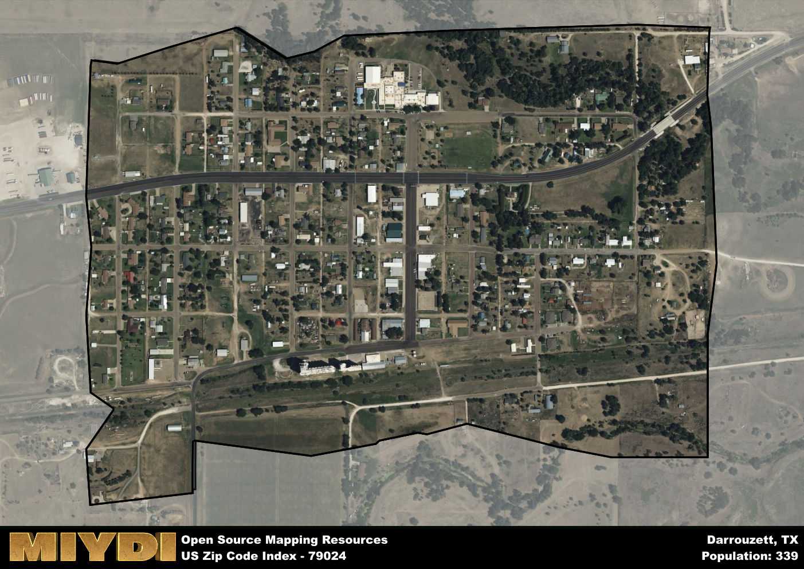

**Area Name:** Darrouzett

**Zip Code:** 79024

**State:** TX

# Darrouzett: A Tranquil Small Town in the Texas Panhandle

Located in the Texas Panhandle, zip code 79024 encompasses the charming small town of Darrouzett. Surrounded by vast plains and farmland, Darrouzett is situated in Lipscomb County, with its boundaries extending to the Oklahoma state line. The town is a part of the larger metropolitan area including cities such as Amarillo and Oklahoma City, serving as a peaceful retreat from the hustle and bustle of urban life while maintaining a close connection to major population centers.

Darrouzett has a rich history dating back to its establishment in the early 1900s as a railroad town. Named after a French railroad surveyor, the town quickly grew as settlers arrived to take advantage of the fertile land for farming and ranching. Over the years, Darrouzett has maintained its small-town charm and strong sense of community, with residents preserving the town's heritage through local events and historic preservation efforts.

Today, Darrouzett offers a peaceful and close-knit community for its residents, with a focus on agriculture and ranching as the primary economic activities. The town boasts a range of services including local shops, restaurants, and schools, providing essential amenities for its residents. Outdoor enthusiasts can enjoy recreational activities such as hunting and fishing in the surrounding natural landscapes, while history buffs can explore the town's historic sites and landmarks. Darrouzett's unique blend of rural tranquility and community spirit makes it a special place within the Texas Panhandle.

# Darrouzett Demographics

The population of Darrouzett is 339.  
Darrouzett has a population density of 941.67 per square mile.  
The area of Darrouzett is 0.36 square miles.  

## Darrouzett Income and Economic Data

These demographic numbers are sourced from IRS return data, providing comprehensive insights into the population dynamics and economic trends within Darrouzett.

**Breakdown of return types for Darrouzett**

The table offers insight into the composition of tax returns filed with the IRS, categorizing them into three main types. Single returns represent filings by individuals, joint returns by married couples, and head of household returns by individuals who qualify as heads of households, typically having dependents. This breakdown provides an understanding of the different filing statuses adopted by taxpayers when submitting their tax documentation.

| Return Types filed for Darrouzett                              | Percentage          |
|----------------------------------------------------------|---------------------|
| Single Returns                                            | 0.4 |
| Joint Returns                                             | 0.53 |
| Head Household Returns                                    | 0 |

The income and economic data presented here is sourced from the IRS income brackets, utilized for categorizing tax returns by income levels. This table displays income ranges for both single filers and married couples, along with the corresponding number of returns and the percentage within each bracket, providing valuable insight into the distribution of taxes across various income groups.

| Bracket Name       | Single Filer Income Range | Married Couple Range | Number of Returns | Percentage of Returns |
|--------------------|----------------------------|----------------------|-------------------|-----------------------|
| 10% Bracket        | Up to $10,275              | Up to $20,550        | 40 | 0.27% |
| 12% Bracket        | $10,276 - $41,775          | $20,551 - $83,550    | 40 | 0.27% |
| 22% Bracket        | $41,776 - $89,075          | $83,551 - $178,150   | 30 | 0.2% |
| 24% Bracket        | $89,076 - $170,050         | $178,151 - $340,100  | 20 | 0.13% |
| 32% Bracket        | $170,051 - $215,950        | $340,101 - $431,900  | 20 | 0.13% |
| 35% Bracket        | $215,951 - $539,900        | $431,901 - $647,850  | 0 | 0% |

### Exploring Taxpayer Diversity: A Breakdown of Different Types of Tax Returns in Darrouzett

The table offers insights into various types of tax returns filed, reflecting different aspects of taxpayer activities and demographics. Categories include charitable returns for donations, dependent returns for claimed dependents, educator population, elderly population, real estate returns, self-employment returns, student loan returns, and unemployment returns, providing valuable insights into taxpayer behavior and demographics.

| Darrouzett Filing Types                    | Count | Percentage |
|--------------------------------------|-------|------------|
| Charitable Donations                 | 0 | 0% |
| Dependents Claimed                   | 0 | 0% |
| Educator Residents                   | 0 | 0% |
| Elderly Population                   | 60 | 0.4% |
| Farming Population                   | 20 | 0.133% |
| Real Estate Transactions             | 0 | 0% |
| Self-Employed Individuals            | 0 | 0% |
| Student Loan Cases                   | 0 | 0% |
| Unemployment Benefit Filings         | 0 | 0% |

## Darrouzett AI and Census Variables

The values presented in this dataset for Darrouzett are AI-optimized, streamlined, and categorized into relevant buckets for enhanced utility in AI and mapping programs. These simplified values have been optimized to facilitate efficient analysis and integration into various technological applications, offering users accessible and actionable insights into demographics within the Darrouzett area.

| AI Variables for Darrouzett | Value |
|-------------|-------|
| Shape Area | 1445654.23046875 |
| Shape Length | 5227.07721254829 |

## How to use this free AI optimized Geo-Spatial Data for Darrouzett, TX

This data is made freely available under the Creative Commons license, allowing for unrestricted use for any purpose. Users can access static resources directly from GitHub or leverage more advanced functionalities by utilizing the GeoJSON files. All datasets originate from official government or private sector sources and are meticulously compiled into relevant datasets within QGIS. However, the versatility of the data ensures compatibility with any mapping application.

## Data Accuracy Disclaimer
It's important to note that the data provided here may contain errors or discrepancies and should be considered as 'close enough' for business applications and AI rather than a definitive source of truth. This data is aggregated from multiple sources, some of which publish information on wildly different intervals, leading to potential inconsistencies. Additionally, certain data points may not be corrected for Covid-related changes, further impacting accuracy. Moreover, the assumption that demographic trends are consistent throughout a region may lead to discrepancies, as trends often concentrate in areas of highest population density. As a result, dense areas may be slightly underrepresented, while rural areas may be slightly overrepresented, resulting in a more conservative dataset. Furthermore, the focus primarily on areas within US Major and Minor Statistical areas means that approximately 40 million Americans living outside of these areas may not be fully represented. Lastly, the historical background and area descriptions generated using AI are susceptible to potential mistakes, so users should exercise caution when interpreting the information provided.
