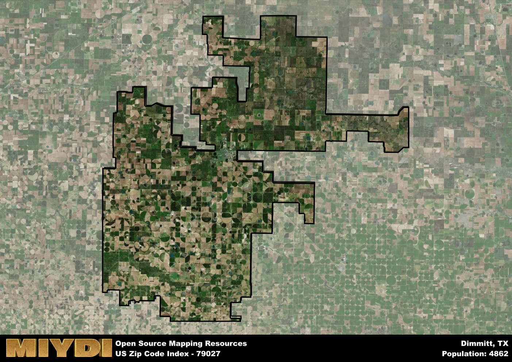

**Area Name:** Dimmitt

**Zip Code:** 79027

**State:** TX

# Dimmitt: A Charming Small Town in the Heart of West Texas

Located in the heart of West Texas, the zip code 79027 area corresponds to the small town of Dimmitt. With boundaries encompassing the charming neighborhoods and local businesses of Dimmitt, this zip code integrates seamlessly with surrounding agricultural communities and is situated within driving distance of larger cities like Amarillo. Dimmitt serves as a hub for the region, providing essential services and a close-knit community atmosphere for residents and visitors alike.

Dimmitt has a rich historical narrative, beginning with its settlement in the late 19th century by pioneers drawn to the fertile farmland of the area. Named after Rev. W.W. Dimmitt, a local Methodist pastor, the town grew rapidly due to its prime location along the railroad and its thriving agricultural industry. Over the years, Dimmitt has weathered economic ups and downs, but its resilient community spirit has kept it thriving as a center of commerce and culture in West Texas.

Today, Dimmitt boasts a diverse economy supported by agriculture, small businesses, and a growing tourism sector. The town offers a range of neighborhood-specific services, including locally-owned shops and restaurants, as well as recreational amenities like parks and community events. Visitors can explore historic sites like the XIT Museum, which showcases the town's ranching heritage, or enjoy the natural beauty of the surrounding plains. Dimmitt's unique blend of history, culture, and community make it a hidden gem within the larger urban fabric of West Texas.

# Dimmitt Demographics

The population of Dimmitt is 4862.  
Dimmitt has a population density of 10.98 per square mile.  
The area of Dimmitt is 442.9 square miles.  

## Dimmitt Income and Economic Data

These demographic numbers are sourced from IRS return data, providing comprehensive insights into the population dynamics and economic trends within Dimmitt.

**Breakdown of return types for Dimmitt**

The table offers insight into the composition of tax returns filed with the IRS, categorizing them into three main types. Single returns represent filings by individuals, joint returns by married couples, and head of household returns by individuals who qualify as heads of households, typically having dependents. This breakdown provides an understanding of the different filing statuses adopted by taxpayers when submitting their tax documentation.

| Return Types filed for Dimmitt                              | Percentage          |
|----------------------------------------------------------|---------------------|
| Single Returns                                            | 0.43 |
| Joint Returns                                             | 0.36 |
| Head Household Returns                                    | 0.2 |

The income and economic data presented here is sourced from the IRS income brackets, utilized for categorizing tax returns by income levels. This table displays income ranges for both single filers and married couples, along with the corresponding number of returns and the percentage within each bracket, providing valuable insight into the distribution of taxes across various income groups.

| Bracket Name       | Single Filer Income Range | Married Couple Range | Number of Returns | Percentage of Returns |
|--------------------|----------------------------|----------------------|-------------------|-----------------------|
| 10% Bracket        | Up to $10,275              | Up to $20,550        | 720 | 0.38% |
| 12% Bracket        | $10,276 - $41,775          | $20,551 - $83,550    | 590 | 0.31% |
| 22% Bracket        | $41,776 - $89,075          | $83,551 - $178,150   | 300 | 0.16% |
| 24% Bracket        | $89,076 - $170,050         | $178,151 - $340,100  | 120 | 0.06% |
| 32% Bracket        | $170,051 - $215,950        | $340,101 - $431,900  | 110 | 0.06% |
| 35% Bracket        | $215,951 - $539,900        | $431,901 - $647,850  | 40 | 0.02% |

### Exploring Taxpayer Diversity: A Breakdown of Different Types of Tax Returns in Dimmitt

The table offers insights into various types of tax returns filed, reflecting different aspects of taxpayer activities and demographics. Categories include charitable returns for donations, dependent returns for claimed dependents, educator population, elderly population, real estate returns, self-employment returns, student loan returns, and unemployment returns, providing valuable insights into taxpayer behavior and demographics.

| Dimmitt Filing Types                    | Count | Percentage |
|--------------------------------------|-------|------------|
| Charitable Donations                 | 40 | 0.021% |
| Dependents Claimed                   | 40 | 0.021% |
| Educator Residents                   | 50 | 0.027% |
| Elderly Population                   | 430 | 0.23% |
| Farming Population                   | 130 | 0.069% |
| Real Estate Transactions             | 20 | 0.011% |
| Self-Employed Individuals            | 220 | 0.117% |
| Student Loan Cases                   | 50 | 0.027% |
| Unemployment Benefit Filings         | 80 | 0.04% |

## Dimmitt AI and Census Variables

The values presented in this dataset for Dimmitt are AI-optimized, streamlined, and categorized into relevant buckets for enhanced utility in AI and mapping programs. These simplified values have been optimized to facilitate efficient analysis and integration into various technological applications, offering users accessible and actionable insights into demographics within the Dimmitt area.

| AI Variables for Dimmitt | Value |
|-------------|-------|
| Shape Area | 1694044247.88672 |
| Shape Length | 363072.523051743 |

## How to use this free AI optimized Geo-Spatial Data for Dimmitt, TX

This data is made freely available under the Creative Commons license, allowing for unrestricted use for any purpose. Users can access static resources directly from GitHub or leverage more advanced functionalities by utilizing the GeoJSON files. All datasets originate from official government or private sector sources and are meticulously compiled into relevant datasets within QGIS. However, the versatility of the data ensures compatibility with any mapping application.

## Data Accuracy Disclaimer
It's important to note that the data provided here may contain errors or discrepancies and should be considered as 'close enough' for business applications and AI rather than a definitive source of truth. This data is aggregated from multiple sources, some of which publish information on wildly different intervals, leading to potential inconsistencies. Additionally, certain data points may not be corrected for Covid-related changes, further impacting accuracy. Moreover, the assumption that demographic trends are consistent throughout a region may lead to discrepancies, as trends often concentrate in areas of highest population density. As a result, dense areas may be slightly underrepresented, while rural areas may be slightly overrepresented, resulting in a more conservative dataset. Furthermore, the focus primarily on areas within US Major and Minor Statistical areas means that approximately 40 million Americans living outside of these areas may not be fully represented. Lastly, the historical background and area descriptions generated using AI are susceptible to potential mistakes, so users should exercise caution when interpreting the information provided.
