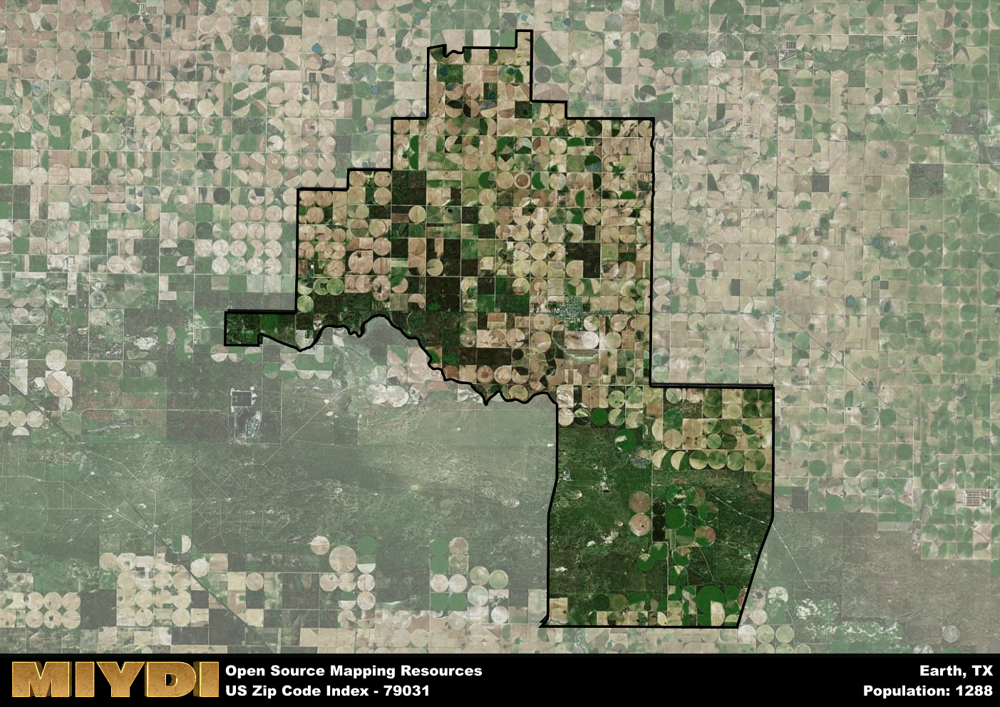

**Area Name:** Earth

**Zip Code:** 79031

**State:** TX

# Earth, TX - Zip Code 79031

Located in the heart of the Texas Panhandle, the zip code 79031 area corresponds to the town of Earth. Surrounded by vast open plains and agricultural fields, Earth is situated within Lamb County and is approximately 15 miles north of the city of Littlefield. The town is a rural community that serves as a hub for local farming and ranching activities, with State Highway 70 running through its center, connecting it to nearby towns and cities.

Earth was originally settled in the late 19th century by pioneers drawn to the fertile land and opportunities for farming. The town was officially incorporated in 1924 and was named after one of its early settlers, William E. Halsell, who was known as the "Sodfather of the Texas Panhandle." Over the years, Earth has developed as a close-knit community with a strong agricultural heritage, hosting annual events such as the Earth Day Celebration and Rodeo that showcase its Western roots.

Today, Earth is a thriving small town with a mix of locally-owned businesses, including family-owned farms, restaurants, and shops. The town offers essential services such as schools, healthcare facilities, and a public library, catering to the needs of its residents. Outdoor enthusiasts can enjoy recreational activities at nearby parks and lakes, while history buffs can explore sites such as the Halsell Museum, which preserves the town's rich pioneer history. Earth's welcoming community spirit and rural charm make it a unique destination within the Texas Panhandle.

# Earth Demographics

The population of Earth is 1288.  
Earth has a population density of 10.92 per square mile.  
The area of Earth is 117.91 square miles.  

## Earth Income and Economic Data

These demographic numbers are sourced from IRS return data, providing comprehensive insights into the population dynamics and economic trends within Earth.

**Breakdown of return types for Earth**

The table offers insight into the composition of tax returns filed with the IRS, categorizing them into three main types. Single returns represent filings by individuals, joint returns by married couples, and head of household returns by individuals who qualify as heads of households, typically having dependents. This breakdown provides an understanding of the different filing statuses adopted by taxpayers when submitting their tax documentation.

| Return Types filed for Earth                              | Percentage          |
|----------------------------------------------------------|---------------------|
| Single Returns                                            | 0.4 |
| Joint Returns                                             | 0.44 |
| Head Household Returns                                    | 0.16 |

The income and economic data presented here is sourced from the IRS income brackets, utilized for categorizing tax returns by income levels. This table displays income ranges for both single filers and married couples, along with the corresponding number of returns and the percentage within each bracket, providing valuable insight into the distribution of taxes across various income groups.

| Bracket Name       | Single Filer Income Range | Married Couple Range | Number of Returns | Percentage of Returns |
|--------------------|----------------------------|----------------------|-------------------|-----------------------|
| 10% Bracket        | Up to $10,275              | Up to $20,550        | 150 | 0.35% |
| 12% Bracket        | $10,276 - $41,775          | $20,551 - $83,550    | 120 | 0.28% |
| 22% Bracket        | $41,776 - $89,075          | $83,551 - $178,150   | 70 | 0.16% |
| 24% Bracket        | $89,076 - $170,050         | $178,151 - $340,100  | 30 | 0.07% |
| 32% Bracket        | $170,051 - $215,950        | $340,101 - $431,900  | 60 | 0.14% |
| 35% Bracket        | $215,951 - $539,900        | $431,901 - $647,850  | 0 | 0% |

### Exploring Taxpayer Diversity: A Breakdown of Different Types of Tax Returns in Earth

The table offers insights into various types of tax returns filed, reflecting different aspects of taxpayer activities and demographics. Categories include charitable returns for donations, dependent returns for claimed dependents, educator population, elderly population, real estate returns, self-employment returns, student loan returns, and unemployment returns, providing valuable insights into taxpayer behavior and demographics.

| Earth Filing Types                    | Count | Percentage |
|--------------------------------------|-------|------------|
| Charitable Donations                 | 0 | 0% |
| Dependents Claimed                   | 0 | 0% |
| Educator Residents                   | 0 | 0% |
| Elderly Population                   | 120 | 0.28% |
| Farming Population                   | 50 | 0.116% |
| Real Estate Transactions             | 0 | 0% |
| Self-Employed Individuals            | 70 | 0.163% |
| Student Loan Cases                   | 0 | 0% |
| Unemployment Benefit Filings         | 20 | 0.05% |

## Earth AI and Census Variables

The values presented in this dataset for Earth are AI-optimized, streamlined, and categorized into relevant buckets for enhanced utility in AI and mapping programs. These simplified values have been optimized to facilitate efficient analysis and integration into various technological applications, offering users accessible and actionable insights into demographics within the Earth area.

| AI Variables for Earth | Value |
|-------------|-------|
| Shape Area | 447811252.144531 |
| Shape Length | 131284.666813917 |

## How to use this free AI optimized Geo-Spatial Data for Earth, TX

This data is made freely available under the Creative Commons license, allowing for unrestricted use for any purpose. Users can access static resources directly from GitHub or leverage more advanced functionalities by utilizing the GeoJSON files. All datasets originate from official government or private sector sources and are meticulously compiled into relevant datasets within QGIS. However, the versatility of the data ensures compatibility with any mapping application.

## Data Accuracy Disclaimer
It's important to note that the data provided here may contain errors or discrepancies and should be considered as 'close enough' for business applications and AI rather than a definitive source of truth. This data is aggregated from multiple sources, some of which publish information on wildly different intervals, leading to potential inconsistencies. Additionally, certain data points may not be corrected for Covid-related changes, further impacting accuracy. Moreover, the assumption that demographic trends are consistent throughout a region may lead to discrepancies, as trends often concentrate in areas of highest population density. As a result, dense areas may be slightly underrepresented, while rural areas may be slightly overrepresented, resulting in a more conservative dataset. Furthermore, the focus primarily on areas within US Major and Minor Statistical areas means that approximately 40 million Americans living outside of these areas may not be fully represented. Lastly, the historical background and area descriptions generated using AI are susceptible to potential mistakes, so users should exercise caution when interpreting the information provided.
