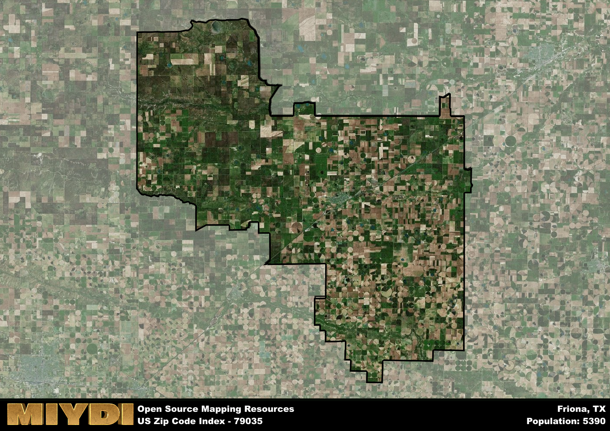

**Area Name:** Friona

**Zip Code:** 79035

**State:** TX

Friona is a part of the Hereford - TX Micro Area, and makes up  of the Metro's population.  

# Friona: A Charming Community in the Texas Panhandle  

Located in the heart of the Texas Panhandle, zip code 79035 encompasses the charming town of Friona. Surrounded by vast open plains and agricultural fields, Friona is a tight-knit community that is situated approximately 11 miles south of Hereford and 65 miles northwest of Amarillo. The area is known for its agricultural industry, with farming and ranching playing a significant role in the local economy. Despite its rural setting, Friona is well-connected to major transportation routes, making it a convenient hub for residents and visitors alike.

Friona has a rich historical narrative that dates back to the late 19th century when the town was founded as a railway stop along the Pecos Valley and Northern Texas Railway. Originally known as Frio, the town's name was later changed to Friona to avoid confusion with another Texas town. Over the years, Friona has experienced steady growth, becoming a thriving community with a diverse population that values its agricultural heritage and small-town charm.

Today, Friona is a vibrant community with a range of amenities and services that cater to residents and visitors. The town boasts a variety of local businesses, including restaurants, shops, and services, as well as parks and recreational facilities for outdoor enthusiasts. Friona is also home to several cultural and historic sites, such as the Friona Heritage Museum, which showcases the town's rich history and agricultural roots. With its strong sense of community and welcoming atmosphere, Friona continues to be a beloved destination in the Texas Panhandle.

# Friona Demographics

The population of Friona is 5390.  
Friona has a population density of 9.84 per square mile.  
The area of Friona is 548.02 square miles.  

## Friona Income and Economic Data

These demographic numbers are sourced from IRS return data, providing comprehensive insights into the population dynamics and economic trends within Friona.

**Breakdown of return types for Friona**

The table offers insight into the composition of tax returns filed with the IRS, categorizing them into three main types. Single returns represent filings by individuals, joint returns by married couples, and head of household returns by individuals who qualify as heads of households, typically having dependents. This breakdown provides an understanding of the different filing statuses adopted by taxpayers when submitting their tax documentation.

| Return Types filed for Friona                              | Percentage          |
|----------------------------------------------------------|---------------------|
| Single Returns                                            | 0.41 |
| Joint Returns                                             | 0.39 |
| Head Household Returns                                    | 0.18 |

The income and economic data presented here is sourced from the IRS income brackets, utilized for categorizing tax returns by income levels. This table displays income ranges for both single filers and married couples, along with the corresponding number of returns and the percentage within each bracket, providing valuable insight into the distribution of taxes across various income groups.

| Bracket Name       | Single Filer Income Range | Married Couple Range | Number of Returns | Percentage of Returns |
|--------------------|----------------------------|----------------------|-------------------|-----------------------|
| 10% Bracket        | Up to $10,275              | Up to $20,550        | 630 | 0.3% |
| 12% Bracket        | $10,276 - $41,775          | $20,551 - $83,550    | 610 | 0.29% |
| 22% Bracket        | $41,776 - $89,075          | $83,551 - $178,150   | 420 | 0.2% |
| 24% Bracket        | $89,076 - $170,050         | $178,151 - $340,100  | 190 | 0.09% |
| 32% Bracket        | $170,051 - $215,950        | $340,101 - $431,900  | 180 | 0.09% |
| 35% Bracket        | $215,951 - $539,900        | $431,901 - $647,850  | 40 | 0.02% |

### Exploring Taxpayer Diversity: A Breakdown of Different Types of Tax Returns in Friona

The table offers insights into various types of tax returns filed, reflecting different aspects of taxpayer activities and demographics. Categories include charitable returns for donations, dependent returns for claimed dependents, educator population, elderly population, real estate returns, self-employment returns, student loan returns, and unemployment returns, providing valuable insights into taxpayer behavior and demographics.

| Friona Filing Types                    | Count | Percentage |
|--------------------------------------|-------|------------|
| Charitable Donations                 | 60 | 0.029% |
| Dependents Claimed                   | 30 | 0.014% |
| Educator Residents                   | 60 | 0.029% |
| Elderly Population                   | 460 | 0.22% |
| Farming Population                   | 170 | 0.082% |
| Real Estate Transactions             | 30 | 0.014% |
| Self-Employed Individuals            | 280 | 0.135% |
| Student Loan Cases                   | 70 | 0.034% |
| Unemployment Benefit Filings         | 60 | 0.03% |

## Friona AI and Census Variables

The values presented in this dataset for Friona are AI-optimized, streamlined, and categorized into relevant buckets for enhanced utility in AI and mapping programs. These simplified values have been optimized to facilitate efficient analysis and integration into various technological applications, offering users accessible and actionable insights into demographics within the Friona area.

| AI Variables for Friona | Value |
|-------------|-------|
| Shape Area | 2102437773.59375 |
| Shape Length | 267940.610118686 |
| CBSA Federal Processing Standard Code | 25820 |

## How to use this free AI optimized Geo-Spatial Data for Friona, TX

This data is made freely available under the Creative Commons license, allowing for unrestricted use for any purpose. Users can access static resources directly from GitHub or leverage more advanced functionalities by utilizing the GeoJSON files. All datasets originate from official government or private sector sources and are meticulously compiled into relevant datasets within QGIS. However, the versatility of the data ensures compatibility with any mapping application.

## Data Accuracy Disclaimer
It's important to note that the data provided here may contain errors or discrepancies and should be considered as 'close enough' for business applications and AI rather than a definitive source of truth. This data is aggregated from multiple sources, some of which publish information on wildly different intervals, leading to potential inconsistencies. Additionally, certain data points may not be corrected for Covid-related changes, further impacting accuracy. Moreover, the assumption that demographic trends are consistent throughout a region may lead to discrepancies, as trends often concentrate in areas of highest population density. As a result, dense areas may be slightly underrepresented, while rural areas may be slightly overrepresented, resulting in a more conservative dataset. Furthermore, the focus primarily on areas within US Major and Minor Statistical areas means that approximately 40 million Americans living outside of these areas may not be fully represented. Lastly, the historical background and area descriptions generated using AI are susceptible to potential mistakes, so users should exercise caution when interpreting the information provided.
