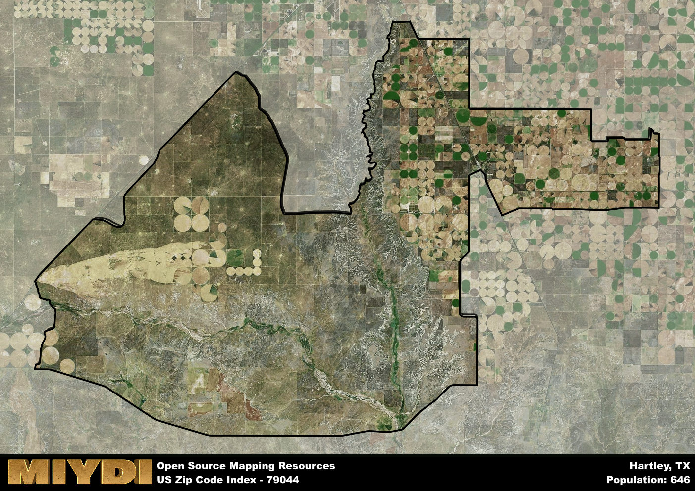

**Area Name:** Hartley

**Zip Code:** 79044

**State:** TX

# Hartley, TX 79044: A Charming Neighborhood in the Texas Panhandle  

Located in the Texas Panhandle, zip code 79044 corresponds to the small town of Hartley. Situated in Hartley County, this area is surrounded by vast plains and agricultural lands. It is a rural community that is a part of the larger Texas Panhandle region, with nearby cities such as Dalhart and Dumas providing essential services and amenities to residents of Hartley. Despite its rural setting, Hartley maintains a close-knit community and a sense of small-town charm.

Hartley has a rich historical narrative that dates back to its early settlement by pioneers and ranchers. The town was established in the late 19th century and grew steadily as agriculture became the backbone of the local economy. Named after Oliver C. Hartley, a prominent figure in the region's development, the town has preserved its Western heritage through historic buildings and landmarks. Over the years, Hartley has evolved into a peaceful residential community with a strong sense of pride in its past.

Today, Hartley is a peaceful residential neighborhood with a mix of single-family homes, farms, and ranches. The town's economy is primarily driven by agriculture, with farming and livestock playing a significant role in the local economy. Residents of Hartley enjoy a close connection to nature, with ample outdoor recreational opportunities available in the surrounding countryside. The town also boasts a few local businesses, such as a grocery store, post office, and small shops, that cater to the needs of its residents. Additionally, Hartley is home to several historic sites that offer a glimpse into its past, making it a unique and charming place to live in the Texas Panhandle.

# Hartley Demographics

The population of Hartley is 646.  
Hartley has a population density of 1.47 per square mile.  
The area of Hartley is 440.82 square miles.  

## Hartley Income and Economic Data

These demographic numbers are sourced from IRS return data, providing comprehensive insights into the population dynamics and economic trends within Hartley.

**Breakdown of return types for Hartley**

The table offers insight into the composition of tax returns filed with the IRS, categorizing them into three main types. Single returns represent filings by individuals, joint returns by married couples, and head of household returns by individuals who qualify as heads of households, typically having dependents. This breakdown provides an understanding of the different filing statuses adopted by taxpayers when submitting their tax documentation.

| Return Types filed for Hartley                              | Percentage          |
|----------------------------------------------------------|---------------------|
| Single Returns                                            | 0.51 |
| Joint Returns                                             | 0.36 |
| Head Household Returns                                    | 0.09 |

The income and economic data presented here is sourced from the IRS income brackets, utilized for categorizing tax returns by income levels. This table displays income ranges for both single filers and married couples, along with the corresponding number of returns and the percentage within each bracket, providing valuable insight into the distribution of taxes across various income groups.

| Bracket Name       | Single Filer Income Range | Married Couple Range | Number of Returns | Percentage of Returns |
|--------------------|----------------------------|----------------------|-------------------|-----------------------|
| 10% Bracket        | Up to $10,275              | Up to $20,550        | 180 | 0.4% |
| 12% Bracket        | $10,276 - $41,775          | $20,551 - $83,550    | 130 | 0.29% |
| 22% Bracket        | $41,776 - $89,075          | $83,551 - $178,150   | 60 | 0.13% |
| 24% Bracket        | $89,076 - $170,050         | $178,151 - $340,100  | 30 | 0.07% |
| 32% Bracket        | $170,051 - $215,950        | $340,101 - $431,900  | 50 | 0.11% |
| 35% Bracket        | $215,951 - $539,900        | $431,901 - $647,850  | 0 | 0% |

### Exploring Taxpayer Diversity: A Breakdown of Different Types of Tax Returns in Hartley

The table offers insights into various types of tax returns filed, reflecting different aspects of taxpayer activities and demographics. Categories include charitable returns for donations, dependent returns for claimed dependents, educator population, elderly population, real estate returns, self-employment returns, student loan returns, and unemployment returns, providing valuable insights into taxpayer behavior and demographics.

| Hartley Filing Types                    | Count | Percentage |
|--------------------------------------|-------|------------|
| Charitable Donations                 | 0 | 0% |
| Dependents Claimed                   | 0 | 0% |
| Educator Residents                   | 0 | 0% |
| Elderly Population                   | 40 | 0.09% |
| Farming Population                   | 30 | 0.067% |
| Real Estate Transactions             | 0 | 0% |
| Self-Employed Individuals            | 50 | 0.111% |
| Student Loan Cases                   | 0 | 0% |
| Unemployment Benefit Filings         | 0 | 0% |

## Hartley AI and Census Variables

The values presented in this dataset for Hartley are AI-optimized, streamlined, and categorized into relevant buckets for enhanced utility in AI and mapping programs. These simplified values have been optimized to facilitate efficient analysis and integration into various technological applications, offering users accessible and actionable insights into demographics within the Hartley area.

| AI Variables for Hartley | Value |
|-------------|-------|
| Shape Area | 1739843142.53516 |
| Shape Length | 265762.578461236 |

## How to use this free AI optimized Geo-Spatial Data for Hartley, TX

This data is made freely available under the Creative Commons license, allowing for unrestricted use for any purpose. Users can access static resources directly from GitHub or leverage more advanced functionalities by utilizing the GeoJSON files. All datasets originate from official government or private sector sources and are meticulously compiled into relevant datasets within QGIS. However, the versatility of the data ensures compatibility with any mapping application.

## Data Accuracy Disclaimer
It's important to note that the data provided here may contain errors or discrepancies and should be considered as 'close enough' for business applications and AI rather than a definitive source of truth. This data is aggregated from multiple sources, some of which publish information on wildly different intervals, leading to potential inconsistencies. Additionally, certain data points may not be corrected for Covid-related changes, further impacting accuracy. Moreover, the assumption that demographic trends are consistent throughout a region may lead to discrepancies, as trends often concentrate in areas of highest population density. As a result, dense areas may be slightly underrepresented, while rural areas may be slightly overrepresented, resulting in a more conservative dataset. Furthermore, the focus primarily on areas within US Major and Minor Statistical areas means that approximately 40 million Americans living outside of these areas may not be fully represented. Lastly, the historical background and area descriptions generated using AI are susceptible to potential mistakes, so users should exercise caution when interpreting the information provided.
