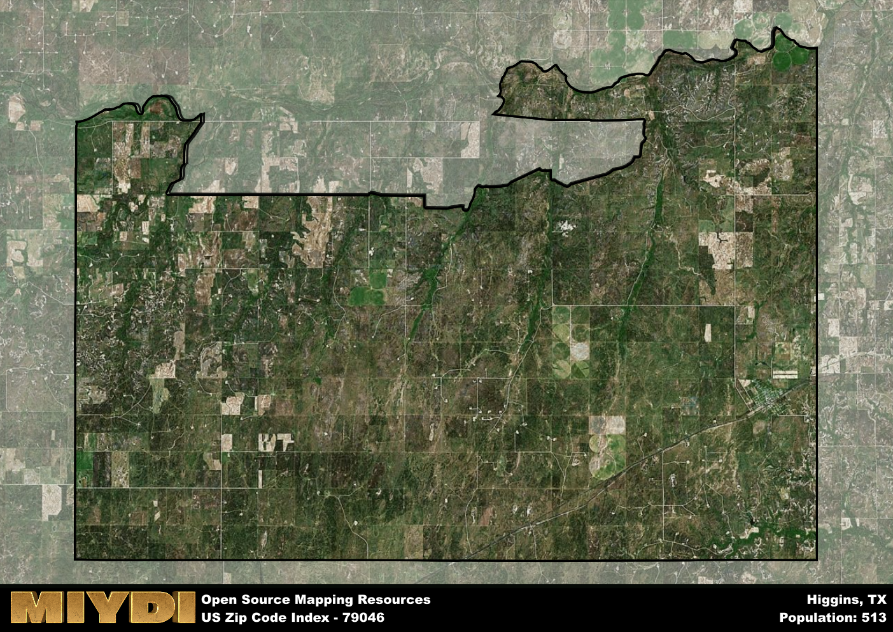

**Area Name:** Higgins

**Zip Code:** 79046

**State:** TX

Higgins is a part of the Woodward - OK Micro Area, and makes up  of the Metro's population.  

# Embracing Small-Town Charm in Higgins, TX (79046)

Located in the northern region of Texas, Higgins (zip code 79046) is a small, tight-knit community nestled within the larger area of Lipscomb County. The boundaries of Higgins are defined by vast farmlands and ranches, with the closest major city being Amarillo, approximately 120 miles to the southwest. Despite its rural setting, Higgins plays an integral role in the agricultural landscape of the region, with many residents working in farming and livestock industries.

Higgins has a rich history dating back to the late 19th century when it was established as a railroad town along the Southern Kansas Railway. The town experienced rapid growth during the early 1900s due to the influx of settlers attracted by the fertile land and promising opportunities. Named after a prominent local family, Higgins has maintained its small-town charm and close community ties over the years, making it a beloved hidden gem in the Texas Panhandle.

Today, Higgins boasts a mix of agriculture-based businesses, small shops, and essential services catering to its residents. The town is known for its annual rodeo and county fair, which draws visitors from neighboring areas. Outdoor enthusiasts can explore the surrounding countryside through hiking trails and fishing spots along the Canadian River. With a strong sense of community pride and a dedication to preserving its heritage, Higgins continues to thrive as a welcoming haven for those seeking a peaceful, rural lifestyle.

# Higgins Demographics

The population of Higgins is 513.  
Higgins has a population density of 2.15 per square mile.  
The area of Higgins is 239.06 square miles.  

## Higgins Income and Economic Data

These demographic numbers are sourced from IRS return data, providing comprehensive insights into the population dynamics and economic trends within Higgins.

**Breakdown of return types for Higgins**

The table offers insight into the composition of tax returns filed with the IRS, categorizing them into three main types. Single returns represent filings by individuals, joint returns by married couples, and head of household returns by individuals who qualify as heads of households, typically having dependents. This breakdown provides an understanding of the different filing statuses adopted by taxpayers when submitting their tax documentation.

| Return Types filed for Higgins                              | Percentage          |
|----------------------------------------------------------|---------------------|
| Single Returns                                            | 0.38 |
| Joint Returns                                             | 0.5 |
| Head Household Returns                                    | 0 |

The income and economic data presented here is sourced from the IRS income brackets, utilized for categorizing tax returns by income levels. This table displays income ranges for both single filers and married couples, along with the corresponding number of returns and the percentage within each bracket, providing valuable insight into the distribution of taxes across various income groups.

| Bracket Name       | Single Filer Income Range | Married Couple Range | Number of Returns | Percentage of Returns |
|--------------------|----------------------------|----------------------|-------------------|-----------------------|
| 10% Bracket        | Up to $10,275              | Up to $20,550        | 50 | 0.31% |
| 12% Bracket        | $10,276 - $41,775          | $20,551 - $83,550    | 30 | 0.19% |
| 22% Bracket        | $41,776 - $89,075          | $83,551 - $178,150   | 30 | 0.19% |
| 24% Bracket        | $89,076 - $170,050         | $178,151 - $340,100  | 20 | 0.13% |
| 32% Bracket        | $170,051 - $215,950        | $340,101 - $431,900  | 30 | 0.19% |
| 35% Bracket        | $215,951 - $539,900        | $431,901 - $647,850  | 0 | 0% |

### Exploring Taxpayer Diversity: A Breakdown of Different Types of Tax Returns in Higgins

The table offers insights into various types of tax returns filed, reflecting different aspects of taxpayer activities and demographics. Categories include charitable returns for donations, dependent returns for claimed dependents, educator population, elderly population, real estate returns, self-employment returns, student loan returns, and unemployment returns, providing valuable insights into taxpayer behavior and demographics.

| Higgins Filing Types                    | Count | Percentage |
|--------------------------------------|-------|------------|
| Charitable Donations                 | 0 | 0% |
| Dependents Claimed                   | 0 | 0% |
| Educator Residents                   | 0 | 0% |
| Elderly Population                   | 90 | 0.56% |
| Farming Population                   | 40 | 0.25% |
| Real Estate Transactions             | 0 | 0% |
| Self-Employed Individuals            | 0 | 0% |
| Student Loan Cases                   | 0 | 0% |
| Unemployment Benefit Filings         | 0 | 0% |

## Higgins AI and Census Variables

The values presented in this dataset for Higgins are AI-optimized, streamlined, and categorized into relevant buckets for enhanced utility in AI and mapping programs. These simplified values have been optimized to facilitate efficient analysis and integration into various technological applications, offering users accessible and actionable insights into demographics within the Higgins area.

| AI Variables for Higgins | Value |
|-------------|-------|
| Shape Area | 951385718.335938 |
| Shape Length | 172809.09031271 |
| CBSA Federal Processing Standard Code | 49260 |

## How to use this free AI optimized Geo-Spatial Data for Higgins, TX

This data is made freely available under the Creative Commons license, allowing for unrestricted use for any purpose. Users can access static resources directly from GitHub or leverage more advanced functionalities by utilizing the GeoJSON files. All datasets originate from official government or private sector sources and are meticulously compiled into relevant datasets within QGIS. However, the versatility of the data ensures compatibility with any mapping application.

## Data Accuracy Disclaimer
It's important to note that the data provided here may contain errors or discrepancies and should be considered as 'close enough' for business applications and AI rather than a definitive source of truth. This data is aggregated from multiple sources, some of which publish information on wildly different intervals, leading to potential inconsistencies. Additionally, certain data points may not be corrected for Covid-related changes, further impacting accuracy. Moreover, the assumption that demographic trends are consistent throughout a region may lead to discrepancies, as trends often concentrate in areas of highest population density. As a result, dense areas may be slightly underrepresented, while rural areas may be slightly overrepresented, resulting in a more conservative dataset. Furthermore, the focus primarily on areas within US Major and Minor Statistical areas means that approximately 40 million Americans living outside of these areas may not be fully represented. Lastly, the historical background and area descriptions generated using AI are susceptible to potential mistakes, so users should exercise caution when interpreting the information provided.
