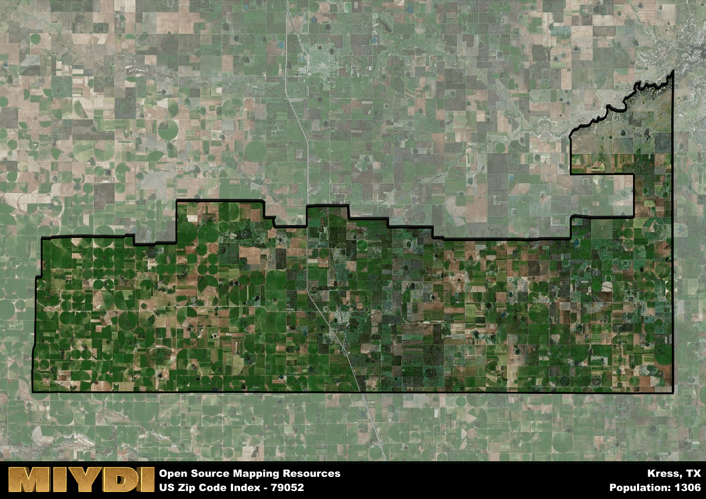

**Area Name:** Kress

**Zip Code:** 79052

**State:** TX

# Kress: A Historic Small Town in Texas  

Located in the heart of the Texas Panhandle, zip code 79052 encompasses the small town of Kress. Situated in Swisher County, Kress is surrounded by vast plains and farmland, with neighboring towns such as Tulia and Plainview providing additional services and amenities. Despite its rural location, Kress is well-connected to major population centers through nearby highways and offers a peaceful, small-town atmosphere for residents and visitors alike.

Kress has a rich historical narrative dating back to its founding in the early 20th century. Originally established as a railroad town, Kress experienced rapid growth due to agricultural development in the region. The town was named after a prominent local family, and its economy flourished with the establishment of businesses and schools. Over the years, Kress has maintained its small-town charm while adapting to modern changes, preserving its unique identity and sense of community.

Today, Kress continues to thrive as a close-knit community with a focus on agriculture and small businesses. The town offers essential services such as schools, churches, and local shops to meet the needs of its residents. Recreational amenities include parks and community events that bring residents together. Visitors can explore the historic downtown area and learn about the town's heritage at local museums. Kress remains a hidden gem in the Texas Panhandle, where the past meets the present in a welcoming and vibrant community.

# Kress Demographics

The population of Kress is 1306.  
Kress has a population density of 4.97 per square mile.  
The area of Kress is 262.56 square miles.  

## Kress Income and Economic Data

These demographic numbers are sourced from IRS return data, providing comprehensive insights into the population dynamics and economic trends within Kress.

**Breakdown of return types for Kress**

The table offers insight into the composition of tax returns filed with the IRS, categorizing them into three main types. Single returns represent filings by individuals, joint returns by married couples, and head of household returns by individuals who qualify as heads of households, typically having dependents. This breakdown provides an understanding of the different filing statuses adopted by taxpayers when submitting their tax documentation.

| Return Types filed for Kress                              | Percentage          |
|----------------------------------------------------------|---------------------|
| Single Returns                                            | 0.44 |
| Joint Returns                                             | 0.42 |
| Head Household Returns                                    | 0.17 |

The income and economic data presented here is sourced from the IRS income brackets, utilized for categorizing tax returns by income levels. This table displays income ranges for both single filers and married couples, along with the corresponding number of returns and the percentage within each bracket, providing valuable insight into the distribution of taxes across various income groups.

| Bracket Name       | Single Filer Income Range | Married Couple Range | Number of Returns | Percentage of Returns |
|--------------------|----------------------------|----------------------|-------------------|-----------------------|
| 10% Bracket        | Up to $10,275              | Up to $20,550        | 170 | 0.35% |
| 12% Bracket        | $10,276 - $41,775          | $20,551 - $83,550    | 160 | 0.33% |
| 22% Bracket        | $41,776 - $89,075          | $83,551 - $178,150   | 70 | 0.15% |
| 24% Bracket        | $89,076 - $170,050         | $178,151 - $340,100  | 40 | 0.08% |
| 32% Bracket        | $170,051 - $215,950        | $340,101 - $431,900  | 40 | 0.08% |
| 35% Bracket        | $215,951 - $539,900        | $431,901 - $647,850  | 0 | 0% |

### Exploring Taxpayer Diversity: A Breakdown of Different Types of Tax Returns in Kress

The table offers insights into various types of tax returns filed, reflecting different aspects of taxpayer activities and demographics. Categories include charitable returns for donations, dependent returns for claimed dependents, educator population, elderly population, real estate returns, self-employment returns, student loan returns, and unemployment returns, providing valuable insights into taxpayer behavior and demographics.

| Kress Filing Types                    | Count | Percentage |
|--------------------------------------|-------|------------|
| Charitable Donations                 | 0 | 0% |
| Dependents Claimed                   | 0 | 0% |
| Educator Residents                   | 0 | 0% |
| Elderly Population                   | 140 | 0.29% |
| Farming Population                   | 60 | 0.125% |
| Real Estate Transactions             | 0 | 0% |
| Self-Employed Individuals            | 80 | 0.167% |
| Student Loan Cases                   | 0 | 0% |
| Unemployment Benefit Filings         | 30 | 0.06% |

## Kress AI and Census Variables

The values presented in this dataset for Kress are AI-optimized, streamlined, and categorized into relevant buckets for enhanced utility in AI and mapping programs. These simplified values have been optimized to facilitate efficient analysis and integration into various technological applications, offering users accessible and actionable insights into demographics within the Kress area.

| AI Variables for Kress | Value |
|-------------|-------|
| Shape Area | 1000809118.69141 |
| Shape Length | 204051.690058815 |

## How to use this free AI optimized Geo-Spatial Data for Kress, TX

This data is made freely available under the Creative Commons license, allowing for unrestricted use for any purpose. Users can access static resources directly from GitHub or leverage more advanced functionalities by utilizing the GeoJSON files. All datasets originate from official government or private sector sources and are meticulously compiled into relevant datasets within QGIS. However, the versatility of the data ensures compatibility with any mapping application.

## Data Accuracy Disclaimer
It's important to note that the data provided here may contain errors or discrepancies and should be considered as 'close enough' for business applications and AI rather than a definitive source of truth. This data is aggregated from multiple sources, some of which publish information on wildly different intervals, leading to potential inconsistencies. Additionally, certain data points may not be corrected for Covid-related changes, further impacting accuracy. Moreover, the assumption that demographic trends are consistent throughout a region may lead to discrepancies, as trends often concentrate in areas of highest population density. As a result, dense areas may be slightly underrepresented, while rural areas may be slightly overrepresented, resulting in a more conservative dataset. Furthermore, the focus primarily on areas within US Major and Minor Statistical areas means that approximately 40 million Americans living outside of these areas may not be fully represented. Lastly, the historical background and area descriptions generated using AI are susceptible to potential mistakes, so users should exercise caution when interpreting the information provided.
