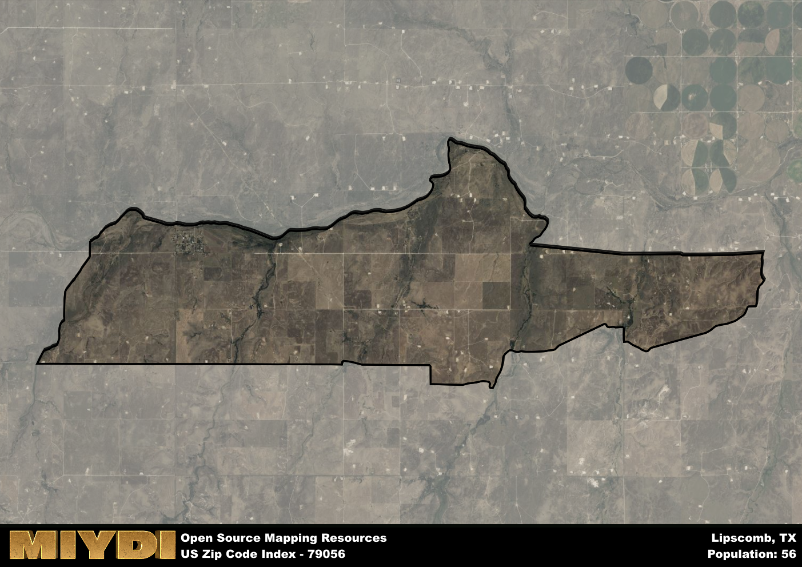

**Area Name:** Lipscomb

**Zip Code:** 79056

**State:** TX

# Lipscomb: A Charming Community in the Texas Panhandle

Located in the Texas Panhandle, Lipscomb (zip code 79056) is a small rural community nestled in Lipscomb County. Bordered by the towns of Higgins and Booker, Lipscomb is part of the larger Amarillo Metropolitan Area, known for its vast open spaces and agricultural landscapes. Despite its rural setting, Lipscomb is easily accessible via State Highway 305, making it a convenient stop for travelers exploring the region.

Lipscomb has a rich history dating back to the late 19th century when settlers began to establish homesteads in the area. The town was officially founded in 1887 and named after a prominent local family. Over the years, Lipscomb has grown into a close-knit community with a strong agricultural heritage. Today, visitors can still see remnants of the town's past in its historic buildings and landmarks.

Presently, Lipscomb is a vibrant community with a focus on agriculture and ranching. The town boasts a variety of local businesses, including family-owned farms and ranches. Residents and visitors alike can enjoy the town's peaceful ambiance and natural beauty, with opportunities for hunting, fishing, and outdoor recreation. Lipscomb also takes pride in its local schools and community events, showcasing the town's tight-knit spirit and commitment to preserving its unique heritage.

# Lipscomb Demographics

The population of Lipscomb is 56.  
Lipscomb has a population density of 1.86 per square mile.  
The area of Lipscomb is 30.1 square miles.  

## Lipscomb AI and Census Variables

The values presented in this dataset for Lipscomb are AI-optimized, streamlined, and categorized into relevant buckets for enhanced utility in AI and mapping programs. These simplified values have been optimized to facilitate efficient analysis and integration into various technological applications, offering users accessible and actionable insights into demographics within the Lipscomb area.

| AI Variables for Lipscomb | Value |
|-------------|-------|
| Shape Area | 120023251.394531 |
| Shape Length | 67283.1773077436 |

## How to use this free AI optimized Geo-Spatial Data for Lipscomb, TX

This data is made freely available under the Creative Commons license, allowing for unrestricted use for any purpose. Users can access static resources directly from GitHub or leverage more advanced functionalities by utilizing the GeoJSON files. All datasets originate from official government or private sector sources and are meticulously compiled into relevant datasets within QGIS. However, the versatility of the data ensures compatibility with any mapping application.

## Data Accuracy Disclaimer
It's important to note that the data provided here may contain errors or discrepancies and should be considered as 'close enough' for business applications and AI rather than a definitive source of truth. This data is aggregated from multiple sources, some of which publish information on wildly different intervals, leading to potential inconsistencies. Additionally, certain data points may not be corrected for Covid-related changes, further impacting accuracy. Moreover, the assumption that demographic trends are consistent throughout a region may lead to discrepancies, as trends often concentrate in areas of highest population density. As a result, dense areas may be slightly underrepresented, while rural areas may be slightly overrepresented, resulting in a more conservative dataset. Furthermore, the focus primarily on areas within US Major and Minor Statistical areas means that approximately 40 million Americans living outside of these areas may not be fully represented. Lastly, the historical background and area descriptions generated using AI are susceptible to potential mistakes, so users should exercise caution when interpreting the information provided.
