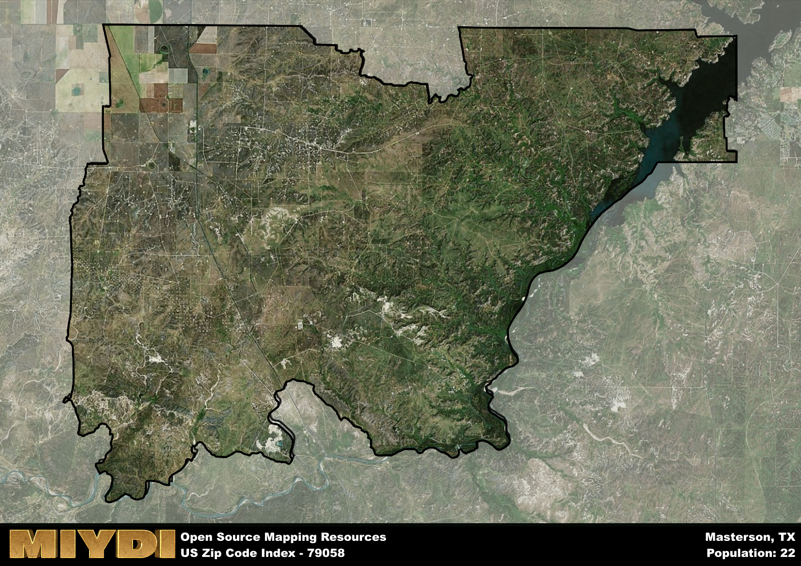

**Area Name:** Masterson

**Zip Code:** 79058

**State:** TX

Masterson is a part of the Amarillo - TX Metro Area, and makes up  of the Metro's population.  

# Masterson: A Historic Neighborhood in the Heart of Texas  

Located in the heart of the Texas Panhandle, zip code 79058 encompasses the charming neighborhood of Masterson. Situated just outside of the bustling city of Amarillo, Masterson is a peaceful residential area with easy access to major transportation routes. Bordered by scenic countryside and agricultural lands, Masterson offers a tranquil retreat while maintaining close proximity to urban amenities.

Masterson has a rich historical background dating back to its founding in the late 19th century. Originally a railway town, Masterson quickly grew into a thriving community centered around agriculture and cattle ranching. The area was named after a prominent local rancher, and its history is intertwined with the development of the region's transportation and economic infrastructure. Today, Masterson retains its small-town charm while embracing modern conveniences and a diverse population.

In the present day, Masterson is a vibrant neighborhood with a mix of residential, commercial, and agricultural spaces. The area boasts a variety of local businesses, including family-owned shops and restaurants, as well as essential services such as schools and healthcare facilities. Residents and visitors can enjoy outdoor recreational activities in nearby parks and nature reserves, or explore the area's historical sites and cultural landmarks. Masterson's strong sense of community and connection to its past make it a unique and welcoming place to call home.

# Masterson Demographics

The population of Masterson is 22.  
Masterson has a population density of 0.08 per square mile.  
The area of Masterson is 261.81 square miles.  

## Masterson AI and Census Variables

The values presented in this dataset for Masterson are AI-optimized, streamlined, and categorized into relevant buckets for enhanced utility in AI and mapping programs. These simplified values have been optimized to facilitate efficient analysis and integration into various technological applications, offering users accessible and actionable insights into demographics within the Masterson area.

| AI Variables for Masterson | Value |
|-------------|-------|
| Shape Area | 1027590047.20313 |
| Shape Length | 189616.905208023 |
| CBSA Federal Processing Standard Code | 11100 |

## How to use this free AI optimized Geo-Spatial Data for Masterson, TX

This data is made freely available under the Creative Commons license, allowing for unrestricted use for any purpose. Users can access static resources directly from GitHub or leverage more advanced functionalities by utilizing the GeoJSON files. All datasets originate from official government or private sector sources and are meticulously compiled into relevant datasets within QGIS. However, the versatility of the data ensures compatibility with any mapping application.

## Data Accuracy Disclaimer
It's important to note that the data provided here may contain errors or discrepancies and should be considered as 'close enough' for business applications and AI rather than a definitive source of truth. This data is aggregated from multiple sources, some of which publish information on wildly different intervals, leading to potential inconsistencies. Additionally, certain data points may not be corrected for Covid-related changes, further impacting accuracy. Moreover, the assumption that demographic trends are consistent throughout a region may lead to discrepancies, as trends often concentrate in areas of highest population density. As a result, dense areas may be slightly underrepresented, while rural areas may be slightly overrepresented, resulting in a more conservative dataset. Furthermore, the focus primarily on areas within US Major and Minor Statistical areas means that approximately 40 million Americans living outside of these areas may not be fully represented. Lastly, the historical background and area descriptions generated using AI are susceptible to potential mistakes, so users should exercise caution when interpreting the information provided.
