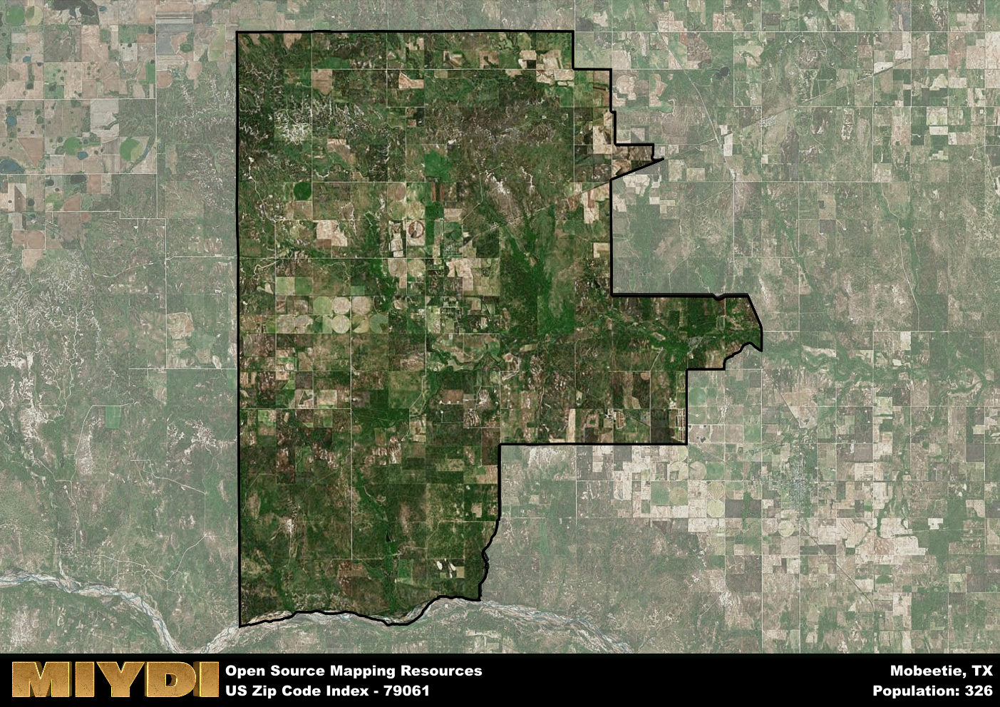

**Area Name:** Mobeetie

**Zip Code:** 79061

**State:** TX

Mobeetie is a part of the Pampa - TX Micro Area, and makes up  of the Metro's population.  

# Historic Mobeetie: A Snapshot of Zip Code 79061  

Mobeetie, the neighborhood corresponding to zip code 79061, is located in Wheeler County in the state of Texas. Situated in the northeastern region of the state, Mobeetie is bordered by the cities of Canadian to the north and Shamrock to the south. The area functions as a rural community within the larger metropolitan context of the Texas Panhandle, providing a serene and picturesque setting for residents.  

Mobeetie has a rich historical narrative, originally established as a trading post in the mid-19th century. As one of the first Anglo-American settlements in the Texas Panhandle, Mobeetie played a crucial role in the region's development and served as the first county seat of Wheeler County. The area's growth was further fueled by the arrival of the railroad in the late 19th century, solidifying Mobeetie's status as a vital hub for trade and commerce in the region.  

Today, Mobeetie maintains its historical charm while offering a range of modern amenities to its residents. The neighborhood is home to a variety of economic activities, including agriculture, ranching, and small businesses that cater to the local community. Residents and visitors can enjoy recreational opportunities such as hiking and camping in the nearby parks and natural areas. Mobeetie also boasts several cultural and historic sites, such as the Mobeetie Jail Museum, which preserves the area's pioneer heritage for future generations to appreciate.

# Mobeetie Demographics

The population of Mobeetie is 326.  
Mobeetie has a population density of 2.13 per square mile.  
The area of Mobeetie is 153.27 square miles.  

## Mobeetie Income and Economic Data

These demographic numbers are sourced from IRS return data, providing comprehensive insights into the population dynamics and economic trends within Mobeetie.

**Breakdown of return types for Mobeetie**

The table offers insight into the composition of tax returns filed with the IRS, categorizing them into three main types. Single returns represent filings by individuals, joint returns by married couples, and head of household returns by individuals who qualify as heads of households, typically having dependents. This breakdown provides an understanding of the different filing statuses adopted by taxpayers when submitting their tax documentation.

| Return Types filed for Mobeetie                              | Percentage          |
|----------------------------------------------------------|---------------------|
| Single Returns                                            | 0.4 |
| Joint Returns                                             | 0.6 |
| Head Household Returns                                    | 0 |

The income and economic data presented here is sourced from the IRS income brackets, utilized for categorizing tax returns by income levels. This table displays income ranges for both single filers and married couples, along with the corresponding number of returns and the percentage within each bracket, providing valuable insight into the distribution of taxes across various income groups.

| Bracket Name       | Single Filer Income Range | Married Couple Range | Number of Returns | Percentage of Returns |
|--------------------|----------------------------|----------------------|-------------------|-----------------------|
| 10% Bracket        | Up to $10,275              | Up to $20,550        | 40 | 0.27% |
| 12% Bracket        | $10,276 - $41,775          | $20,551 - $83,550    | 30 | 0.2% |
| 22% Bracket        | $41,776 - $89,075          | $83,551 - $178,150   | 30 | 0.2% |
| 24% Bracket        | $89,076 - $170,050         | $178,151 - $340,100  | 20 | 0.13% |
| 32% Bracket        | $170,051 - $215,950        | $340,101 - $431,900  | 30 | 0.2% |
| 35% Bracket        | $215,951 - $539,900        | $431,901 - $647,850  | 0 | 0% |

### Exploring Taxpayer Diversity: A Breakdown of Different Types of Tax Returns in Mobeetie

The table offers insights into various types of tax returns filed, reflecting different aspects of taxpayer activities and demographics. Categories include charitable returns for donations, dependent returns for claimed dependents, educator population, elderly population, real estate returns, self-employment returns, student loan returns, and unemployment returns, providing valuable insights into taxpayer behavior and demographics.

| Mobeetie Filing Types                    | Count | Percentage |
|--------------------------------------|-------|------------|
| Charitable Donations                 | 0 | 0% |
| Dependents Claimed                   | 0 | 0% |
| Educator Residents                   | 0 | 0% |
| Elderly Population                   | 60 | 0.4% |
| Farming Population                   | 50 | 0.333% |
| Real Estate Transactions             | 0 | 0% |
| Self-Employed Individuals            | 40 | 0.267% |
| Student Loan Cases                   | 0 | 0% |
| Unemployment Benefit Filings         | 0 | 0% |

## Mobeetie AI and Census Variables

The values presented in this dataset for Mobeetie are AI-optimized, streamlined, and categorized into relevant buckets for enhanced utility in AI and mapping programs. These simplified values have been optimized to facilitate efficient analysis and integration into various technological applications, offering users accessible and actionable insights into demographics within the Mobeetie area.

| AI Variables for Mobeetie | Value |
|-------------|-------|
| Shape Area | 600457272.503906 |
| Shape Length | 122425.475417726 |
| CBSA Federal Processing Standard Code | 37420 |

## How to use this free AI optimized Geo-Spatial Data for Mobeetie, TX

This data is made freely available under the Creative Commons license, allowing for unrestricted use for any purpose. Users can access static resources directly from GitHub or leverage more advanced functionalities by utilizing the GeoJSON files. All datasets originate from official government or private sector sources and are meticulously compiled into relevant datasets within QGIS. However, the versatility of the data ensures compatibility with any mapping application.

## Data Accuracy Disclaimer
It's important to note that the data provided here may contain errors or discrepancies and should be considered as 'close enough' for business applications and AI rather than a definitive source of truth. This data is aggregated from multiple sources, some of which publish information on wildly different intervals, leading to potential inconsistencies. Additionally, certain data points may not be corrected for Covid-related changes, further impacting accuracy. Moreover, the assumption that demographic trends are consistent throughout a region may lead to discrepancies, as trends often concentrate in areas of highest population density. As a result, dense areas may be slightly underrepresented, while rural areas may be slightly overrepresented, resulting in a more conservative dataset. Furthermore, the focus primarily on areas within US Major and Minor Statistical areas means that approximately 40 million Americans living outside of these areas may not be fully represented. Lastly, the historical background and area descriptions generated using AI are susceptible to potential mistakes, so users should exercise caution when interpreting the information provided.
