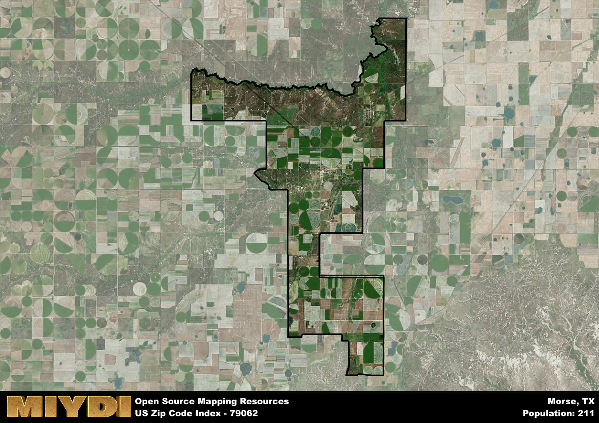

**Area Name:** Morse

**Zip Code:** 79062

**State:** TX

Morse is a part of the Borger - TX Micro Area, and makes up  of the Metro's population.  

# Morse: A Historic Community in the Heart of the Texas Panhandle

Located in the heart of the Texas Panhandle, the zip code 79062 area of Morse is a small but vibrant community nestled among the vast plains of the region. Bordered by neighboring zip codes and towns such as 79073 (Stinnett) to the north and 79092 (Vega) to the south, Morse serves as a crucial hub for the surrounding rural population. Situated near major highways and transportation routes, Morse enjoys easy access to larger cities like Amarillo, making it an integral part of the urban fabric of the region.

Morse was founded in the late 19th century as a railroad town, serving as a crucial stop on the Atchison, Topeka, and Santa Fe Railway. Originally named "Loraine," the town was later renamed in honor of Samuel Morse, the inventor of the telegraph. The area experienced significant growth during the oil boom of the early 20th century, attracting settlers and businesses to the region. Today, Morse retains its historic charm, with many buildings dating back to its early days as a bustling railroad community.

Presently, Morse is a close-knit community with a strong agricultural economy, supported by local farms and ranches that dot the surrounding landscape. Residents enjoy access to essential services such as schools, churches, and small businesses that cater to the needs of the population. Additionally, Morse boasts a rich cultural heritage, with historic sites like the Morse Depot Museum preserving the town's history for future generations. Outdoor enthusiasts can explore the vast plains and natural beauty of the Texas Panhandle, making Morse a hidden gem in the region.

# Morse Demographics

The population of Morse is 211.  
Morse has a population density of 3.23 per square mile.  
The area of Morse is 65.24 square miles.  

## Morse Income and Economic Data

These demographic numbers are sourced from IRS return data, providing comprehensive insights into the population dynamics and economic trends within Morse.

**Breakdown of return types for Morse**

The table offers insight into the composition of tax returns filed with the IRS, categorizing them into three main types. Single returns represent filings by individuals, joint returns by married couples, and head of household returns by individuals who qualify as heads of households, typically having dependents. This breakdown provides an understanding of the different filing statuses adopted by taxpayers when submitting their tax documentation.

| Return Types filed for Morse                              | Percentage          |
|----------------------------------------------------------|---------------------|
| Single Returns                                            | 0.4 |
| Joint Returns                                             | 0.5 |
| Head Household Returns                                    | 0 |

The income and economic data presented here is sourced from the IRS income brackets, utilized for categorizing tax returns by income levels. This table displays income ranges for both single filers and married couples, along with the corresponding number of returns and the percentage within each bracket, providing valuable insight into the distribution of taxes across various income groups.

| Bracket Name       | Single Filer Income Range | Married Couple Range | Number of Returns | Percentage of Returns |
|--------------------|----------------------------|----------------------|-------------------|-----------------------|
| 10% Bracket        | Up to $10,275              | Up to $20,550        | 30 | 0.3% |
| 12% Bracket        | $10,276 - $41,775          | $20,551 - $83,550    | 30 | 0.3% |
| 22% Bracket        | $41,776 - $89,075          | $83,551 - $178,150   | 20 | 0.2% |
| 24% Bracket        | $89,076 - $170,050         | $178,151 - $340,100  | 0 | 0% |
| 32% Bracket        | $170,051 - $215,950        | $340,101 - $431,900  | 20 | 0.2% |
| 35% Bracket        | $215,951 - $539,900        | $431,901 - $647,850  | 0 | 0% |

### Exploring Taxpayer Diversity: A Breakdown of Different Types of Tax Returns in Morse

The table offers insights into various types of tax returns filed, reflecting different aspects of taxpayer activities and demographics. Categories include charitable returns for donations, dependent returns for claimed dependents, educator population, elderly population, real estate returns, self-employment returns, student loan returns, and unemployment returns, providing valuable insights into taxpayer behavior and demographics.

| Morse Filing Types                    | Count | Percentage |
|--------------------------------------|-------|------------|
| Charitable Donations                 | 0 | 0% |
| Dependents Claimed                   | 0 | 0% |
| Educator Residents                   | 0 | 0% |
| Elderly Population                   | 30 | 0.3% |
| Farming Population                   | 0 | 0% |
| Real Estate Transactions             | 0 | 0% |
| Self-Employed Individuals            | 0 | 0% |
| Student Loan Cases                   | 0 | 0% |
| Unemployment Benefit Filings         | 0 | 0% |

## Morse AI and Census Variables

The values presented in this dataset for Morse are AI-optimized, streamlined, and categorized into relevant buckets for enhanced utility in AI and mapping programs. These simplified values have been optimized to facilitate efficient analysis and integration into various technological applications, offering users accessible and actionable insights into demographics within the Morse area.

| AI Variables for Morse | Value |
|-------------|-------|
| Shape Area | 258794550.429688 |
| Shape Length | 133152.555153055 |
| CBSA Federal Processing Standard Code | 14420 |

## How to use this free AI optimized Geo-Spatial Data for Morse, TX

This data is made freely available under the Creative Commons license, allowing for unrestricted use for any purpose. Users can access static resources directly from GitHub or leverage more advanced functionalities by utilizing the GeoJSON files. All datasets originate from official government or private sector sources and are meticulously compiled into relevant datasets within QGIS. However, the versatility of the data ensures compatibility with any mapping application.

## Data Accuracy Disclaimer
It's important to note that the data provided here may contain errors or discrepancies and should be considered as 'close enough' for business applications and AI rather than a definitive source of truth. This data is aggregated from multiple sources, some of which publish information on wildly different intervals, leading to potential inconsistencies. Additionally, certain data points may not be corrected for Covid-related changes, further impacting accuracy. Moreover, the assumption that demographic trends are consistent throughout a region may lead to discrepancies, as trends often concentrate in areas of highest population density. As a result, dense areas may be slightly underrepresented, while rural areas may be slightly overrepresented, resulting in a more conservative dataset. Furthermore, the focus primarily on areas within US Major and Minor Statistical areas means that approximately 40 million Americans living outside of these areas may not be fully represented. Lastly, the historical background and area descriptions generated using AI are susceptible to potential mistakes, so users should exercise caution when interpreting the information provided.
