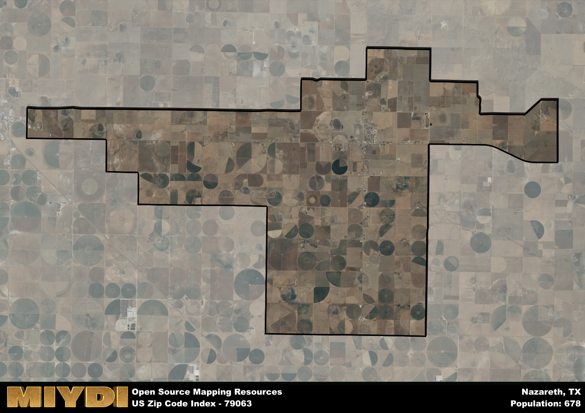

**Area Name:** Nazareth

**Zip Code:** 79063

**State:** TX

# Nazareth, TX 79063: A Tight-Knit Community Rich in History and Tradition

Located in the heart of the Texas Panhandle, the zip code 79063 corresponds to the small town of Nazareth. Surrounded by vast stretches of farmland, this tight-knit community is situated within Castro County and is approximately 25 miles southeast of the city of Hereford. Despite its rural setting, Nazareth is an integral part of the larger metropolitan area, contributing to the agricultural economy of the region and serving as a hub for local farmers and residents.

Nazareth has a rich historical narrative that dates back to its founding by German Catholic settlers in the late 19th century. The town was named after the biblical city in Israel and has maintained its strong religious and cultural heritage throughout the years. Over time, Nazareth has grown into a close-knit community known for its strong sense of tradition, annual events such as the German Festival, and its dedication to preserving its unique identity in the face of modernization.

Today, Nazareth remains a thriving rural community with a focus on agriculture and small businesses. The town boasts a variety of services for its residents, including a post office, schools, and local shops. Residents and visitors alike can enjoy recreational amenities such as parks and sports facilities, as well as explore the town's historic sites like the Sacred Heart Catholic Church. With its strong sense of community and commitment to preserving its heritage, Nazareth continues to be a distinctive and vibrant part of the Texas Panhandle.

# Nazareth Demographics

The population of Nazareth is 678.  
Nazareth has a population density of 10.24 per square mile.  
The area of Nazareth is 66.24 square miles.  

## Nazareth Income and Economic Data

These demographic numbers are sourced from IRS return data, providing comprehensive insights into the population dynamics and economic trends within Nazareth.

**Breakdown of return types for Nazareth**

The table offers insight into the composition of tax returns filed with the IRS, categorizing them into three main types. Single returns represent filings by individuals, joint returns by married couples, and head of household returns by individuals who qualify as heads of households, typically having dependents. This breakdown provides an understanding of the different filing statuses adopted by taxpayers when submitting their tax documentation.

| Return Types filed for Nazareth                              | Percentage          |
|----------------------------------------------------------|---------------------|
| Single Returns                                            | 0.4 |
| Joint Returns                                             | 0.54 |
| Head Household Returns                                    | 0 |

The income and economic data presented here is sourced from the IRS income brackets, utilized for categorizing tax returns by income levels. This table displays income ranges for both single filers and married couples, along with the corresponding number of returns and the percentage within each bracket, providing valuable insight into the distribution of taxes across various income groups.

| Bracket Name       | Single Filer Income Range | Married Couple Range | Number of Returns | Percentage of Returns |
|--------------------|----------------------------|----------------------|-------------------|-----------------------|
| 10% Bracket        | Up to $10,275              | Up to $20,550        | 100 | 0.29% |
| 12% Bracket        | $10,276 - $41,775          | $20,551 - $83,550    | 80 | 0.23% |
| 22% Bracket        | $41,776 - $89,075          | $83,551 - $178,150   | 50 | 0.14% |
| 24% Bracket        | $89,076 - $170,050         | $178,151 - $340,100  | 30 | 0.09% |
| 32% Bracket        | $170,051 - $215,950        | $340,101 - $431,900  | 60 | 0.17% |
| 35% Bracket        | $215,951 - $539,900        | $431,901 - $647,850  | 30 | 0.09% |

### Exploring Taxpayer Diversity: A Breakdown of Different Types of Tax Returns in Nazareth

The table offers insights into various types of tax returns filed, reflecting different aspects of taxpayer activities and demographics. Categories include charitable returns for donations, dependent returns for claimed dependents, educator population, elderly population, real estate returns, self-employment returns, student loan returns, and unemployment returns, providing valuable insights into taxpayer behavior and demographics.

| Nazareth Filing Types                    | Count | Percentage |
|--------------------------------------|-------|------------|
| Charitable Donations                 | 0 | 0% |
| Dependents Claimed                   | 0 | 0% |
| Educator Residents                   | 0 | 0% |
| Elderly Population                   | 100 | 0.29% |
| Farming Population                   | 110 | 0.314% |
| Real Estate Transactions             | 0 | 0% |
| Self-Employed Individuals            | 100 | 0.286% |
| Student Loan Cases                   | 0 | 0% |
| Unemployment Benefit Filings         | 0 | 0% |

## Nazareth AI and Census Variables

The values presented in this dataset for Nazareth are AI-optimized, streamlined, and categorized into relevant buckets for enhanced utility in AI and mapping programs. These simplified values have been optimized to facilitate efficient analysis and integration into various technological applications, offering users accessible and actionable insights into demographics within the Nazareth area.

| AI Variables for Nazareth | Value |
|-------------|-------|
| Shape Area | 253348135.582031 |
| Shape Length | 103693.440935812 |

## How to use this free AI optimized Geo-Spatial Data for Nazareth, TX

This data is made freely available under the Creative Commons license, allowing for unrestricted use for any purpose. Users can access static resources directly from GitHub or leverage more advanced functionalities by utilizing the GeoJSON files. All datasets originate from official government or private sector sources and are meticulously compiled into relevant datasets within QGIS. However, the versatility of the data ensures compatibility with any mapping application.

## Data Accuracy Disclaimer
It's important to note that the data provided here may contain errors or discrepancies and should be considered as 'close enough' for business applications and AI rather than a definitive source of truth. This data is aggregated from multiple sources, some of which publish information on wildly different intervals, leading to potential inconsistencies. Additionally, certain data points may not be corrected for Covid-related changes, further impacting accuracy. Moreover, the assumption that demographic trends are consistent throughout a region may lead to discrepancies, as trends often concentrate in areas of highest population density. As a result, dense areas may be slightly underrepresented, while rural areas may be slightly overrepresented, resulting in a more conservative dataset. Furthermore, the focus primarily on areas within US Major and Minor Statistical areas means that approximately 40 million Americans living outside of these areas may not be fully represented. Lastly, the historical background and area descriptions generated using AI are susceptible to potential mistakes, so users should exercise caution when interpreting the information provided.
