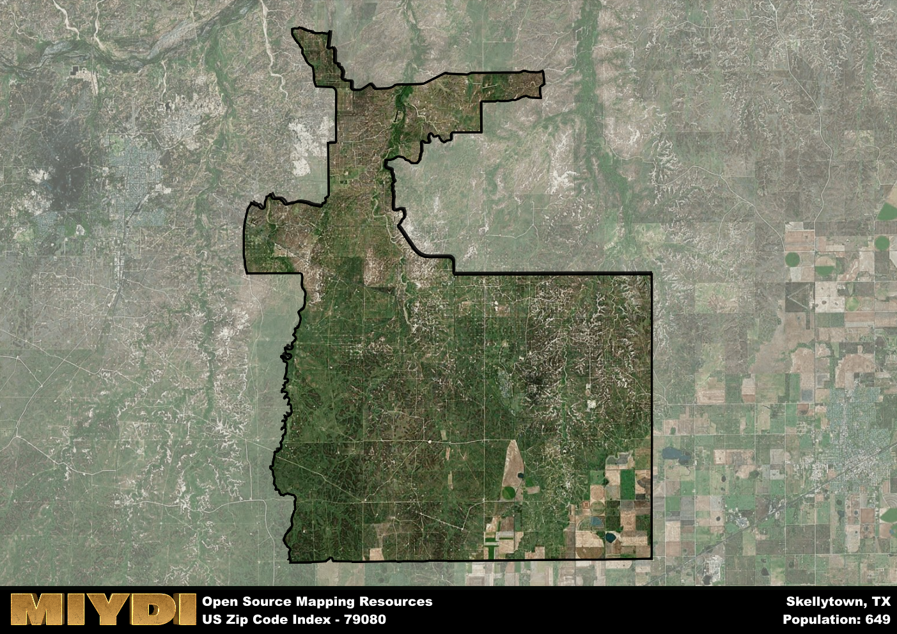

**Area Name:** Skellytown

**Zip Code:** 79080

**State:** TX

Skellytown is a part of the Amarillo - TX Metro Area, and makes up  of the Metro's population.  

# Skellytown: A Snapshot of a Small Town in Texas  
Skellytown, located within the 79080 zip code, is a small town in Texas situated in Carson County. Bordered by the cities of Borger and Stinnett, Skellytown is part of the larger metropolitan area of Amarillo. Despite its small size, Skellytown plays a vital role in the region as a residential community for those working in nearby industries.

The history of Skellytown dates back to the early 1920s when it was founded as a company town by Skelly Oil Company. Initially established to support the oil industry, the town grew rapidly as more workers and their families settled in the area. Named after the oil company, Skellytown has retained its unique identity and close-knit community feel through the years.

Today, Skellytown continues to be a charming residential area with a focus on community and family. The town offers essential services such as local shops, schools, and parks for residents to enjoy. With its proximity to the oil industry, many residents work in related fields, contributing to the town's economy. Skellytown also boasts a rich history, with historic sites and landmarks that showcase its past as a company town.

# Skellytown Demographics

The population of Skellytown is 649.  
Skellytown has a population density of 4.42 per square mile.  
The area of Skellytown is 146.74 square miles.  

## Skellytown Income and Economic Data

These demographic numbers are sourced from IRS return data, providing comprehensive insights into the population dynamics and economic trends within Skellytown.

**Breakdown of return types for Skellytown**

The table offers insight into the composition of tax returns filed with the IRS, categorizing them into three main types. Single returns represent filings by individuals, joint returns by married couples, and head of household returns by individuals who qualify as heads of households, typically having dependents. This breakdown provides an understanding of the different filing statuses adopted by taxpayers when submitting their tax documentation.

| Return Types filed for Skellytown                              | Percentage          |
|----------------------------------------------------------|---------------------|
| Single Returns                                            | 0.48 |
| Joint Returns                                             | 0.43 |
| Head Household Returns                                    | 0.14 |

The income and economic data presented here is sourced from the IRS income brackets, utilized for categorizing tax returns by income levels. This table displays income ranges for both single filers and married couples, along with the corresponding number of returns and the percentage within each bracket, providing valuable insight into the distribution of taxes across various income groups.

| Bracket Name       | Single Filer Income Range | Married Couple Range | Number of Returns | Percentage of Returns |
|--------------------|----------------------------|----------------------|-------------------|-----------------------|
| 10% Bracket        | Up to $10,275              | Up to $20,550        | 70 | 0.33% |
| 12% Bracket        | $10,276 - $41,775          | $20,551 - $83,550    | 50 | 0.24% |
| 22% Bracket        | $41,776 - $89,075          | $83,551 - $178,150   | 40 | 0.19% |
| 24% Bracket        | $89,076 - $170,050         | $178,151 - $340,100  | 20 | 0.1% |
| 32% Bracket        | $170,051 - $215,950        | $340,101 - $431,900  | 30 | 0.14% |
| 35% Bracket        | $215,951 - $539,900        | $431,901 - $647,850  | 0 | 0% |

### Exploring Taxpayer Diversity: A Breakdown of Different Types of Tax Returns in Skellytown

The table offers insights into various types of tax returns filed, reflecting different aspects of taxpayer activities and demographics. Categories include charitable returns for donations, dependent returns for claimed dependents, educator population, elderly population, real estate returns, self-employment returns, student loan returns, and unemployment returns, providing valuable insights into taxpayer behavior and demographics.

| Skellytown Filing Types                    | Count | Percentage |
|--------------------------------------|-------|------------|
| Charitable Donations                 | 0 | 0% |
| Dependents Claimed                   | 0 | 0% |
| Educator Residents                   | 0 | 0% |
| Elderly Population                   | 80 | 0.38% |
| Farming Population                   | 0 | 0% |
| Real Estate Transactions             | 0 | 0% |
| Self-Employed Individuals            | 0 | 0% |
| Student Loan Cases                   | 0 | 0% |
| Unemployment Benefit Filings         | 20 | 0.1% |

## Skellytown AI and Census Variables

The values presented in this dataset for Skellytown are AI-optimized, streamlined, and categorized into relevant buckets for enhanced utility in AI and mapping programs. These simplified values have been optimized to facilitate efficient analysis and integration into various technological applications, offering users accessible and actionable insights into demographics within the Skellytown area.

| AI Variables for Skellytown | Value |
|-------------|-------|
| Shape Area | 575863910.066406 |
| Shape Length | 161856.214815811 |
| CBSA Federal Processing Standard Code | 11100 |

## How to use this free AI optimized Geo-Spatial Data for Skellytown, TX

This data is made freely available under the Creative Commons license, allowing for unrestricted use for any purpose. Users can access static resources directly from GitHub or leverage more advanced functionalities by utilizing the GeoJSON files. All datasets originate from official government or private sector sources and are meticulously compiled into relevant datasets within QGIS. However, the versatility of the data ensures compatibility with any mapping application.

## Data Accuracy Disclaimer
It's important to note that the data provided here may contain errors or discrepancies and should be considered as 'close enough' for business applications and AI rather than a definitive source of truth. This data is aggregated from multiple sources, some of which publish information on wildly different intervals, leading to potential inconsistencies. Additionally, certain data points may not be corrected for Covid-related changes, further impacting accuracy. Moreover, the assumption that demographic trends are consistent throughout a region may lead to discrepancies, as trends often concentrate in areas of highest population density. As a result, dense areas may be slightly underrepresented, while rural areas may be slightly overrepresented, resulting in a more conservative dataset. Furthermore, the focus primarily on areas within US Major and Minor Statistical areas means that approximately 40 million Americans living outside of these areas may not be fully represented. Lastly, the historical background and area descriptions generated using AI are susceptible to potential mistakes, so users should exercise caution when interpreting the information provided.
