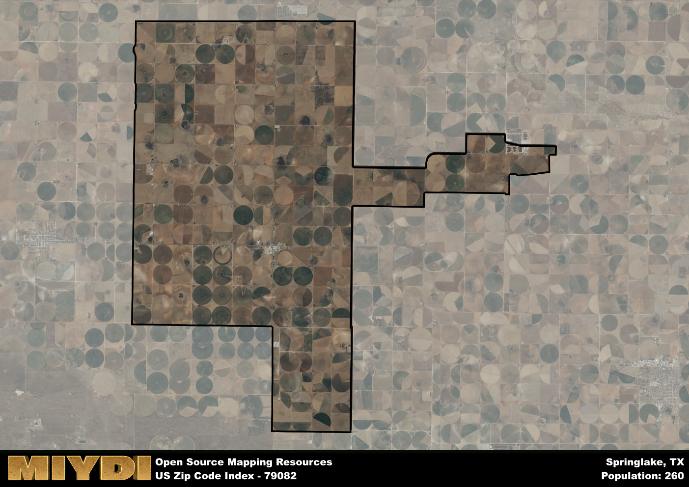

**Area Name:** Springlake

**Zip Code:** 79082

**State:** TX

# Springlake, TX - Zip Code 79082: A Charming Small Town Oasis in West Texas  

Located in the heart of the Texas Panhandle, zip code 79082 encompasses the small rural town of Springlake. Surrounded by vast stretches of farmland and ranches, Springlake is situated within Lamb County and is a part of the larger metropolitan area of Lubbock. Despite its proximity to the bustling city, Springlake maintains its small-town charm and sense of community, making it a peaceful retreat for residents seeking a slower pace of life.

Springlake has a rich history dating back to its founding in the early 20th century, when settlers were drawn to the area by its fertile soil and opportunities for agriculture. The town grew steadily over the years, becoming a hub for farming and ranching activities in the region. The name "Springlake" was inspired by a nearby natural spring that provided water for the early settlers, highlighting the town's reliance on the land and its resources for sustenance and growth.

Today, Springlake remains a close-knit community with a strong agricultural presence. The town is known for its wheat and cotton farming, which form the backbone of its economy. Residents enjoy a range of local services, including family-owned businesses, schools, and recreational facilities. Springlake is also home to several historic sites that showcase its past, such as the Springlake-Earth Museum, which preserves artifacts and stories from the town's early days. With its picturesque surroundings and friendly atmosphere, Springlake offers residents a peaceful and idyllic place to call home in the vast expanse of West Texas.

# Springlake Demographics

The population of Springlake is 260.  
Springlake has a population density of 4.97 per square mile.  
The area of Springlake is 52.36 square miles.  

## Springlake Income and Economic Data

These demographic numbers are sourced from IRS return data, providing comprehensive insights into the population dynamics and economic trends within Springlake.

**Breakdown of return types for Springlake**

The table offers insight into the composition of tax returns filed with the IRS, categorizing them into three main types. Single returns represent filings by individuals, joint returns by married couples, and head of household returns by individuals who qualify as heads of households, typically having dependents. This breakdown provides an understanding of the different filing statuses adopted by taxpayers when submitting their tax documentation.

| Return Types filed for Springlake                              | Percentage          |
|----------------------------------------------------------|---------------------|
| Single Returns                                            | 0.33 |
| Joint Returns                                             | 0.5 |
| Head Household Returns                                    | 0 |

The income and economic data presented here is sourced from the IRS income brackets, utilized for categorizing tax returns by income levels. This table displays income ranges for both single filers and married couples, along with the corresponding number of returns and the percentage within each bracket, providing valuable insight into the distribution of taxes across various income groups.

| Bracket Name       | Single Filer Income Range | Married Couple Range | Number of Returns | Percentage of Returns |
|--------------------|----------------------------|----------------------|-------------------|-----------------------|
| 10% Bracket        | Up to $10,275              | Up to $20,550        | 30 | 0.25% |
| 12% Bracket        | $10,276 - $41,775          | $20,551 - $83,550    | 30 | 0.25% |
| 22% Bracket        | $41,776 - $89,075          | $83,551 - $178,150   | 40 | 0.33% |
| 24% Bracket        | $89,076 - $170,050         | $178,151 - $340,100  | 0 | 0% |
| 32% Bracket        | $170,051 - $215,950        | $340,101 - $431,900  | 20 | 0.17% |
| 35% Bracket        | $215,951 - $539,900        | $431,901 - $647,850  | 0 | 0% |

### Exploring Taxpayer Diversity: A Breakdown of Different Types of Tax Returns in Springlake

The table offers insights into various types of tax returns filed, reflecting different aspects of taxpayer activities and demographics. Categories include charitable returns for donations, dependent returns for claimed dependents, educator population, elderly population, real estate returns, self-employment returns, student loan returns, and unemployment returns, providing valuable insights into taxpayer behavior and demographics.

| Springlake Filing Types                    | Count | Percentage |
|--------------------------------------|-------|------------|
| Charitable Donations                 | 0 | 0% |
| Dependents Claimed                   | 0 | 0% |
| Educator Residents                   | 0 | 0% |
| Elderly Population                   | 50 | 0.42% |
| Farming Population                   | 0 | 0% |
| Real Estate Transactions             | 0 | 0% |
| Self-Employed Individuals            | 0 | 0% |
| Student Loan Cases                   | 0 | 0% |
| Unemployment Benefit Filings         | 0 | 0% |

## Springlake AI and Census Variables

The values presented in this dataset for Springlake are AI-optimized, streamlined, and categorized into relevant buckets for enhanced utility in AI and mapping programs. These simplified values have been optimized to facilitate efficient analysis and integration into various technological applications, offering users accessible and actionable insights into demographics within the Springlake area.

| AI Variables for Springlake | Value |
|-------------|-------|
| Shape Area | 198956079.347656 |
| Shape Length | 84276.5749653515 |

## How to use this free AI optimized Geo-Spatial Data for Springlake, TX

This data is made freely available under the Creative Commons license, allowing for unrestricted use for any purpose. Users can access static resources directly from GitHub or leverage more advanced functionalities by utilizing the GeoJSON files. All datasets originate from official government or private sector sources and are meticulously compiled into relevant datasets within QGIS. However, the versatility of the data ensures compatibility with any mapping application.

## Data Accuracy Disclaimer
It's important to note that the data provided here may contain errors or discrepancies and should be considered as 'close enough' for business applications and AI rather than a definitive source of truth. This data is aggregated from multiple sources, some of which publish information on wildly different intervals, leading to potential inconsistencies. Additionally, certain data points may not be corrected for Covid-related changes, further impacting accuracy. Moreover, the assumption that demographic trends are consistent throughout a region may lead to discrepancies, as trends often concentrate in areas of highest population density. As a result, dense areas may be slightly underrepresented, while rural areas may be slightly overrepresented, resulting in a more conservative dataset. Furthermore, the focus primarily on areas within US Major and Minor Statistical areas means that approximately 40 million Americans living outside of these areas may not be fully represented. Lastly, the historical background and area descriptions generated using AI are susceptible to potential mistakes, so users should exercise caution when interpreting the information provided.
