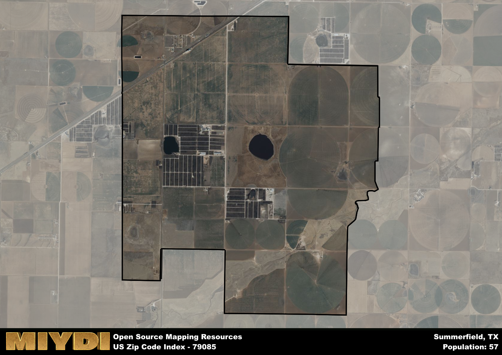

**Area Name:** Summerfield

**Zip Code:** 79085

**State:** TX

Summerfield is a part of the Hereford - TX Micro Area, and makes up  of the Metro's population.  

# Summerfield, TX - Zip Code 79085: A Charming Neighborhood in the Heart of West Texas  

Located in the heart of West Texas, Summerfield is a small neighborhood that falls within the zip code 79085. Bordered by vast expanses of farmland and rolling hills, Summerfield is just a short drive away from the bustling city of Amarillo. This close proximity allows residents to enjoy the tranquility of suburban life while still having access to the amenities and opportunities of a larger urban center.

Summerfield has a rich historical narrative, with its roots dating back to the early settlers who were drawn to the area for its fertile land and picturesque landscapes. Over the years, the neighborhood has evolved into a tight-knit community known for its friendly residents and strong sense of pride. The name "Summerfield" is said to have been inspired by the lush green fields that dominate the area during the summer months, creating a serene and peaceful environment for its inhabitants.

Today, Summerfield is a vibrant neighborhood that offers a mix of residential areas, local businesses, and recreational opportunities. The area is home to a diverse range of economic activities, from small family-owned shops to larger commercial enterprises. Residents can enjoy a variety of neighborhood-specific services, including parks, schools, and community centers. Additionally, Summerfield boasts several cultural and historic sites that showcase the area's unique heritage and character, making it a truly special place within the larger urban fabric of West Texas.

# Summerfield Demographics

The population of Summerfield is 57.  
Summerfield has a population density of 3.41 per square mile.  
The area of Summerfield is 16.73 square miles.  

## Summerfield AI and Census Variables

The values presented in this dataset for Summerfield are AI-optimized, streamlined, and categorized into relevant buckets for enhanced utility in AI and mapping programs. These simplified values have been optimized to facilitate efficient analysis and integration into various technological applications, offering users accessible and actionable insights into demographics within the Summerfield area.

| AI Variables for Summerfield | Value |
|-------------|-------|
| Shape Area | 64279761.15625 |
| Shape Length | 37351.5520518898 |
| CBSA Federal Processing Standard Code | 25820 |

## How to use this free AI optimized Geo-Spatial Data for Summerfield, TX

This data is made freely available under the Creative Commons license, allowing for unrestricted use for any purpose. Users can access static resources directly from GitHub or leverage more advanced functionalities by utilizing the GeoJSON files. All datasets originate from official government or private sector sources and are meticulously compiled into relevant datasets within QGIS. However, the versatility of the data ensures compatibility with any mapping application.

## Data Accuracy Disclaimer
It's important to note that the data provided here may contain errors or discrepancies and should be considered as 'close enough' for business applications and AI rather than a definitive source of truth. This data is aggregated from multiple sources, some of which publish information on wildly different intervals, leading to potential inconsistencies. Additionally, certain data points may not be corrected for Covid-related changes, further impacting accuracy. Moreover, the assumption that demographic trends are consistent throughout a region may lead to discrepancies, as trends often concentrate in areas of highest population density. As a result, dense areas may be slightly underrepresented, while rural areas may be slightly overrepresented, resulting in a more conservative dataset. Furthermore, the focus primarily on areas within US Major and Minor Statistical areas means that approximately 40 million Americans living outside of these areas may not be fully represented. Lastly, the historical background and area descriptions generated using AI are susceptible to potential mistakes, so users should exercise caution when interpreting the information provided.
