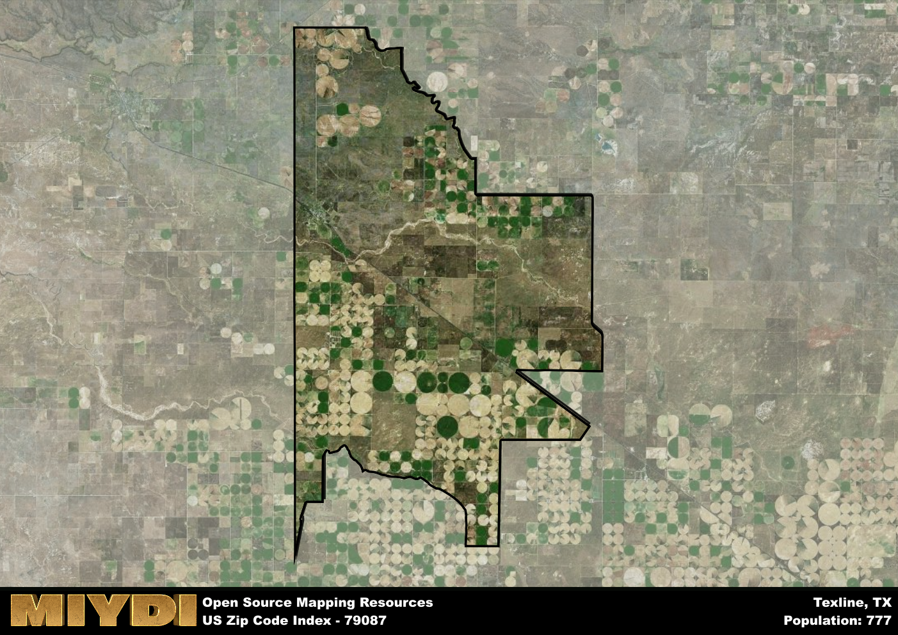

**Area Name:** Texline

**Zip Code:** 79087

**State:** TX

# Texline, TX 79087: A Small Town Gem on the Texas Panhandle  
Located in the northeastern corner of the Texas Panhandle, the zip code area 79087 encompasses the charming town of Texline. Bordered by the small communities of Dalhart to the northwest and Clayton, New Mexico to the east, Texline is situated amidst vast stretches of plains and farmland. Despite its rural setting, Texline is only a few hours' drive from major cities like Amarillo and Lubbock, allowing residents to enjoy the peace and tranquility of small-town life while still having access to urban amenities.

Established in the late 19th century as a stop along the railroad, Texline has a rich history tied to the expansion of the railroad industry in the region. The town experienced rapid growth during this time, attracting settlers looking to capitalize on the burgeoning transportation network. Over the years, Texline has maintained its small-town charm and close-knit community feel, with many residents tracing their roots back several generations. The name Texline is said to be a combination of "Texas" and "New Mexico," reflecting the town's unique position on the state border.

Today, Texline is a thriving community with a strong agricultural economy at its core. The town is known for its production of wheat, corn, and cattle, making agriculture a key industry in the area. Residents and visitors alike can enjoy a range of outdoor recreational activities, from hunting and fishing to hiking and camping. Texline also boasts a historic downtown area with local shops and restaurants, as well as cultural sites that offer a glimpse into the town's past. With its picturesque setting and friendly atmosphere, Texline remains a hidden gem in the Texas Panhandle.

# Texline Demographics

The population of Texline is 777.  
Texline has a population density of 3.47 per square mile.  
The area of Texline is 223.84 square miles.  

## Texline Income and Economic Data

These demographic numbers are sourced from IRS return data, providing comprehensive insights into the population dynamics and economic trends within Texline.

**Breakdown of return types for Texline**

The table offers insight into the composition of tax returns filed with the IRS, categorizing them into three main types. Single returns represent filings by individuals, joint returns by married couples, and head of household returns by individuals who qualify as heads of households, typically having dependents. This breakdown provides an understanding of the different filing statuses adopted by taxpayers when submitting their tax documentation.

| Return Types filed for Texline                              | Percentage          |
|----------------------------------------------------------|---------------------|
| Single Returns                                            | 0.48 |
| Joint Returns                                             | 0.45 |
| Head Household Returns                                    | 0.14 |

The income and economic data presented here is sourced from the IRS income brackets, utilized for categorizing tax returns by income levels. This table displays income ranges for both single filers and married couples, along with the corresponding number of returns and the percentage within each bracket, providing valuable insight into the distribution of taxes across various income groups.

| Bracket Name       | Single Filer Income Range | Married Couple Range | Number of Returns | Percentage of Returns |
|--------------------|----------------------------|----------------------|-------------------|-----------------------|
| 10% Bracket        | Up to $10,275              | Up to $20,550        | 80 | 0.28% |
| 12% Bracket        | $10,276 - $41,775          | $20,551 - $83,550    | 100 | 0.34% |
| 22% Bracket        | $41,776 - $89,075          | $83,551 - $178,150   | 50 | 0.17% |
| 24% Bracket        | $89,076 - $170,050         | $178,151 - $340,100  | 30 | 0.1% |
| 32% Bracket        | $170,051 - $215,950        | $340,101 - $431,900  | 30 | 0.1% |
| 35% Bracket        | $215,951 - $539,900        | $431,901 - $647,850  | 0 | 0% |

### Exploring Taxpayer Diversity: A Breakdown of Different Types of Tax Returns in Texline

The table offers insights into various types of tax returns filed, reflecting different aspects of taxpayer activities and demographics. Categories include charitable returns for donations, dependent returns for claimed dependents, educator population, elderly population, real estate returns, self-employment returns, student loan returns, and unemployment returns, providing valuable insights into taxpayer behavior and demographics.

| Texline Filing Types                    | Count | Percentage |
|--------------------------------------|-------|------------|
| Charitable Donations                 | 0 | 0% |
| Dependents Claimed                   | 0 | 0% |
| Educator Residents                   | 0 | 0% |
| Elderly Population                   | 70 | 0.24% |
| Farming Population                   | 40 | 0.138% |
| Real Estate Transactions             | 0 | 0% |
| Self-Employed Individuals            | 60 | 0.207% |
| Student Loan Cases                   | 0 | 0% |
| Unemployment Benefit Filings         | 0 | 0% |

## Texline AI and Census Variables

The values presented in this dataset for Texline are AI-optimized, streamlined, and categorized into relevant buckets for enhanced utility in AI and mapping programs. These simplified values have been optimized to facilitate efficient analysis and integration into various technological applications, offering users accessible and actionable insights into demographics within the Texline area.

| AI Variables for Texline | Value |
|-------------|-------|
| Shape Area | 894998118.214844 |
| Shape Length | 177694.684888916 |

## How to use this free AI optimized Geo-Spatial Data for Texline, TX

This data is made freely available under the Creative Commons license, allowing for unrestricted use for any purpose. Users can access static resources directly from GitHub or leverage more advanced functionalities by utilizing the GeoJSON files. All datasets originate from official government or private sector sources and are meticulously compiled into relevant datasets within QGIS. However, the versatility of the data ensures compatibility with any mapping application.

## Data Accuracy Disclaimer
It's important to note that the data provided here may contain errors or discrepancies and should be considered as 'close enough' for business applications and AI rather than a definitive source of truth. This data is aggregated from multiple sources, some of which publish information on wildly different intervals, leading to potential inconsistencies. Additionally, certain data points may not be corrected for Covid-related changes, further impacting accuracy. Moreover, the assumption that demographic trends are consistent throughout a region may lead to discrepancies, as trends often concentrate in areas of highest population density. As a result, dense areas may be slightly underrepresented, while rural areas may be slightly overrepresented, resulting in a more conservative dataset. Furthermore, the focus primarily on areas within US Major and Minor Statistical areas means that approximately 40 million Americans living outside of these areas may not be fully represented. Lastly, the historical background and area descriptions generated using AI are susceptible to potential mistakes, so users should exercise caution when interpreting the information provided.
