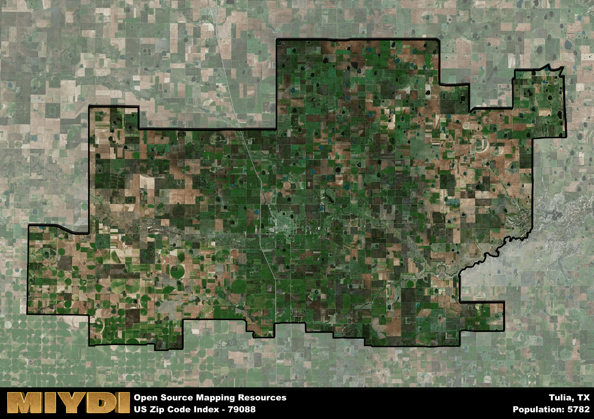

**Area Name:** Tulia

**Zip Code:** 79088

**State:** TX

# Tulia: A Charming Community in the Heart of the Texas Panhandle

Located in the heart of the Texas Panhandle, Tulia is a quaint and charming community that is represented by the zip code 79088. Situated in Swisher County, Tulia is surrounded by vast farmland and open spaces, making it an ideal location for those seeking a peaceful and rural lifestyle. The area is well-connected to nearby cities such as Amarillo and Lubbock, providing residents with easy access to urban amenities while still enjoying the tranquility of small-town living.

Tulia has a rich historical narrative that dates back to its founding in the late 19th century. Originally established as a cattle shipping point along the Fort Worth and Denver City Railway, Tulia quickly grew into a thriving community known for its agriculture and ranching industries. The town was officially incorporated in 1925 and has since become a hub for commerce and trade in the region. Tulia's name is believed to be derived from a Native American word meaning "watering place," reflecting the importance of water sources in the area's development.

Today, Tulia is a vibrant community with a strong agricultural economy and a close-knit population. The area is home to a variety of local businesses, including family-owned farms, shops, and restaurants. Residents and visitors alike can enjoy recreational activities such as fishing, hiking, and camping in the nearby Palo Duro Canyon State Park. Tulia also boasts several historic sites, including the Swisher County Museum, which showcases the area's rich cultural heritage. With its welcoming atmosphere and picturesque surroundings, Tulia continues to attract individuals and families looking to experience the charm of small-town Texas.

# Tulia Demographics

The population of Tulia is 5782.  
Tulia has a population density of 11.07 per square mile.  
The area of Tulia is 522.28 square miles.  

## Tulia Income and Economic Data

These demographic numbers are sourced from IRS return data, providing comprehensive insights into the population dynamics and economic trends within Tulia.

**Breakdown of return types for Tulia**

The table offers insight into the composition of tax returns filed with the IRS, categorizing them into three main types. Single returns represent filings by individuals, joint returns by married couples, and head of household returns by individuals who qualify as heads of households, typically having dependents. This breakdown provides an understanding of the different filing statuses adopted by taxpayers when submitting their tax documentation.

| Return Types filed for Tulia                              | Percentage          |
|----------------------------------------------------------|---------------------|
| Single Returns                                            | 0.43 |
| Joint Returns                                             | 0.37 |
| Head Household Returns                                    | 0.18 |

The income and economic data presented here is sourced from the IRS income brackets, utilized for categorizing tax returns by income levels. This table displays income ranges for both single filers and married couples, along with the corresponding number of returns and the percentage within each bracket, providing valuable insight into the distribution of taxes across various income groups.

| Bracket Name       | Single Filer Income Range | Married Couple Range | Number of Returns | Percentage of Returns |
|--------------------|----------------------------|----------------------|-------------------|-----------------------|
| 10% Bracket        | Up to $10,275              | Up to $20,550        | 830 | 0.41% |
| 12% Bracket        | $10,276 - $41,775          | $20,551 - $83,550    | 570 | 0.28% |
| 22% Bracket        | $41,776 - $89,075          | $83,551 - $178,150   | 270 | 0.13% |
| 24% Bracket        | $89,076 - $170,050         | $178,151 - $340,100  | 170 | 0.08% |
| 32% Bracket        | $170,051 - $215,950        | $340,101 - $431,900  | 160 | 0.08% |
| 35% Bracket        | $215,951 - $539,900        | $431,901 - $647,850  | 40 | 0.02% |

### Exploring Taxpayer Diversity: A Breakdown of Different Types of Tax Returns in Tulia

The table offers insights into various types of tax returns filed, reflecting different aspects of taxpayer activities and demographics. Categories include charitable returns for donations, dependent returns for claimed dependents, educator population, elderly population, real estate returns, self-employment returns, student loan returns, and unemployment returns, providing valuable insights into taxpayer behavior and demographics.

| Tulia Filing Types                    | Count | Percentage |
|--------------------------------------|-------|------------|
| Charitable Donations                 | 30 | 0.015% |
| Dependents Claimed                   | 30 | 0.015% |
| Educator Residents                   | 40 | 0.02% |
| Elderly Population                   | 560 | 0.27% |
| Farming Population                   | 180 | 0.088% |
| Real Estate Transactions             | 20 | 0.01% |
| Self-Employed Individuals            | 310 | 0.152% |
| Student Loan Cases                   | 80 | 0.039% |
| Unemployment Benefit Filings         | 140 | 0.07% |

## Tulia AI and Census Variables

The values presented in this dataset for Tulia are AI-optimized, streamlined, and categorized into relevant buckets for enhanced utility in AI and mapping programs. These simplified values have been optimized to facilitate efficient analysis and integration into various technological applications, offering users accessible and actionable insights into demographics within the Tulia area.

| AI Variables for Tulia | Value |
|-------------|-------|
| Shape Area | 1999132141.88672 |
| Shape Length | 268236.99166796 |

## How to use this free AI optimized Geo-Spatial Data for Tulia, TX

This data is made freely available under the Creative Commons license, allowing for unrestricted use for any purpose. Users can access static resources directly from GitHub or leverage more advanced functionalities by utilizing the GeoJSON files. All datasets originate from official government or private sector sources and are meticulously compiled into relevant datasets within QGIS. However, the versatility of the data ensures compatibility with any mapping application.

## Data Accuracy Disclaimer
It's important to note that the data provided here may contain errors or discrepancies and should be considered as 'close enough' for business applications and AI rather than a definitive source of truth. This data is aggregated from multiple sources, some of which publish information on wildly different intervals, leading to potential inconsistencies. Additionally, certain data points may not be corrected for Covid-related changes, further impacting accuracy. Moreover, the assumption that demographic trends are consistent throughout a region may lead to discrepancies, as trends often concentrate in areas of highest population density. As a result, dense areas may be slightly underrepresented, while rural areas may be slightly overrepresented, resulting in a more conservative dataset. Furthermore, the focus primarily on areas within US Major and Minor Statistical areas means that approximately 40 million Americans living outside of these areas may not be fully represented. Lastly, the historical background and area descriptions generated using AI are susceptible to potential mistakes, so users should exercise caution when interpreting the information provided.
