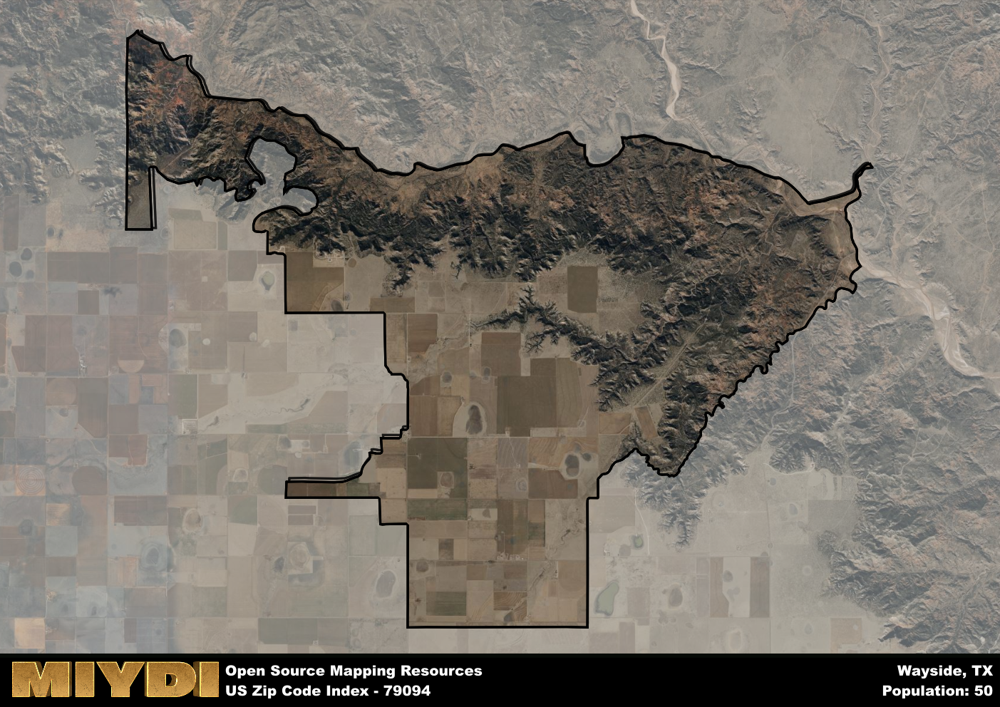

**Area Name:** Wayside

**Zip Code:** 79094

**State:** TX

Wayside is a part of the Amarillo - TX Metro Area, and makes up  of the Metro's population.  

# Charming Wayside, Texas: A Hidden Gem in the Panhandle  
Located in the northern region of the Texas Panhandle, zip code 79094 encompasses the delightful community of Wayside. Bordered by the towns of Canyon to the south and Happy to the north, Wayside seamlessly integrates with the rural landscape of the region, offering a peaceful retreat from the hustle and bustle of city life. Despite its small size, Wayside serves as a unique residential area within the larger metropolitan area, providing a close-knit community for its residents.

Established in the late 19th century, Wayside has a rich history rooted in agriculture and ranching. The area was originally settled by pioneers drawn to the fertile soil and abundant grazing land. Over the years, Wayside experienced steady growth as more families and businesses moved to the area. The community's name reflects its location as a wayside stop for travelers passing through the region, contributing to its warm and welcoming atmosphere.

Today, Wayside continues to thrive as a close community with a focus on agriculture and small businesses. Residents enjoy the peaceful surroundings and tight-knit neighborhood feel, with local services such as schools, churches, and community centers catering to their needs. Outdoor enthusiasts can explore the nearby Palo Duro Canyon State Park for hiking and camping opportunities, while history buffs can visit the Wayside Historical Museum to learn more about the area's heritage. Wayside truly stands out as a hidden gem in the Panhandle, offering a unique blend of rural charm and modern convenience.

# Wayside Demographics

The population of Wayside is 50.  
Wayside has a population density of 0.96 per square mile.  
The area of Wayside is 51.98 square miles.  

## Wayside AI and Census Variables

The values presented in this dataset for Wayside are AI-optimized, streamlined, and categorized into relevant buckets for enhanced utility in AI and mapping programs. These simplified values have been optimized to facilitate efficient analysis and integration into various technological applications, offering users accessible and actionable insights into demographics within the Wayside area.

| AI Variables for Wayside | Value |
|-------------|-------|
| Shape Area | 200245719.046875 |
| Shape Length | 109448.71016926 |
| CBSA Federal Processing Standard Code | 11100 |

## How to use this free AI optimized Geo-Spatial Data for Wayside, TX

This data is made freely available under the Creative Commons license, allowing for unrestricted use for any purpose. Users can access static resources directly from GitHub or leverage more advanced functionalities by utilizing the GeoJSON files. All datasets originate from official government or private sector sources and are meticulously compiled into relevant datasets within QGIS. However, the versatility of the data ensures compatibility with any mapping application.

## Data Accuracy Disclaimer
It's important to note that the data provided here may contain errors or discrepancies and should be considered as 'close enough' for business applications and AI rather than a definitive source of truth. This data is aggregated from multiple sources, some of which publish information on wildly different intervals, leading to potential inconsistencies. Additionally, certain data points may not be corrected for Covid-related changes, further impacting accuracy. Moreover, the assumption that demographic trends are consistent throughout a region may lead to discrepancies, as trends often concentrate in areas of highest population density. As a result, dense areas may be slightly underrepresented, while rural areas may be slightly overrepresented, resulting in a more conservative dataset. Furthermore, the focus primarily on areas within US Major and Minor Statistical areas means that approximately 40 million Americans living outside of these areas may not be fully represented. Lastly, the historical background and area descriptions generated using AI are susceptible to potential mistakes, so users should exercise caution when interpreting the information provided.
