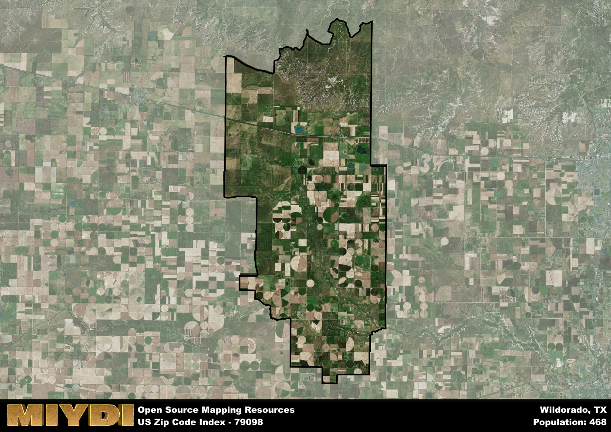

**Area Name:** Wildorado

**Zip Code:** 79098

**State:** TX

Wildorado is a part of the Hereford - TX Micro Area, and makes up  of the Metro's population.  

# Wildorado: A Quaint Community in the Texas Panhandle  

Located in the Texas Panhandle, Wildorado is a small unincorporated community encompassed by the zip code 79098. Situated about 25 miles west of Amarillo, Wildorado is surrounded by vast expanses of farmland and ranches. The area is easily accessible via Interstate 40, which runs through the region, connecting it to nearby towns and major transportation routes. Despite its rural setting, Wildorado is an integral part of the larger metropolitan area, serving as a peaceful retreat for residents seeking a slower pace of life.

Wildorado has a rich history dating back to the early 20th century when it was established as a railroad town along the Chicago, Rock Island and Gulf Railway. The community thrived as a hub for agricultural trade, attracting settlers looking to start a new life in the fertile plains of the Panhandle. Over the years, Wildorado has maintained its close-knit community spirit, with residents preserving its heritage through local events and historic landmarks. The name "Wildorado" is a combination of "wild" and "Colorado," reflecting the untamed beauty of the region and its ties to the nearby Colorado River.

Today, Wildorado remains a charming rural community with a strong sense of pride in its agricultural roots. The area is known for its thriving farming and ranching industries, with fields of crops stretching as far as the eye can see. Residents enjoy a close connection to the land, participating in local farmers' markets and community events that celebrate the region's bounty. In addition to its agricultural activities, Wildorado offers a range of recreational amenities, including parks, hiking trails, and fishing spots along nearby creeks. Visitors to the area can explore historic sites such as the Wildorado Cemetery, which pays tribute to the pioneers who shaped the community's history.

# Wildorado Demographics

The population of Wildorado is 468.  
Wildorado has a population density of 2.78 per square mile.  
The area of Wildorado is 168.24 square miles.  

## Wildorado Income and Economic Data

These demographic numbers are sourced from IRS return data, providing comprehensive insights into the population dynamics and economic trends within Wildorado.

**Breakdown of return types for Wildorado**

The table offers insight into the composition of tax returns filed with the IRS, categorizing them into three main types. Single returns represent filings by individuals, joint returns by married couples, and head of household returns by individuals who qualify as heads of households, typically having dependents. This breakdown provides an understanding of the different filing statuses adopted by taxpayers when submitting their tax documentation.

| Return Types filed for Wildorado                              | Percentage          |
|----------------------------------------------------------|---------------------|
| Single Returns                                            | 0.45 |
| Joint Returns                                             | 0.45 |
| Head Household Returns                                    | 0 |

The income and economic data presented here is sourced from the IRS income brackets, utilized for categorizing tax returns by income levels. This table displays income ranges for both single filers and married couples, along with the corresponding number of returns and the percentage within each bracket, providing valuable insight into the distribution of taxes across various income groups.

| Bracket Name       | Single Filer Income Range | Married Couple Range | Number of Returns | Percentage of Returns |
|--------------------|----------------------------|----------------------|-------------------|-----------------------|
| 10% Bracket        | Up to $10,275              | Up to $20,550        | 60 | 0.3% |
| 12% Bracket        | $10,276 - $41,775          | $20,551 - $83,550    | 50 | 0.25% |
| 22% Bracket        | $41,776 - $89,075          | $83,551 - $178,150   | 50 | 0.25% |
| 24% Bracket        | $89,076 - $170,050         | $178,151 - $340,100  | 0 | 0% |
| 32% Bracket        | $170,051 - $215,950        | $340,101 - $431,900  | 40 | 0.2% |
| 35% Bracket        | $215,951 - $539,900        | $431,901 - $647,850  | 0 | 0% |

### Exploring Taxpayer Diversity: A Breakdown of Different Types of Tax Returns in Wildorado

The table offers insights into various types of tax returns filed, reflecting different aspects of taxpayer activities and demographics. Categories include charitable returns for donations, dependent returns for claimed dependents, educator population, elderly population, real estate returns, self-employment returns, student loan returns, and unemployment returns, providing valuable insights into taxpayer behavior and demographics.

| Wildorado Filing Types                    | Count | Percentage |
|--------------------------------------|-------|------------|
| Charitable Donations                 | 0 | 0% |
| Dependents Claimed                   | 0 | 0% |
| Educator Residents                   | 0 | 0% |
| Elderly Population                   | 60 | 0.3% |
| Farming Population                   | 40 | 0.2% |
| Real Estate Transactions             | 0 | 0% |
| Self-Employed Individuals            | 50 | 0.25% |
| Student Loan Cases                   | 0 | 0% |
| Unemployment Benefit Filings         | 0 | 0% |

## Wildorado AI and Census Variables

The values presented in this dataset for Wildorado are AI-optimized, streamlined, and categorized into relevant buckets for enhanced utility in AI and mapping programs. These simplified values have been optimized to facilitate efficient analysis and integration into various technological applications, offering users accessible and actionable insights into demographics within the Wildorado area.

| AI Variables for Wildorado | Value |
|-------------|-------|
| Shape Area | 653329603.933594 |
| Shape Length | 142600.742926329 |
| CBSA Federal Processing Standard Code | 25820 |

## How to use this free AI optimized Geo-Spatial Data for Wildorado, TX

This data is made freely available under the Creative Commons license, allowing for unrestricted use for any purpose. Users can access static resources directly from GitHub or leverage more advanced functionalities by utilizing the GeoJSON files. All datasets originate from official government or private sector sources and are meticulously compiled into relevant datasets within QGIS. However, the versatility of the data ensures compatibility with any mapping application.

## Data Accuracy Disclaimer
It's important to note that the data provided here may contain errors or discrepancies and should be considered as 'close enough' for business applications and AI rather than a definitive source of truth. This data is aggregated from multiple sources, some of which publish information on wildly different intervals, leading to potential inconsistencies. Additionally, certain data points may not be corrected for Covid-related changes, further impacting accuracy. Moreover, the assumption that demographic trends are consistent throughout a region may lead to discrepancies, as trends often concentrate in areas of highest population density. As a result, dense areas may be slightly underrepresented, while rural areas may be slightly overrepresented, resulting in a more conservative dataset. Furthermore, the focus primarily on areas within US Major and Minor Statistical areas means that approximately 40 million Americans living outside of these areas may not be fully represented. Lastly, the historical background and area descriptions generated using AI are susceptible to potential mistakes, so users should exercise caution when interpreting the information provided.
