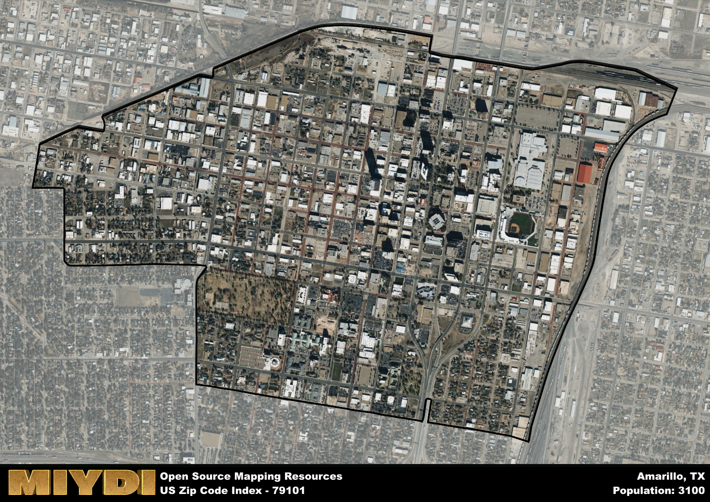

**Area Name:** Amarillo

**Zip Code:** 79101

**State:** TX

Amarillo is a part of the Amarillo - TX Metro Area, and makes up  of the Metro's population.  

# Historic Downtown Amarillo: Zip Code 79101  

Located in the heart of Amarillo, Texas, zip code 79101 encompasses the vibrant neighborhood of Historic Downtown Amarillo. Bordered by I-40 to the south and Hwy 287 to the north, this area seamlessly integrates with surrounding districts and serves as the cultural and economic hub of the city. As part of the larger metropolitan context, Historic Downtown Amarillo is a key player in Amarillo's urban fabric, offering a mix of historic architecture, modern amenities, and a bustling commercial center.

Historic Downtown Amarillo has a rich historical narrative dating back to its establishment in the late 19th century. Originally a stop on the Fort Worth and Denver City Railroad, the area quickly flourished as a trading post and transportation hub. Over the years, it has undergone various transformations, including the development of iconic buildings like the Amarillo National Bank Tower and the Santa Fe Building. The area's growth was fueled by its strategic location and diverse economy, solidifying its reputation as a thriving urban center.

Today, Historic Downtown Amarillo is a dynamic neighborhood offering a wide range of attractions and services. From boutique shops and art galleries to trendy restaurants and entertainment venues, the area caters to residents and visitors alike. The neighborhood is also home to historic landmarks such as the Paramount Theater and the Courthouse, adding to its cultural appeal. With a mix of residential and commercial spaces, Historic Downtown Amarillo continues to evolve while preserving its unique heritage and character.

# Amarillo Demographics

The population of Amarillo is 3100.  
Amarillo has a population density of 1962.03 per square mile.  
The area of Amarillo is 1.58 square miles.  

## Amarillo Income and Economic Data

These demographic numbers are sourced from IRS return data, providing comprehensive insights into the population dynamics and economic trends within Amarillo.

**Breakdown of return types for Amarillo**

The table offers insight into the composition of tax returns filed with the IRS, categorizing them into three main types. Single returns represent filings by individuals, joint returns by married couples, and head of household returns by individuals who qualify as heads of households, typically having dependents. This breakdown provides an understanding of the different filing statuses adopted by taxpayers when submitting their tax documentation.

| Return Types filed for Amarillo                              | Percentage          |
|----------------------------------------------------------|---------------------|
| Single Returns                                            | 0.65 |
| Joint Returns                                             | 0.2 |
| Head Household Returns                                    | 0.14 |

The income and economic data presented here is sourced from the IRS income brackets, utilized for categorizing tax returns by income levels. This table displays income ranges for both single filers and married couples, along with the corresponding number of returns and the percentage within each bracket, providing valuable insight into the distribution of taxes across various income groups.

| Bracket Name       | Single Filer Income Range | Married Couple Range | Number of Returns | Percentage of Returns |
|--------------------|----------------------------|----------------------|-------------------|-----------------------|
| 10% Bracket        | Up to $10,275              | Up to $20,550        | 520 | 0.5% |
| 12% Bracket        | $10,276 - $41,775          | $20,551 - $83,550    | 280 | 0.27% |
| 22% Bracket        | $41,776 - $89,075          | $83,551 - $178,150   | 100 | 0.1% |
| 24% Bracket        | $89,076 - $170,050         | $178,151 - $340,100  | 50 | 0.05% |
| 32% Bracket        | $170,051 - $215,950        | $340,101 - $431,900  | 50 | 0.05% |
| 35% Bracket        | $215,951 - $539,900        | $431,901 - $647,850  | 50 | 0.05% |

### Exploring Taxpayer Diversity: A Breakdown of Different Types of Tax Returns in Amarillo

The table offers insights into various types of tax returns filed, reflecting different aspects of taxpayer activities and demographics. Categories include charitable returns for donations, dependent returns for claimed dependents, educator population, elderly population, real estate returns, self-employment returns, student loan returns, and unemployment returns, providing valuable insights into taxpayer behavior and demographics.

| Amarillo Filing Types                    | Count | Percentage |
|--------------------------------------|-------|------------|
| Charitable Donations                 | 50 | 0.048% |
| Dependents Claimed                   | 0 | 0% |
| Educator Residents                   | 0 | 0% |
| Elderly Population                   | 360 | 0.34% |
| Farming Population                   | 0 | 0% |
| Real Estate Transactions             | 40 | 0.038% |
| Self-Employed Individuals            | 90 | 0.086% |
| Student Loan Cases                   | 0 | 0% |
| Unemployment Benefit Filings         | 110 | 0.1% |

## Amarillo AI and Census Variables

The values presented in this dataset for Amarillo are AI-optimized, streamlined, and categorized into relevant buckets for enhanced utility in AI and mapping programs. These simplified values have been optimized to facilitate efficient analysis and integration into various technological applications, offering users accessible and actionable insights into demographics within the Amarillo area.

| AI Variables for Amarillo | Value |
|-------------|-------|
| Shape Area | 6145513.10546875 |
| Shape Length | 11530.7601749144 |
| CBSA Federal Processing Standard Code | 11100 |

## How to use this free AI optimized Geo-Spatial Data for Amarillo, TX

This data is made freely available under the Creative Commons license, allowing for unrestricted use for any purpose. Users can access static resources directly from GitHub or leverage more advanced functionalities by utilizing the GeoJSON files. All datasets originate from official government or private sector sources and are meticulously compiled into relevant datasets within QGIS. However, the versatility of the data ensures compatibility with any mapping application.

## Data Accuracy Disclaimer
It's important to note that the data provided here may contain errors or discrepancies and should be considered as 'close enough' for business applications and AI rather than a definitive source of truth. This data is aggregated from multiple sources, some of which publish information on wildly different intervals, leading to potential inconsistencies. Additionally, certain data points may not be corrected for Covid-related changes, further impacting accuracy. Moreover, the assumption that demographic trends are consistent throughout a region may lead to discrepancies, as trends often concentrate in areas of highest population density. As a result, dense areas may be slightly underrepresented, while rural areas may be slightly overrepresented, resulting in a more conservative dataset. Furthermore, the focus primarily on areas within US Major and Minor Statistical areas means that approximately 40 million Americans living outside of these areas may not be fully represented. Lastly, the historical background and area descriptions generated using AI are susceptible to potential mistakes, so users should exercise caution when interpreting the information provided.
