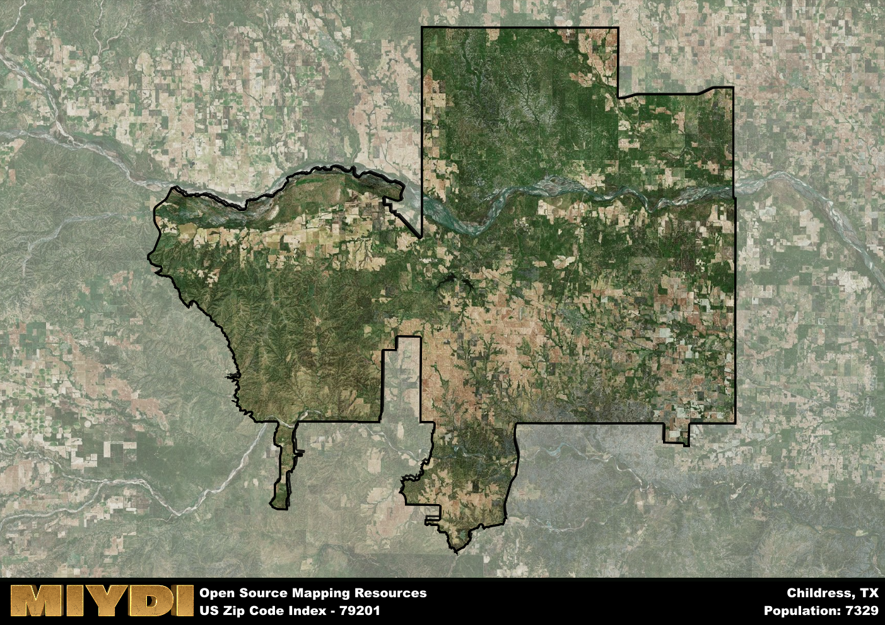

**Area Name:** Childress

**Zip Code:** 79201

**State:** TX

# Childress: A Historic Neighborhood in West Texas

Located in the heart of West Texas, zip code 79201 encompasses the charming neighborhood of Childress. Bordered by rural farmlands and the city of Amarillo to the west, Childress serves as a pivotal junction for travelers on Highway 287. This zip code area is an integral part of the larger Childress County, offering a mix of suburban and rural living experiences for its residents.

Childress has a rich historical narrative that dates back to its founding in the late 19th century. Originally established as a stop along the Fort Worth and Denver City Railway, the area quickly grew into a thriving community centered around agriculture and ranching. The neighborhood was named after George Childress, one of the signers of the Texas Declaration of Independence. Over the years, Childress has maintained its small-town charm while embracing modern developments and infrastructure.

Today, Childress continues to thrive as a vibrant community with a strong economy supported by agriculture, oil, and gas industries. Residents enjoy a variety of local businesses, restaurants, and community services that cater to their needs. The area also boasts recreational amenities such as parks, golf courses, and historical sites like the Childress County Heritage Museum, providing a unique blend of modern conveniences and historic charm in the heart of West Texas.

# Childress Demographics

The population of Childress is 7329.  
Childress has a population density of 7.17 per square mile.  
The area of Childress is 1022.74 square miles.  

## Childress Income and Economic Data

These demographic numbers are sourced from IRS return data, providing comprehensive insights into the population dynamics and economic trends within Childress.

**Breakdown of return types for Childress**

The table offers insight into the composition of tax returns filed with the IRS, categorizing them into three main types. Single returns represent filings by individuals, joint returns by married couples, and head of household returns by individuals who qualify as heads of households, typically having dependents. This breakdown provides an understanding of the different filing statuses adopted by taxpayers when submitting their tax documentation.

| Return Types filed for Childress                              | Percentage          |
|----------------------------------------------------------|---------------------|
| Single Returns                                            | 0.45 |
| Joint Returns                                             | 0.39 |
| Head Household Returns                                    | 0.15 |

The income and economic data presented here is sourced from the IRS income brackets, utilized for categorizing tax returns by income levels. This table displays income ranges for both single filers and married couples, along with the corresponding number of returns and the percentage within each bracket, providing valuable insight into the distribution of taxes across various income groups.

| Bracket Name       | Single Filer Income Range | Married Couple Range | Number of Returns | Percentage of Returns |
|--------------------|----------------------------|----------------------|-------------------|-----------------------|
| 10% Bracket        | Up to $10,275              | Up to $20,550        | 910 | 0.37% |
| 12% Bracket        | $10,276 - $41,775          | $20,551 - $83,550    | 640 | 0.26% |
| 22% Bracket        | $41,776 - $89,075          | $83,551 - $178,150   | 350 | 0.14% |
| 24% Bracket        | $89,076 - $170,050         | $178,151 - $340,100  | 230 | 0.09% |
| 32% Bracket        | $170,051 - $215,950        | $340,101 - $431,900  | 260 | 0.11% |
| 35% Bracket        | $215,951 - $539,900        | $431,901 - $647,850  | 50 | 0.02% |

### Exploring Taxpayer Diversity: A Breakdown of Different Types of Tax Returns in Childress

The table offers insights into various types of tax returns filed, reflecting different aspects of taxpayer activities and demographics. Categories include charitable returns for donations, dependent returns for claimed dependents, educator population, elderly population, real estate returns, self-employment returns, student loan returns, and unemployment returns, providing valuable insights into taxpayer behavior and demographics.

| Childress Filing Types                    | Count | Percentage |
|--------------------------------------|-------|------------|
| Charitable Donations                 | 50 | 0.02% |
| Dependents Claimed                   | 50 | 0.02% |
| Educator Residents                   | 40 | 0.016% |
| Elderly Population                   | 680 | 0.28% |
| Farming Population                   | 210 | 0.086% |
| Real Estate Transactions             | 40 | 0.016% |
| Self-Employed Individuals            | 330 | 0.135% |
| Student Loan Cases                   | 90 | 0.037% |
| Unemployment Benefit Filings         | 180 | 0.07% |

## Childress AI and Census Variables

The values presented in this dataset for Childress are AI-optimized, streamlined, and categorized into relevant buckets for enhanced utility in AI and mapping programs. These simplified values have been optimized to facilitate efficient analysis and integration into various technological applications, offering users accessible and actionable insights into demographics within the Childress area.

| AI Variables for Childress | Value |
|-------------|-------|
| Shape Area | 3908084590.18359 |
| Shape Length | 444043.293844417 |

## How to use this free AI optimized Geo-Spatial Data for Childress, TX

This data is made freely available under the Creative Commons license, allowing for unrestricted use for any purpose. Users can access static resources directly from GitHub or leverage more advanced functionalities by utilizing the GeoJSON files. All datasets originate from official government or private sector sources and are meticulously compiled into relevant datasets within QGIS. However, the versatility of the data ensures compatibility with any mapping application.

## Data Accuracy Disclaimer
It's important to note that the data provided here may contain errors or discrepancies and should be considered as 'close enough' for business applications and AI rather than a definitive source of truth. This data is aggregated from multiple sources, some of which publish information on wildly different intervals, leading to potential inconsistencies. Additionally, certain data points may not be corrected for Covid-related changes, further impacting accuracy. Moreover, the assumption that demographic trends are consistent throughout a region may lead to discrepancies, as trends often concentrate in areas of highest population density. As a result, dense areas may be slightly underrepresented, while rural areas may be slightly overrepresented, resulting in a more conservative dataset. Furthermore, the focus primarily on areas within US Major and Minor Statistical areas means that approximately 40 million Americans living outside of these areas may not be fully represented. Lastly, the historical background and area descriptions generated using AI are susceptible to potential mistakes, so users should exercise caution when interpreting the information provided.
