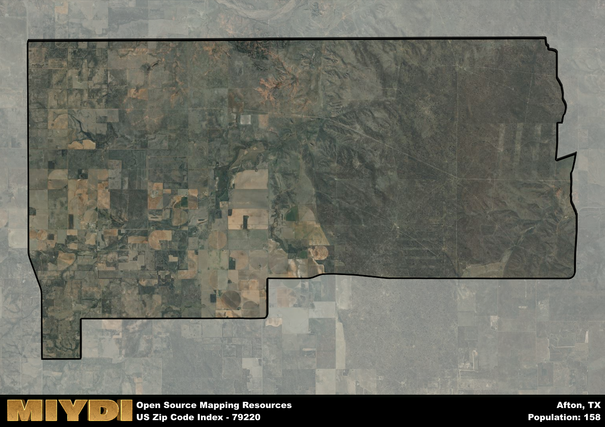

**Area Name:** Afton

**Zip Code:** 79220

**State:** TX

# Afton: A Charming Community in West Texas  

Located in West Texas, the zip code 79220 corresponds to the charming community of Afton. Situated within the larger metropolitan context of Dickens County, Afton is a small but vibrant neighborhood. It is surrounded by vast prairies and agricultural lands, with the closest major city being Lubbock, approximately 70 miles to the northeast. Afton serves as a peaceful retreat from the hustle and bustle of urban life, offering residents a close-knit community atmosphere.  

Afton has a rich historical narrative that dates back to its founding in the late 19th century. Originally established as a farming and ranching community, Afton saw significant growth with the arrival of the railroad in the early 1900s. The area's economy flourished, attracting settlers looking for new opportunities in the expanding West Texas region. Over the years, Afton has maintained its rural character while embracing modern developments, making it a unique blend of old-world charm and contemporary conveniences.  

Today, Afton is a thriving community that prides itself on its strong agricultural heritage. The area is known for its fertile soil, which supports a variety of crops and livestock. Residents enjoy a range of neighborhood-specific services, including locally-owned businesses, schools, and churches. Afton also offers recreational amenities such as parks and community centers, where families can gather for events and celebrations. Visitors to the area can explore historic sites that highlight Afton's past, providing a glimpse into the community's enduring legacy.

# Afton Demographics

The population of Afton is 158.  
Afton has a population density of 1.82 per square mile.  
The area of Afton is 86.97 square miles.  

## Afton AI and Census Variables

The values presented in this dataset for Afton are AI-optimized, streamlined, and categorized into relevant buckets for enhanced utility in AI and mapping programs. These simplified values have been optimized to facilitate efficient analysis and integration into various technological applications, offering users accessible and actionable insights into demographics within the Afton area.

| AI Variables for Afton | Value |
|-------------|-------|
| Shape Area | 326951862.503906 |
| Shape Length | 83911.0486628478 |

## How to use this free AI optimized Geo-Spatial Data for Afton, TX

This data is made freely available under the Creative Commons license, allowing for unrestricted use for any purpose. Users can access static resources directly from GitHub or leverage more advanced functionalities by utilizing the GeoJSON files. All datasets originate from official government or private sector sources and are meticulously compiled into relevant datasets within QGIS. However, the versatility of the data ensures compatibility with any mapping application.

## Data Accuracy Disclaimer
It's important to note that the data provided here may contain errors or discrepancies and should be considered as 'close enough' for business applications and AI rather than a definitive source of truth. This data is aggregated from multiple sources, some of which publish information on wildly different intervals, leading to potential inconsistencies. Additionally, certain data points may not be corrected for Covid-related changes, further impacting accuracy. Moreover, the assumption that demographic trends are consistent throughout a region may lead to discrepancies, as trends often concentrate in areas of highest population density. As a result, dense areas may be slightly underrepresented, while rural areas may be slightly overrepresented, resulting in a more conservative dataset. Furthermore, the focus primarily on areas within US Major and Minor Statistical areas means that approximately 40 million Americans living outside of these areas may not be fully represented. Lastly, the historical background and area descriptions generated using AI are susceptible to potential mistakes, so users should exercise caution when interpreting the information provided.
