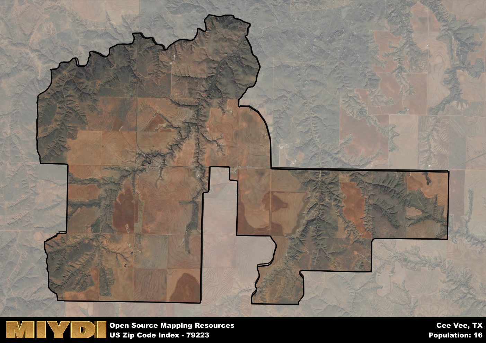

**Area Name:** Cee Vee

**Zip Code:** 79223

**State:** TX

# Cee Vee: A Historic and Vibrant Community in Zip Code 79223  

Located in the northern part of Texas, zip code 79223 encompasses the small but vibrant community of Cee Vee. Bounded by rolling hills and sprawling farmland, Cee Vee is situated within close proximity to larger cities such as Amarillo and Lubbock. This area serves as a peaceful retreat from the bustling urban centers, offering residents a tranquil setting to call home while still being connected to the region's major population hubs.

Cee Vee has a rich historical narrative that dates back to the early 20th century when the community was established as a farming and ranching settlement. Over the years, Cee Vee has evolved into a close-knit community known for its agricultural heritage and strong sense of community pride. The name "Cee Vee" is said to have originated from the initials of the area's two founders, Charles Vernon and Vinson.

Today, Cee Vee continues to thrive as a tight-knit rural community with a focus on agriculture and ranching. The area boasts a variety of local businesses, including family-owned farms and ranches, providing residents with fresh produce and locally sourced goods. In addition to its agricultural roots, Cee Vee offers residents access to recreational amenities such as parks, hiking trails, and community events that celebrate the area's unique history and culture. With its charming small-town atmosphere and strong community spirit, Cee Vee remains a hidden gem within the larger urban fabric of northern Texas.

# Cee Vee Demographics

The population of Cee Vee is 16.  
Cee Vee has a population density of 1.12 per square mile.  
The area of Cee Vee is 14.34 square miles.  

## Cee Vee AI and Census Variables

The values presented in this dataset for Cee Vee are AI-optimized, streamlined, and categorized into relevant buckets for enhanced utility in AI and mapping programs. These simplified values have been optimized to facilitate efficient analysis and integration into various technological applications, offering users accessible and actionable insights into demographics within the Cee Vee area.

| AI Variables for Cee Vee | Value |
|-------------|-------|
| Shape Area | 54465047.7226563 |
| Shape Length | 50205.3170535689 |

## How to use this free AI optimized Geo-Spatial Data for Cee Vee, TX

This data is made freely available under the Creative Commons license, allowing for unrestricted use for any purpose. Users can access static resources directly from GitHub or leverage more advanced functionalities by utilizing the GeoJSON files. All datasets originate from official government or private sector sources and are meticulously compiled into relevant datasets within QGIS. However, the versatility of the data ensures compatibility with any mapping application.

## Data Accuracy Disclaimer
It's important to note that the data provided here may contain errors or discrepancies and should be considered as 'close enough' for business applications and AI rather than a definitive source of truth. This data is aggregated from multiple sources, some of which publish information on wildly different intervals, leading to potential inconsistencies. Additionally, certain data points may not be corrected for Covid-related changes, further impacting accuracy. Moreover, the assumption that demographic trends are consistent throughout a region may lead to discrepancies, as trends often concentrate in areas of highest population density. As a result, dense areas may be slightly underrepresented, while rural areas may be slightly overrepresented, resulting in a more conservative dataset. Furthermore, the focus primarily on areas within US Major and Minor Statistical areas means that approximately 40 million Americans living outside of these areas may not be fully represented. Lastly, the historical background and area descriptions generated using AI are susceptible to potential mistakes, so users should exercise caution when interpreting the information provided.
