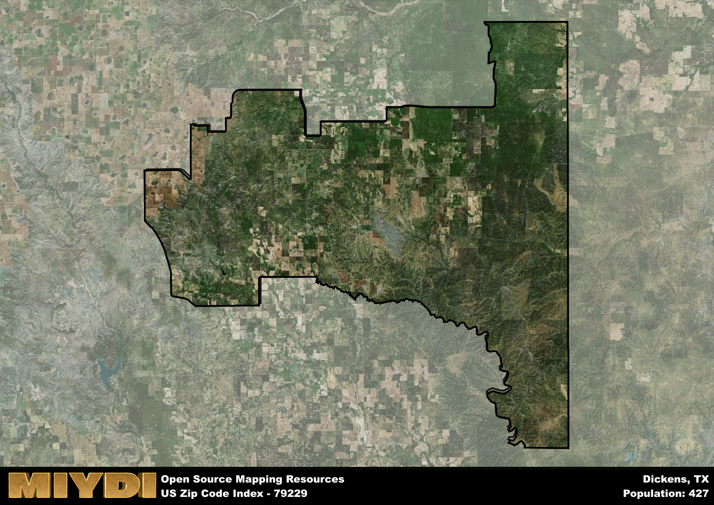

**Area Name:** Dickens

**Zip Code:** 79229

**State:** TX

Dickens is a part of the Lubbock - TX Metro Area, and makes up  of the Metro's population.  

# Discover the Charming Community of Dickens in Zip Code 79229

Located in the heart of Dickens County, the zip code 79229 area encompasses the quaint community of Dickens. Bordered by rolling plains and open skies, this area is situated about 80 miles east of Lubbock and 90 miles north of Abilene. Dickens serves as a central hub for local ranching and agriculture, with easy access to nearby towns such as Spur and Guthrie. Despite its rural setting, Dickens maintains strong ties to the surrounding metropolitan areas, providing a peaceful retreat for residents while still offering essential services and connections to larger urban centers.

Founded in the late 19th century, Dickens has a rich history rooted in the cattle and farming industries that have sustained the community for generations. Named after J. Dickens, an early settler in the region, the area grew steadily as pioneers moved westward in search of fertile land and new opportunities. Over the years, Dickens has weathered economic fluctuations and natural disasters, but its resilient spirit and close-knit community have kept its heritage alive. Today, visitors can explore historic landmarks such as the Dickens County Courthouse and learn about the area's pioneering past at local museums and heritage sites.

Presently, Dickens in zip code 79229 offers a blend of small-town charm and modern conveniences. Local businesses cater to residents' needs, from family-owned shops to cozy cafes serving up homemade comfort food. Outdoor enthusiasts can enjoy the area's natural beauty through hiking trails, fishing spots, and camping grounds, while community events and festivals showcase the vibrant culture and artistic talents of the area. Dickens remains a hidden gem in West Texas, where visitors can experience the warmth of rural hospitality and the beauty of wide-open spaces, all within reach of the bustling urban centers nearby.

# Dickens Demographics

The population of Dickens is 427.  
Dickens has a population density of 0.91 per square mile.  
The area of Dickens is 471.24 square miles.  

## Dickens Income and Economic Data

These demographic numbers are sourced from IRS return data, providing comprehensive insights into the population dynamics and economic trends within Dickens.

**Breakdown of return types for Dickens**

The table offers insight into the composition of tax returns filed with the IRS, categorizing them into three main types. Single returns represent filings by individuals, joint returns by married couples, and head of household returns by individuals who qualify as heads of households, typically having dependents. This breakdown provides an understanding of the different filing statuses adopted by taxpayers when submitting their tax documentation.

| Return Types filed for Dickens                              | Percentage          |
|----------------------------------------------------------|---------------------|
| Single Returns                                            | 0.38 |
| Joint Returns                                             | 0.54 |
| Head Household Returns                                    | 0 |

The income and economic data presented here is sourced from the IRS income brackets, utilized for categorizing tax returns by income levels. This table displays income ranges for both single filers and married couples, along with the corresponding number of returns and the percentage within each bracket, providing valuable insight into the distribution of taxes across various income groups.

| Bracket Name       | Single Filer Income Range | Married Couple Range | Number of Returns | Percentage of Returns |
|--------------------|----------------------------|----------------------|-------------------|-----------------------|
| 10% Bracket        | Up to $10,275              | Up to $20,550        | 40 | 0.31% |
| 12% Bracket        | $10,276 - $41,775          | $20,551 - $83,550    | 30 | 0.23% |
| 22% Bracket        | $41,776 - $89,075          | $83,551 - $178,150   | 20 | 0.15% |
| 24% Bracket        | $89,076 - $170,050         | $178,151 - $340,100  | 40 | 0.31% |
| 32% Bracket        | $170,051 - $215,950        | $340,101 - $431,900  | 0 | 0% |
| 35% Bracket        | $215,951 - $539,900        | $431,901 - $647,850  | 0 | 0% |

### Exploring Taxpayer Diversity: A Breakdown of Different Types of Tax Returns in Dickens

The table offers insights into various types of tax returns filed, reflecting different aspects of taxpayer activities and demographics. Categories include charitable returns for donations, dependent returns for claimed dependents, educator population, elderly population, real estate returns, self-employment returns, student loan returns, and unemployment returns, providing valuable insights into taxpayer behavior and demographics.

| Dickens Filing Types                    | Count | Percentage |
|--------------------------------------|-------|------------|
| Charitable Donations                 | 0 | 0% |
| Dependents Claimed                   | 0 | 0% |
| Educator Residents                   | 0 | 0% |
| Elderly Population                   | 60 | 0.46% |
| Farming Population                   | 30 | 0.231% |
| Real Estate Transactions             | 0 | 0% |
| Self-Employed Individuals            | 20 | 0.154% |
| Student Loan Cases                   | 0 | 0% |
| Unemployment Benefit Filings         | 0 | 0% |

## Dickens AI and Census Variables

The values presented in this dataset for Dickens are AI-optimized, streamlined, and categorized into relevant buckets for enhanced utility in AI and mapping programs. These simplified values have been optimized to facilitate efficient analysis and integration into various technological applications, offering users accessible and actionable insights into demographics within the Dickens area.

| AI Variables for Dickens | Value |
|-------------|-------|
| Shape Area | 1765426133.35938 |
| Shape Length | 271118.963949617 |
| CBSA Federal Processing Standard Code | 31180 |

## How to use this free AI optimized Geo-Spatial Data for Dickens, TX

This data is made freely available under the Creative Commons license, allowing for unrestricted use for any purpose. Users can access static resources directly from GitHub or leverage more advanced functionalities by utilizing the GeoJSON files. All datasets originate from official government or private sector sources and are meticulously compiled into relevant datasets within QGIS. However, the versatility of the data ensures compatibility with any mapping application.

## Data Accuracy Disclaimer
It's important to note that the data provided here may contain errors or discrepancies and should be considered as 'close enough' for business applications and AI rather than a definitive source of truth. This data is aggregated from multiple sources, some of which publish information on wildly different intervals, leading to potential inconsistencies. Additionally, certain data points may not be corrected for Covid-related changes, further impacting accuracy. Moreover, the assumption that demographic trends are consistent throughout a region may lead to discrepancies, as trends often concentrate in areas of highest population density. As a result, dense areas may be slightly underrepresented, while rural areas may be slightly overrepresented, resulting in a more conservative dataset. Furthermore, the focus primarily on areas within US Major and Minor Statistical areas means that approximately 40 million Americans living outside of these areas may not be fully represented. Lastly, the historical background and area descriptions generated using AI are susceptible to potential mistakes, so users should exercise caution when interpreting the information provided.
