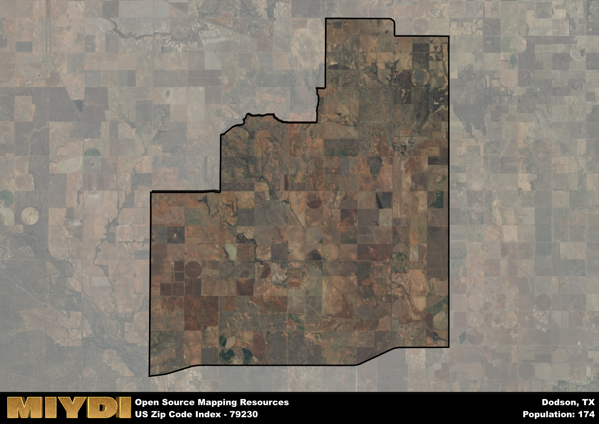

**Area Name:** Dodson

**Zip Code:** 79230

**State:** TX

# Discover the Charming Community of Dodson, TX (Zip Code 79230)  

Dodson, located in zip code 79230, is a quaint rural community situated in the northeastern region of Texas. Bordered by vast expanses of farmland and rolling hills, Dodson is a tight-knit neighborhood that connects with nearby towns such as Wellington and Memphis. Despite its rural setting, Dodson is just a short drive away from larger cities like Amarillo, providing residents with easy access to urban amenities while enjoying the tranquility of small-town living.

Established in the late 19th century, Dodson has a rich history rooted in agriculture and ranching. The area saw significant growth during the early 1900s with the arrival of the railroad, which facilitated trade and commerce in the region. Named after a prominent local landowner, Dodson has retained its rural charm over the years, with its historic buildings and landmarks serving as a testament to its past. Today, Dodson remains a tight-knit community where residents take pride in their heritage and traditions.

Presently, Dodson is a vibrant community that thrives on agriculture and livestock production. The area is known for its fertile soil and vast expanses of farmland, which support a strong agricultural economy. Residents can enjoy a range of recreational activities, including hunting, fishing, and hiking in the surrounding countryside. Dodson also boasts a close-knit community center, local businesses, and annual events that bring residents together. With its rich history, strong sense of community, and picturesque surroundings, Dodson offers a unique blend of small-town charm and rural beauty.

# Dodson Demographics

The population of Dodson is 174.  
Dodson has a population density of 2.61 per square mile.  
The area of Dodson is 66.57 square miles.  

## Dodson AI and Census Variables

The values presented in this dataset for Dodson are AI-optimized, streamlined, and categorized into relevant buckets for enhanced utility in AI and mapping programs. These simplified values have been optimized to facilitate efficient analysis and integration into various technological applications, offering users accessible and actionable insights into demographics within the Dodson area.

| AI Variables for Dodson | Value |
|-------------|-------|
| Shape Area | 255902460.207031 |
| Shape Length | 73564.6588874376 |

## How to use this free AI optimized Geo-Spatial Data for Dodson, TX

This data is made freely available under the Creative Commons license, allowing for unrestricted use for any purpose. Users can access static resources directly from GitHub or leverage more advanced functionalities by utilizing the GeoJSON files. All datasets originate from official government or private sector sources and are meticulously compiled into relevant datasets within QGIS. However, the versatility of the data ensures compatibility with any mapping application.

## Data Accuracy Disclaimer
It's important to note that the data provided here may contain errors or discrepancies and should be considered as 'close enough' for business applications and AI rather than a definitive source of truth. This data is aggregated from multiple sources, some of which publish information on wildly different intervals, leading to potential inconsistencies. Additionally, certain data points may not be corrected for Covid-related changes, further impacting accuracy. Moreover, the assumption that demographic trends are consistent throughout a region may lead to discrepancies, as trends often concentrate in areas of highest population density. As a result, dense areas may be slightly underrepresented, while rural areas may be slightly overrepresented, resulting in a more conservative dataset. Furthermore, the focus primarily on areas within US Major and Minor Statistical areas means that approximately 40 million Americans living outside of these areas may not be fully represented. Lastly, the historical background and area descriptions generated using AI are susceptible to potential mistakes, so users should exercise caution when interpreting the information provided.
