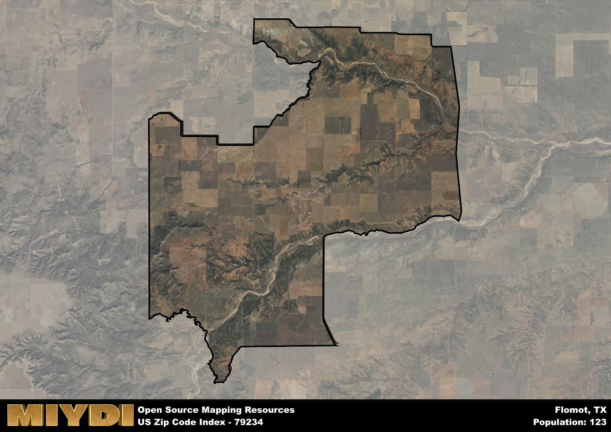

**Area Name:** Flomot

**Zip Code:** 79234

**State:** TX

# Flomot: A Charming Neighborhood in West Texas  

Located in the heart of West Texas, the zip code 79234 corresponds to the small community of Flomot. Surrounded by vast expanses of flat farmland, Flomot is situated within the larger metropolitan context of the Texas Panhandle region. It is approximately 30 miles southeast of the city of Plainview and 70 miles north of Lubbock, making it a quaint rural enclave within a predominantly agricultural area.

Flomot has a rich history dating back to the early 20th century when it was founded as a railroad town. Originally named Floyd, the town's name was later changed to Flomot, combining "Floyd" with "Motley," the names of the two counties it straddles. The town experienced a period of growth during the oil boom of the 1920s, attracting settlers and businesses to the area. Today, Flomot retains its small-town charm and close-knit community feel, with a population that values its agricultural heritage and rural way of life.

Despite its small size, Flomot boasts a variety of economic activities, including farming, ranching, and small businesses that cater to the local community. Residents enjoy access to essential services such as a post office, school, and local shops. The area also offers recreational amenities such as parks and outdoor spaces for residents to enjoy. Flomot is home to several historic sites, including the original train depot and other landmarks that showcase the town's unique past.

# Flomot Demographics

The population of Flomot is 123.  
Flomot has a population density of 2.33 per square mile.  
The area of Flomot is 52.84 square miles.  

## Flomot AI and Census Variables

The values presented in this dataset for Flomot are AI-optimized, streamlined, and categorized into relevant buckets for enhanced utility in AI and mapping programs. These simplified values have been optimized to facilitate efficient analysis and integration into various technological applications, offering users accessible and actionable insights into demographics within the Flomot area.

| AI Variables for Flomot | Value |
|-------------|-------|
| Shape Area | 200690695.539063 |
| Shape Length | 85970.8173048564 |

## How to use this free AI optimized Geo-Spatial Data for Flomot, TX

This data is made freely available under the Creative Commons license, allowing for unrestricted use for any purpose. Users can access static resources directly from GitHub or leverage more advanced functionalities by utilizing the GeoJSON files. All datasets originate from official government or private sector sources and are meticulously compiled into relevant datasets within QGIS. However, the versatility of the data ensures compatibility with any mapping application.

## Data Accuracy Disclaimer
It's important to note that the data provided here may contain errors or discrepancies and should be considered as 'close enough' for business applications and AI rather than a definitive source of truth. This data is aggregated from multiple sources, some of which publish information on wildly different intervals, leading to potential inconsistencies. Additionally, certain data points may not be corrected for Covid-related changes, further impacting accuracy. Moreover, the assumption that demographic trends are consistent throughout a region may lead to discrepancies, as trends often concentrate in areas of highest population density. As a result, dense areas may be slightly underrepresented, while rural areas may be slightly overrepresented, resulting in a more conservative dataset. Furthermore, the focus primarily on areas within US Major and Minor Statistical areas means that approximately 40 million Americans living outside of these areas may not be fully represented. Lastly, the historical background and area descriptions generated using AI are susceptible to potential mistakes, so users should exercise caution when interpreting the information provided.
