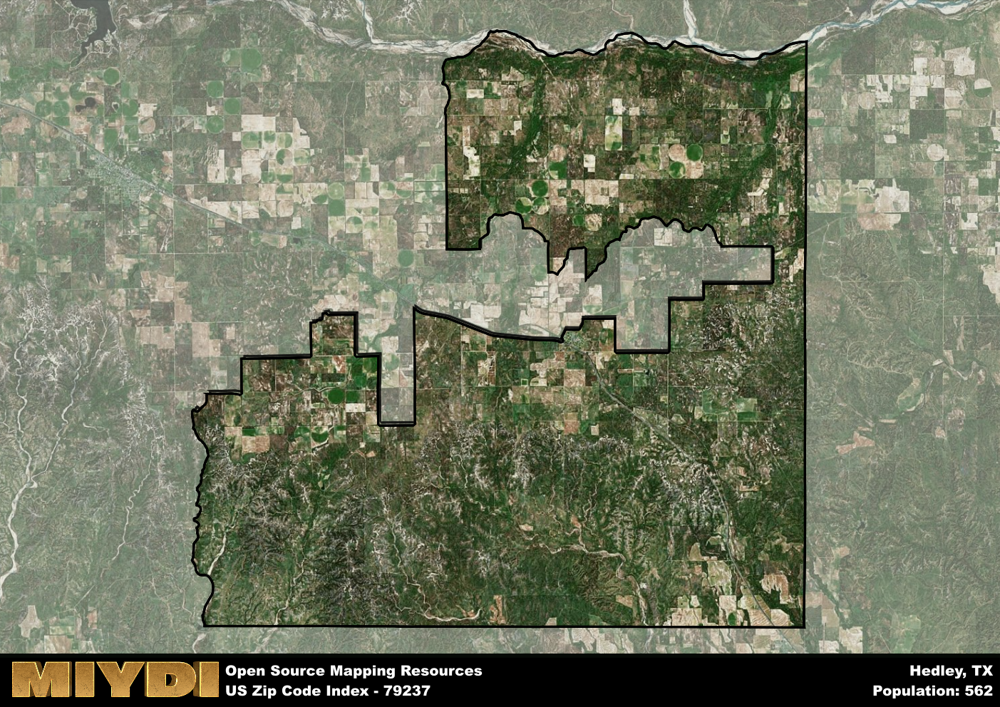

**Area Name:** Hedley

**Zip Code:** 79237

**State:** TX

# Hedley: A Historic Small Town in the Texas Panhandle  

Located in the heart of the Texas Panhandle, zip code 79237 corresponds to the small town of Hedley. Surrounded by vast stretches of farmland and ranches, Hedley is situated approximately 80 miles southeast of Amarillo. Despite its rural setting, the town remains closely connected to nearby communities such as Clarendon and Memphis, serving as a hub for local commerce and social gatherings.

Established in the late 19th century as a railroad stop along the Fort Worth and Denver City Railway, Hedley quickly grew into a bustling agricultural center. Named after an English railway investor, the town prospered as farmers and ranchers settled in the area, attracted by its fertile soil and abundant water supply. Over the years, Hedley developed a strong sense of community, with residents banding together to weather economic downturns and natural disasters.

Today, Hedley maintains its agricultural roots while embracing modern amenities and attractions. The town's economy is primarily driven by farming, ranching, and small businesses, with a focus on preserving its historic downtown district. Residents and visitors alike can enjoy local eateries, shops, and recreational facilities, as well as landmarks like the Hedley Country Club and the Hedley Gin Museum. With its rich history and tight-knit community, Hedley continues to be a welcoming destination for those seeking a taste of small-town Texas charm.

# Hedley Demographics

The population of Hedley is 562.  
Hedley has a population density of 2.69 per square mile.  
The area of Hedley is 209.16 square miles.  

## Hedley Income and Economic Data

These demographic numbers are sourced from IRS return data, providing comprehensive insights into the population dynamics and economic trends within Hedley.

**Breakdown of return types for Hedley**

The table offers insight into the composition of tax returns filed with the IRS, categorizing them into three main types. Single returns represent filings by individuals, joint returns by married couples, and head of household returns by individuals who qualify as heads of households, typically having dependents. This breakdown provides an understanding of the different filing statuses adopted by taxpayers when submitting their tax documentation.

| Return Types filed for Hedley                              | Percentage          |
|----------------------------------------------------------|---------------------|
| Single Returns                                            | 0.39 |
| Joint Returns                                             | 0.5 |
| Head Household Returns                                    | 0 |

The income and economic data presented here is sourced from the IRS income brackets, utilized for categorizing tax returns by income levels. This table displays income ranges for both single filers and married couples, along with the corresponding number of returns and the percentage within each bracket, providing valuable insight into the distribution of taxes across various income groups.

| Bracket Name       | Single Filer Income Range | Married Couple Range | Number of Returns | Percentage of Returns |
|--------------------|----------------------------|----------------------|-------------------|-----------------------|
| 10% Bracket        | Up to $10,275              | Up to $20,550        | 80 | 0.44% |
| 12% Bracket        | $10,276 - $41,775          | $20,551 - $83,550    | 50 | 0.28% |
| 22% Bracket        | $41,776 - $89,075          | $83,551 - $178,150   | 30 | 0.17% |
| 24% Bracket        | $89,076 - $170,050         | $178,151 - $340,100  | 20 | 0.11% |
| 32% Bracket        | $170,051 - $215,950        | $340,101 - $431,900  | 0 | 0% |
| 35% Bracket        | $215,951 - $539,900        | $431,901 - $647,850  | 0 | 0% |

### Exploring Taxpayer Diversity: A Breakdown of Different Types of Tax Returns in Hedley

The table offers insights into various types of tax returns filed, reflecting different aspects of taxpayer activities and demographics. Categories include charitable returns for donations, dependent returns for claimed dependents, educator population, elderly population, real estate returns, self-employment returns, student loan returns, and unemployment returns, providing valuable insights into taxpayer behavior and demographics.

| Hedley Filing Types                    | Count | Percentage |
|--------------------------------------|-------|------------|
| Charitable Donations                 | 0 | 0% |
| Dependents Claimed                   | 0 | 0% |
| Educator Residents                   | 0 | 0% |
| Elderly Population                   | 60 | 0.33% |
| Farming Population                   | 30 | 0.167% |
| Real Estate Transactions             | 0 | 0% |
| Self-Employed Individuals            | 30 | 0.167% |
| Student Loan Cases                   | 0 | 0% |
| Unemployment Benefit Filings         | 0 | 0% |

## Hedley AI and Census Variables

The values presented in this dataset for Hedley are AI-optimized, streamlined, and categorized into relevant buckets for enhanced utility in AI and mapping programs. These simplified values have been optimized to facilitate efficient analysis and integration into various technological applications, offering users accessible and actionable insights into demographics within the Hedley area.

| AI Variables for Hedley | Value |
|-------------|-------|
| Shape Area | 806287709.929688 |
| Shape Length | 208066.94304083 |

## How to use this free AI optimized Geo-Spatial Data for Hedley, TX

This data is made freely available under the Creative Commons license, allowing for unrestricted use for any purpose. Users can access static resources directly from GitHub or leverage more advanced functionalities by utilizing the GeoJSON files. All datasets originate from official government or private sector sources and are meticulously compiled into relevant datasets within QGIS. However, the versatility of the data ensures compatibility with any mapping application.

## Data Accuracy Disclaimer
It's important to note that the data provided here may contain errors or discrepancies and should be considered as 'close enough' for business applications and AI rather than a definitive source of truth. This data is aggregated from multiple sources, some of which publish information on wildly different intervals, leading to potential inconsistencies. Additionally, certain data points may not be corrected for Covid-related changes, further impacting accuracy. Moreover, the assumption that demographic trends are consistent throughout a region may lead to discrepancies, as trends often concentrate in areas of highest population density. As a result, dense areas may be slightly underrepresented, while rural areas may be slightly overrepresented, resulting in a more conservative dataset. Furthermore, the focus primarily on areas within US Major and Minor Statistical areas means that approximately 40 million Americans living outside of these areas may not be fully represented. Lastly, the historical background and area descriptions generated using AI are susceptible to potential mistakes, so users should exercise caution when interpreting the information provided.
