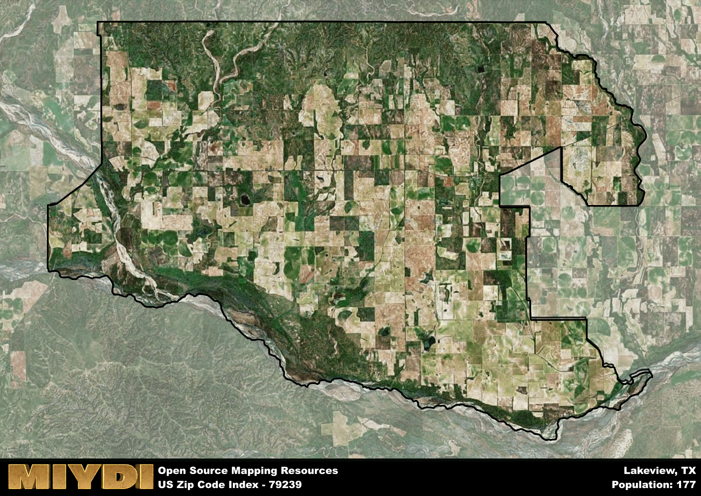

**Area Name:** Lakeview

**Zip Code:** 79239

**State:** TX

# Lakeview: A Quaint Neighborhood in West Texas

Located in the heart of West Texas, Lakeview is a cozy neighborhood that falls under the zip code 79239. Bordered by vast stretches of plains and farmlands, Lakeview is situated within the larger metropolitan area of Lubbock. This neighborhood seamlessly integrates with nearby cities such as Plainview and Amarillo, serving as a peaceful residential area amidst the bustling urban fabric of the region.

Lakeview has a rich historical narrative dating back to the early 1900s when it was first established as a farming community. Over the years, the neighborhood has experienced steady growth, attracting families looking for a serene place to call home. The name Lakeview was derived from the stunning views of nearby lakes that residents enjoy, adding to the area's charm and appeal.

Today, Lakeview boasts a thriving community with a mix of residential and commercial spaces. The neighborhood is known for its friendly atmosphere and tight-knit community spirit. Residents can enjoy a range of amenities, including local cafes, parks, and recreational facilities. Lakeview also prides itself on its historical sites, showcasing the evolution of the neighborhood over the years. With a strong emphasis on preserving its heritage while embracing modern developments, Lakeview remains a sought-after destination in West Texas.

# Lakeview Demographics

The population of Lakeview is 177.  
Lakeview has a population density of 0.94 per square mile.  
The area of Lakeview is 187.39 square miles.  

## Lakeview AI and Census Variables

The values presented in this dataset for Lakeview are AI-optimized, streamlined, and categorized into relevant buckets for enhanced utility in AI and mapping programs. These simplified values have been optimized to facilitate efficient analysis and integration into various technological applications, offering users accessible and actionable insights into demographics within the Lakeview area.

| AI Variables for Lakeview | Value |
|-------------|-------|
| Shape Area | 719129799.953125 |
| Shape Length | 151000.891343734 |

## How to use this free AI optimized Geo-Spatial Data for Lakeview, TX

This data is made freely available under the Creative Commons license, allowing for unrestricted use for any purpose. Users can access static resources directly from GitHub or leverage more advanced functionalities by utilizing the GeoJSON files. All datasets originate from official government or private sector sources and are meticulously compiled into relevant datasets within QGIS. However, the versatility of the data ensures compatibility with any mapping application.

## Data Accuracy Disclaimer
It's important to note that the data provided here may contain errors or discrepancies and should be considered as 'close enough' for business applications and AI rather than a definitive source of truth. This data is aggregated from multiple sources, some of which publish information on wildly different intervals, leading to potential inconsistencies. Additionally, certain data points may not be corrected for Covid-related changes, further impacting accuracy. Moreover, the assumption that demographic trends are consistent throughout a region may lead to discrepancies, as trends often concentrate in areas of highest population density. As a result, dense areas may be slightly underrepresented, while rural areas may be slightly overrepresented, resulting in a more conservative dataset. Furthermore, the focus primarily on areas within US Major and Minor Statistical areas means that approximately 40 million Americans living outside of these areas may not be fully represented. Lastly, the historical background and area descriptions generated using AI are susceptible to potential mistakes, so users should exercise caution when interpreting the information provided.
