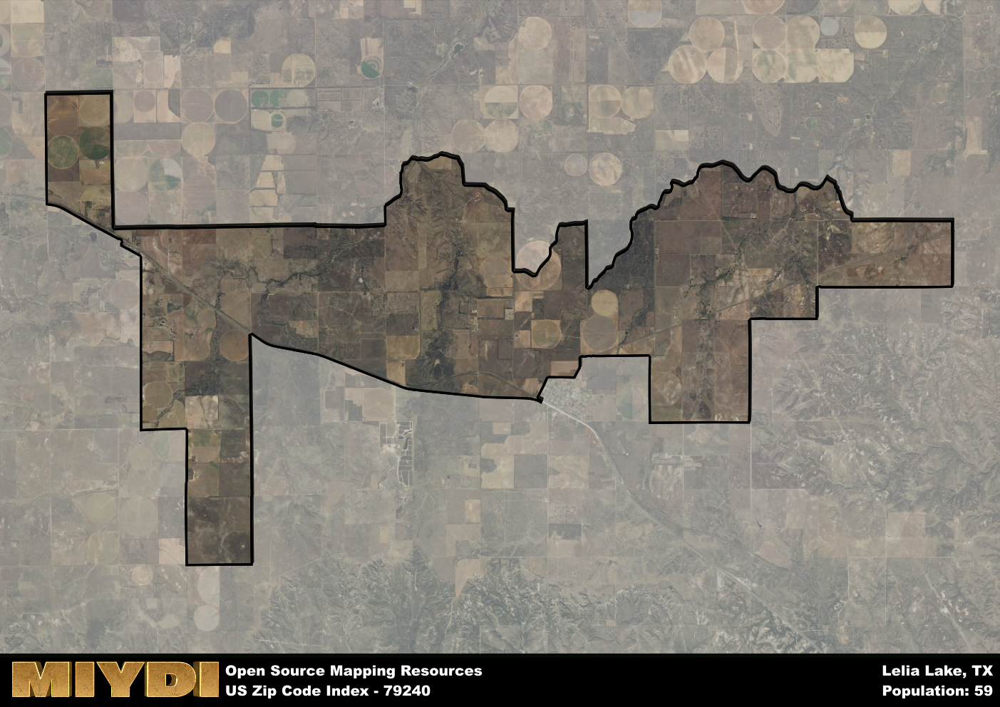

**Area Name:** Lelia Lake

**Zip Code:** 79240

**State:** TX

# Lelia Lake: A Charming Community in the Texas Panhandle

Located in the Texas Panhandle, the zip code area 79240 encompasses the quaint neighborhood of Lelia Lake. Situated within Donley County, this area is surrounded by vast stretches of farmland and is approximately 20 miles south of Clarendon. Lelia Lake is a small, tight-knit community that serves as a peaceful retreat from the hustle and bustle of larger cities in the region.

Lelia Lake has a rich history dating back to the late 19th century when it was established as a farming community. The area experienced a period of growth during the early 20th century with the development of local businesses and services to support the growing population. The name "Lelia Lake" is said to have originated from a prominent local family in the area, adding a personal touch to the community's identity.

Today, Lelia Lake maintains its rural charm while offering essential services to its residents. The area is primarily known for its agricultural activities, with many farms and ranches dotting the landscape. Residents enjoy a close-knit community atmosphere and have access to local businesses, schools, and recreational facilities. Visitors can explore the historic sites in the area and soak in the serene surroundings that make Lelia Lake a hidden gem in the Texas Panhandle.

# Lelia Lake Demographics

The population of Lelia Lake is 59.  
Lelia Lake has a population density of 1.82 per square mile.  
The area of Lelia Lake is 32.35 square miles.  

## Lelia Lake AI and Census Variables

The values presented in this dataset for Lelia Lake are AI-optimized, streamlined, and categorized into relevant buckets for enhanced utility in AI and mapping programs. These simplified values have been optimized to facilitate efficient analysis and integration into various technological applications, offering users accessible and actionable insights into demographics within the Lelia Lake area.

| AI Variables for Lelia Lake | Value |
|-------------|-------|
| Shape Area | 124821740.195313 |
| Shape Length | 97388.7701172781 |

## How to use this free AI optimized Geo-Spatial Data for Lelia Lake, TX

This data is made freely available under the Creative Commons license, allowing for unrestricted use for any purpose. Users can access static resources directly from GitHub or leverage more advanced functionalities by utilizing the GeoJSON files. All datasets originate from official government or private sector sources and are meticulously compiled into relevant datasets within QGIS. However, the versatility of the data ensures compatibility with any mapping application.

## Data Accuracy Disclaimer
It's important to note that the data provided here may contain errors or discrepancies and should be considered as 'close enough' for business applications and AI rather than a definitive source of truth. This data is aggregated from multiple sources, some of which publish information on wildly different intervals, leading to potential inconsistencies. Additionally, certain data points may not be corrected for Covid-related changes, further impacting accuracy. Moreover, the assumption that demographic trends are consistent throughout a region may lead to discrepancies, as trends often concentrate in areas of highest population density. As a result, dense areas may be slightly underrepresented, while rural areas may be slightly overrepresented, resulting in a more conservative dataset. Furthermore, the focus primarily on areas within US Major and Minor Statistical areas means that approximately 40 million Americans living outside of these areas may not be fully represented. Lastly, the historical background and area descriptions generated using AI are susceptible to potential mistakes, so users should exercise caution when interpreting the information provided.
