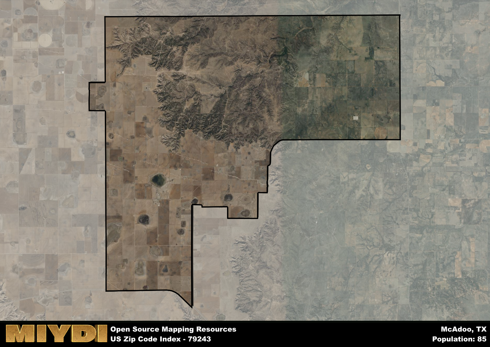

**Area Name:** McAdoo

**Zip Code:** 79243

**State:** TX

McAdoo is a part of the Lubbock - TX Metro Area, and makes up  of the Metro's population.  

# McAdoo: A Charming Community in West Texas  
Located in the heart of West Texas, the zip code 79243 area encompasses the small, close-knit community of McAdoo. Situated within the larger metropolitan context of Lubbock, McAdoo is approximately 60 miles northeast of the city and is surrounded by vast stretches of farmland and ranches. Despite its rural setting, McAdoo serves as a peaceful retreat for residents looking to escape the hustle and bustle of urban life.

Founded in the late 19th century, McAdoo has a rich historical narrative that dates back to its early days as a railroad stop. Named after the cattle baron John McAdoo, the area experienced growth with the arrival of the railroad, attracting settlers looking to establish farms and ranches in the fertile plains of West Texas. Over the years, McAdoo has maintained its small-town charm and agricultural roots, with many families tracing their lineage back to the original pioneers of the area.

Today, McAdoo remains a quintessential West Texas community, known for its agricultural heritage and friendly atmosphere. The economy is primarily driven by farming and ranching, with residents taking pride in their rural way of life. The area offers essential services such as a local post office, school, and community center, fostering a strong sense of community among its residents. McAdoo also boasts recreational amenities such as parks and outdoor spaces, where locals gather for events and celebrations. Rich in history, McAdoo is home to several historic sites and landmarks that showcase its past, making it a hidden gem within the vast West Texas landscape.

# McAdoo Demographics

The population of McAdoo is 85.  
McAdoo has a population density of 1.07 per square mile.  
The area of McAdoo is 79.18 square miles.  

## McAdoo AI and Census Variables

The values presented in this dataset for McAdoo are AI-optimized, streamlined, and categorized into relevant buckets for enhanced utility in AI and mapping programs. These simplified values have been optimized to facilitate efficient analysis and integration into various technological applications, offering users accessible and actionable insights into demographics within the McAdoo area.

| AI Variables for McAdoo | Value |
|-------------|-------|
| Shape Area | 297585616 |
| Shape Length | 88804.3891023034 |
| CBSA Federal Processing Standard Code | 31180 |

## How to use this free AI optimized Geo-Spatial Data for McAdoo, TX

This data is made freely available under the Creative Commons license, allowing for unrestricted use for any purpose. Users can access static resources directly from GitHub or leverage more advanced functionalities by utilizing the GeoJSON files. All datasets originate from official government or private sector sources and are meticulously compiled into relevant datasets within QGIS. However, the versatility of the data ensures compatibility with any mapping application.

## Data Accuracy Disclaimer
It's important to note that the data provided here may contain errors or discrepancies and should be considered as 'close enough' for business applications and AI rather than a definitive source of truth. This data is aggregated from multiple sources, some of which publish information on wildly different intervals, leading to potential inconsistencies. Additionally, certain data points may not be corrected for Covid-related changes, further impacting accuracy. Moreover, the assumption that demographic trends are consistent throughout a region may lead to discrepancies, as trends often concentrate in areas of highest population density. As a result, dense areas may be slightly underrepresented, while rural areas may be slightly overrepresented, resulting in a more conservative dataset. Furthermore, the focus primarily on areas within US Major and Minor Statistical areas means that approximately 40 million Americans living outside of these areas may not be fully represented. Lastly, the historical background and area descriptions generated using AI are susceptible to potential mistakes, so users should exercise caution when interpreting the information provided.
