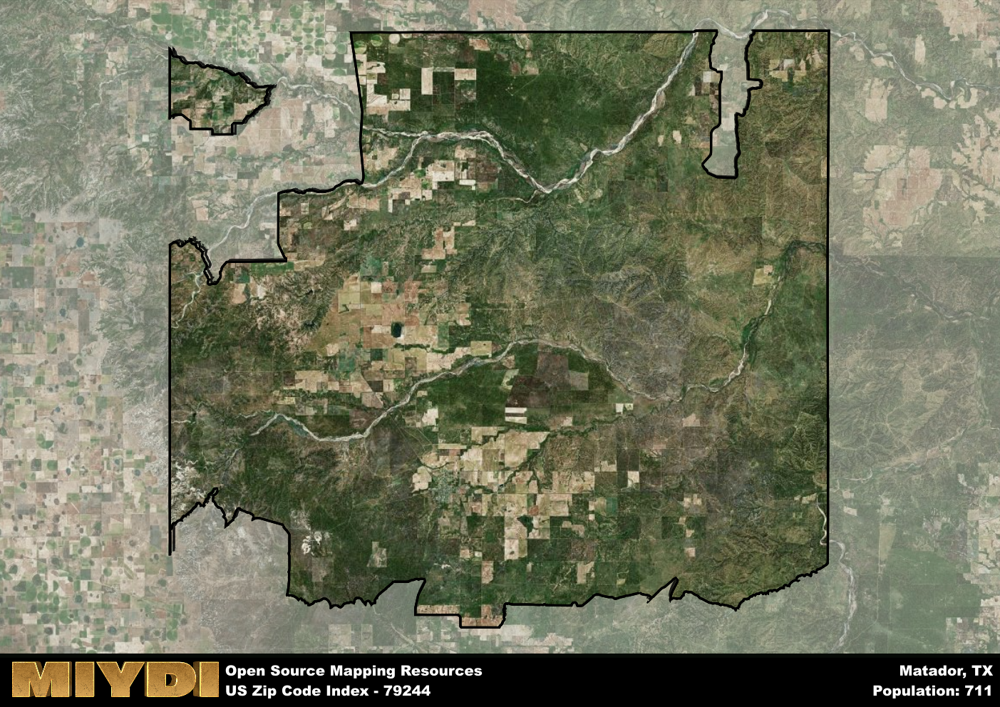

**Area Name:** Matador

**Zip Code:** 79244

**State:** TX

# Matador: A Historic Community in West Texas

Nestled in the heart of West Texas, Matador is a charming community located within the 79244 zip code. Bordered by vast stretches of rolling plains and agricultural land, Matador seamlessly integrates with the surrounding rural landscape. The zip code area is situated within a larger metropolitan context, with nearby cities such as Lubbock and Amarillo serving as major hubs for commerce and transportation. Despite its rural setting, Matador provides a peaceful retreat for residents seeking a slower pace of life while still maintaining easy access to urban amenities.

Founded in the late 19th century, Matador has a rich historical narrative that traces back to its origins as a cattle ranching town. The area experienced rapid growth during the early 20th century, attracting settlers drawn to the promise of abundant land and economic opportunities. The town's name, derived from the Spanish word for "killer" or "slayer," reflects its roots in the ranching industry. Over the years, Matador has evolved into a close-knit community with a strong sense of history and tradition, evident in its well-preserved historic buildings and landmarks.

Today, Matador continues to thrive as a vibrant community with a diverse economy that includes agriculture, ranching, and small businesses. Residents enjoy a range of neighborhood-specific services such as local shops, restaurants, and schools that cater to their daily needs. The area also boasts recreational amenities such as parks and outdoor spaces, offering opportunities for outdoor activities and community gatherings. Matador's cultural heritage is celebrated through events and festivals that showcase its unique history and traditions, making it a special place within the larger urban fabric of West Texas.

# Matador Demographics

The population of Matador is 711.  
Matador has a population density of 1.05 per square mile.  
The area of Matador is 679.98 square miles.  

## Matador Income and Economic Data

These demographic numbers are sourced from IRS return data, providing comprehensive insights into the population dynamics and economic trends within Matador.

**Breakdown of return types for Matador**

The table offers insight into the composition of tax returns filed with the IRS, categorizing them into three main types. Single returns represent filings by individuals, joint returns by married couples, and head of household returns by individuals who qualify as heads of households, typically having dependents. This breakdown provides an understanding of the different filing statuses adopted by taxpayers when submitting their tax documentation.

| Return Types filed for Matador                              | Percentage          |
|----------------------------------------------------------|---------------------|
| Single Returns                                            | 0.41 |
| Joint Returns                                             | 0.52 |
| Head Household Returns                                    | 0.1 |

The income and economic data presented here is sourced from the IRS income brackets, utilized for categorizing tax returns by income levels. This table displays income ranges for both single filers and married couples, along with the corresponding number of returns and the percentage within each bracket, providing valuable insight into the distribution of taxes across various income groups.

| Bracket Name       | Single Filer Income Range | Married Couple Range | Number of Returns | Percentage of Returns |
|--------------------|----------------------------|----------------------|-------------------|-----------------------|
| 10% Bracket        | Up to $10,275              | Up to $20,550        | 110 | 0.38% |
| 12% Bracket        | $10,276 - $41,775          | $20,551 - $83,550    | 70 | 0.24% |
| 22% Bracket        | $41,776 - $89,075          | $83,551 - $178,150   | 40 | 0.14% |
| 24% Bracket        | $89,076 - $170,050         | $178,151 - $340,100  | 30 | 0.1% |
| 32% Bracket        | $170,051 - $215,950        | $340,101 - $431,900  | 40 | 0.14% |
| 35% Bracket        | $215,951 - $539,900        | $431,901 - $647,850  | 0 | 0% |

### Exploring Taxpayer Diversity: A Breakdown of Different Types of Tax Returns in Matador

The table offers insights into various types of tax returns filed, reflecting different aspects of taxpayer activities and demographics. Categories include charitable returns for donations, dependent returns for claimed dependents, educator population, elderly population, real estate returns, self-employment returns, student loan returns, and unemployment returns, providing valuable insights into taxpayer behavior and demographics.

| Matador Filing Types                    | Count | Percentage |
|--------------------------------------|-------|------------|
| Charitable Donations                 | 0 | 0% |
| Dependents Claimed                   | 0 | 0% |
| Educator Residents                   | 0 | 0% |
| Elderly Population                   | 120 | 0.41% |
| Farming Population                   | 60 | 0.207% |
| Real Estate Transactions             | 0 | 0% |
| Self-Employed Individuals            | 80 | 0.276% |
| Student Loan Cases                   | 0 | 0% |
| Unemployment Benefit Filings         | 0 | 0% |

## Matador AI and Census Variables

The values presented in this dataset for Matador are AI-optimized, streamlined, and categorized into relevant buckets for enhanced utility in AI and mapping programs. These simplified values have been optimized to facilitate efficient analysis and integration into various technological applications, offering users accessible and actionable insights into demographics within the Matador area.

| AI Variables for Matador | Value |
|-------------|-------|
| Shape Area | 2575971617.29688 |
| Shape Length | 324930.912679399 |

## How to use this free AI optimized Geo-Spatial Data for Matador, TX

This data is made freely available under the Creative Commons license, allowing for unrestricted use for any purpose. Users can access static resources directly from GitHub or leverage more advanced functionalities by utilizing the GeoJSON files. All datasets originate from official government or private sector sources and are meticulously compiled into relevant datasets within QGIS. However, the versatility of the data ensures compatibility with any mapping application.

## Data Accuracy Disclaimer
It's important to note that the data provided here may contain errors or discrepancies and should be considered as 'close enough' for business applications and AI rather than a definitive source of truth. This data is aggregated from multiple sources, some of which publish information on wildly different intervals, leading to potential inconsistencies. Additionally, certain data points may not be corrected for Covid-related changes, further impacting accuracy. Moreover, the assumption that demographic trends are consistent throughout a region may lead to discrepancies, as trends often concentrate in areas of highest population density. As a result, dense areas may be slightly underrepresented, while rural areas may be slightly overrepresented, resulting in a more conservative dataset. Furthermore, the focus primarily on areas within US Major and Minor Statistical areas means that approximately 40 million Americans living outside of these areas may not be fully represented. Lastly, the historical background and area descriptions generated using AI are susceptible to potential mistakes, so users should exercise caution when interpreting the information provided.
