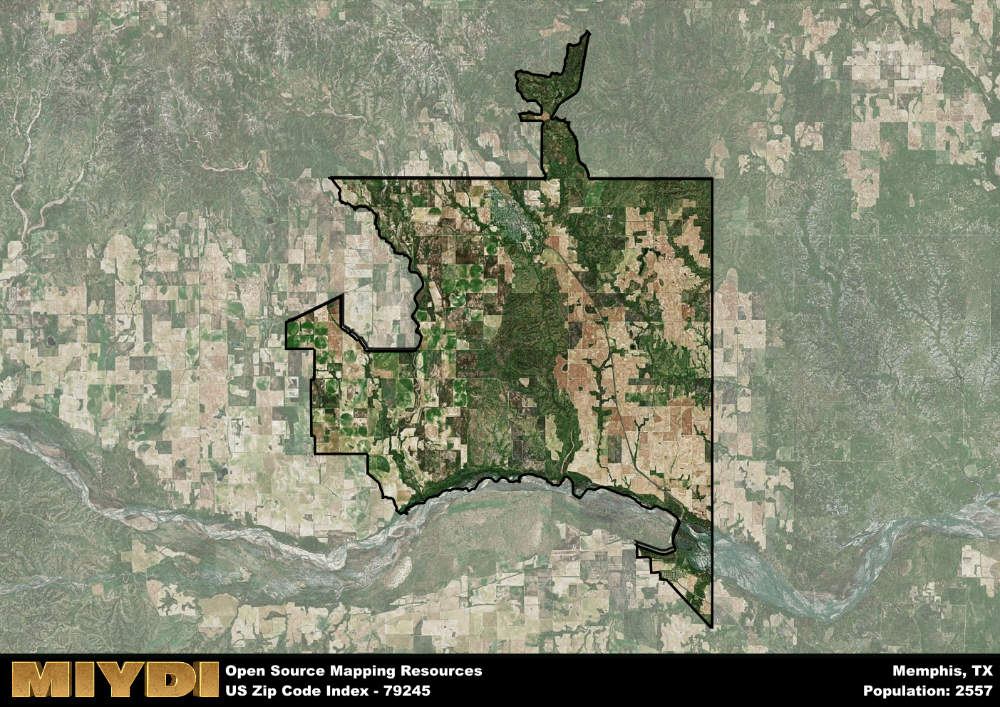

**Area Name:** Memphis

**Zip Code:** 79245

**State:** TX

# Exploring Memphis: A Hidden Gem in West Texas

Located in the heart of West Texas, the zip code 79245 corresponds to the charming town of Memphis. Surrounded by vast plains and rolling hills, Memphis is a small community that is part of the larger metropolitan area of Amarillo. Situated along Highway 287, Memphis serves as a gateway to the Texas Panhandle and is just a short drive away from major cities like Lubbock and Wichita Falls.

Originally settled in the late 19th century, Memphis was named after the ancient city in Egypt due to its location along the Nile River. The town experienced rapid growth during the early 20th century with the arrival of the railroad, which brought in new residents and businesses. Over the years, Memphis has maintained its small-town charm while embracing modern amenities and infrastructure, making it a popular destination for those seeking a peaceful retreat in the Texas countryside.

Today, Memphis is a thriving community known for its agricultural industry, with cotton farming being a prominent economic activity in the area. The town boasts a variety of local shops, restaurants, and services to cater to residents and visitors alike. Outdoor enthusiasts can explore the nearby Caprock Canyons State Park or visit the historic Memphis Depot Museum to learn about the town's rich heritage. With its blend of history, culture, and natural beauty, Memphis offers a unique experience for those looking to discover the hidden gems of West Texas.

# Memphis Demographics

The population of Memphis is 2557.  
Memphis has a population density of 16.55 per square mile.  
The area of Memphis is 154.51 square miles.  

## Memphis Income and Economic Data

These demographic numbers are sourced from IRS return data, providing comprehensive insights into the population dynamics and economic trends within Memphis.

**Breakdown of return types for Memphis**

The table offers insight into the composition of tax returns filed with the IRS, categorizing them into three main types. Single returns represent filings by individuals, joint returns by married couples, and head of household returns by individuals who qualify as heads of households, typically having dependents. This breakdown provides an understanding of the different filing statuses adopted by taxpayers when submitting their tax documentation.

| Return Types filed for Memphis                              | Percentage          |
|----------------------------------------------------------|---------------------|
| Single Returns                                            | 0.42 |
| Joint Returns                                             | 0.39 |
| Head Household Returns                                    | 0.16 |

The income and economic data presented here is sourced from the IRS income brackets, utilized for categorizing tax returns by income levels. This table displays income ranges for both single filers and married couples, along with the corresponding number of returns and the percentage within each bracket, providing valuable insight into the distribution of taxes across various income groups.

| Bracket Name       | Single Filer Income Range | Married Couple Range | Number of Returns | Percentage of Returns |
|--------------------|----------------------------|----------------------|-------------------|-----------------------|
| 10% Bracket        | Up to $10,275              | Up to $20,550        | 410 | 0.45% |
| 12% Bracket        | $10,276 - $41,775          | $20,551 - $83,550    | 260 | 0.28% |
| 22% Bracket        | $41,776 - $89,075          | $83,551 - $178,150   | 100 | 0.11% |
| 24% Bracket        | $89,076 - $170,050         | $178,151 - $340,100  | 70 | 0.08% |
| 32% Bracket        | $170,051 - $215,950        | $340,101 - $431,900  | 80 | 0.09% |
| 35% Bracket        | $215,951 - $539,900        | $431,901 - $647,850  | 0 | 0% |

### Exploring Taxpayer Diversity: A Breakdown of Different Types of Tax Returns in Memphis

The table offers insights into various types of tax returns filed, reflecting different aspects of taxpayer activities and demographics. Categories include charitable returns for donations, dependent returns for claimed dependents, educator population, elderly population, real estate returns, self-employment returns, student loan returns, and unemployment returns, providing valuable insights into taxpayer behavior and demographics.

| Memphis Filing Types                    | Count | Percentage |
|--------------------------------------|-------|------------|
| Charitable Donations                 | 0 | 0% |
| Dependents Claimed                   | 0 | 0% |
| Educator Residents                   | 20 | 0.022% |
| Elderly Population                   | 270 | 0.29% |
| Farming Population                   | 70 | 0.076% |
| Real Estate Transactions             | 0 | 0% |
| Self-Employed Individuals            | 120 | 0.13% |
| Student Loan Cases                   | 30 | 0.033% |
| Unemployment Benefit Filings         | 70 | 0.08% |

## Memphis AI and Census Variables

The values presented in this dataset for Memphis are AI-optimized, streamlined, and categorized into relevant buckets for enhanced utility in AI and mapping programs. These simplified values have been optimized to facilitate efficient analysis and integration into various technological applications, offering users accessible and actionable insights into demographics within the Memphis area.

| AI Variables for Memphis | Value |
|-------------|-------|
| Shape Area | 592948626.371094 |
| Shape Length | 177508.061393845 |

## How to use this free AI optimized Geo-Spatial Data for Memphis, TX

This data is made freely available under the Creative Commons license, allowing for unrestricted use for any purpose. Users can access static resources directly from GitHub or leverage more advanced functionalities by utilizing the GeoJSON files. All datasets originate from official government or private sector sources and are meticulously compiled into relevant datasets within QGIS. However, the versatility of the data ensures compatibility with any mapping application.

## Data Accuracy Disclaimer
It's important to note that the data provided here may contain errors or discrepancies and should be considered as 'close enough' for business applications and AI rather than a definitive source of truth. This data is aggregated from multiple sources, some of which publish information on wildly different intervals, leading to potential inconsistencies. Additionally, certain data points may not be corrected for Covid-related changes, further impacting accuracy. Moreover, the assumption that demographic trends are consistent throughout a region may lead to discrepancies, as trends often concentrate in areas of highest population density. As a result, dense areas may be slightly underrepresented, while rural areas may be slightly overrepresented, resulting in a more conservative dataset. Furthermore, the focus primarily on areas within US Major and Minor Statistical areas means that approximately 40 million Americans living outside of these areas may not be fully represented. Lastly, the historical background and area descriptions generated using AI are susceptible to potential mistakes, so users should exercise caution when interpreting the information provided.
