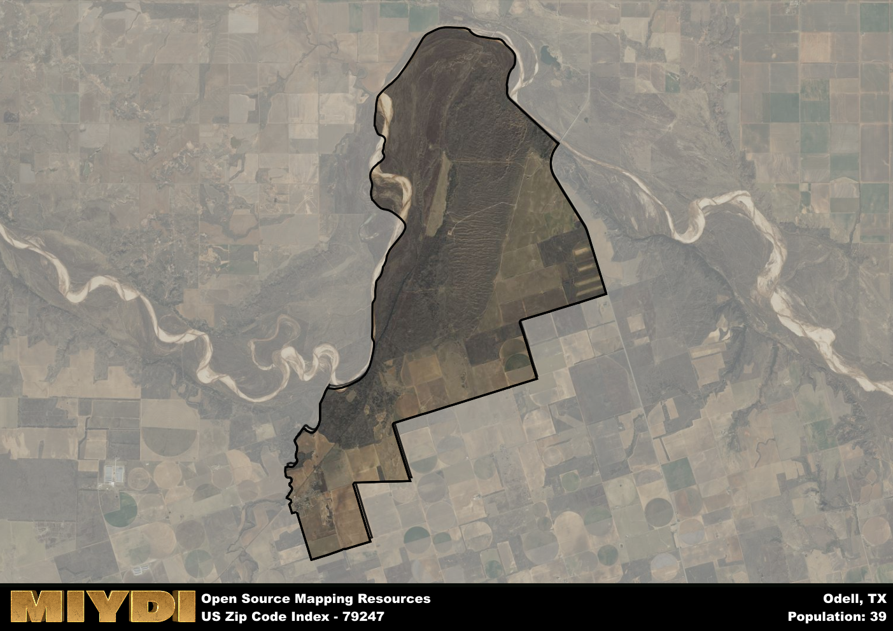

**Area Name:** Odell

**Zip Code:** 79247

**State:** TX

Odell is a part of the Vernon - TX Micro Area, and makes up  of the Metro's population.  

# Odell: A Charming Neighborhood in West Texas  
The zip code 79247 corresponds to the quaint neighborhood of Odell, located in West Texas. Situated within the larger metropolitan area of Wichita Falls, Odell is bordered by rural landscapes to the north and east, while also being in close proximity to major highways connecting it to neighboring towns and cities. This tight-knit community is known for its peaceful atmosphere and friendly residents, making it a desirable place to call home within the bustling region.

Originally settled in the late 19th century by pioneers seeking fertile land for farming, Odell has since evolved into a vibrant residential area with a strong sense of community pride. The neighborhood was named after a prominent local family who played a key role in its development. Throughout the years, Odell has experienced steady growth and expansion, attracting new residents while preserving its rich history and small-town charm.

Today, Odell boasts a mix of residential homes, small businesses, and local amenities that cater to the needs of its residents. The area is known for its agriculture industry, with many farms and ranches dotting the surrounding countryside. Residents can enjoy various recreational activities such as hiking and fishing in the nearby parks, as well as explore the historic sites that showcase Odell's heritage. With its peaceful ambiance and strong community spirit, Odell continues to thrive as a hidden gem in West Texas.

# Odell Demographics

The population of Odell is 39.  
Odell has a population density of 1.9 per square mile.  
The area of Odell is 20.54 square miles.  

## Odell AI and Census Variables

The values presented in this dataset for Odell are AI-optimized, streamlined, and categorized into relevant buckets for enhanced utility in AI and mapping programs. These simplified values have been optimized to facilitate efficient analysis and integration into various technological applications, offering users accessible and actionable insights into demographics within the Odell area.

| AI Variables for Odell | Value |
|-------------|-------|
| Shape Area | 78320578.8203125 |
| Shape Length | 51343.8910780291 |
| CBSA Federal Processing Standard Code | 46900 |

## How to use this free AI optimized Geo-Spatial Data for Odell, TX

This data is made freely available under the Creative Commons license, allowing for unrestricted use for any purpose. Users can access static resources directly from GitHub or leverage more advanced functionalities by utilizing the GeoJSON files. All datasets originate from official government or private sector sources and are meticulously compiled into relevant datasets within QGIS. However, the versatility of the data ensures compatibility with any mapping application.

## Data Accuracy Disclaimer
It's important to note that the data provided here may contain errors or discrepancies and should be considered as 'close enough' for business applications and AI rather than a definitive source of truth. This data is aggregated from multiple sources, some of which publish information on wildly different intervals, leading to potential inconsistencies. Additionally, certain data points may not be corrected for Covid-related changes, further impacting accuracy. Moreover, the assumption that demographic trends are consistent throughout a region may lead to discrepancies, as trends often concentrate in areas of highest population density. As a result, dense areas may be slightly underrepresented, while rural areas may be slightly overrepresented, resulting in a more conservative dataset. Furthermore, the focus primarily on areas within US Major and Minor Statistical areas means that approximately 40 million Americans living outside of these areas may not be fully represented. Lastly, the historical background and area descriptions generated using AI are susceptible to potential mistakes, so users should exercise caution when interpreting the information provided.
