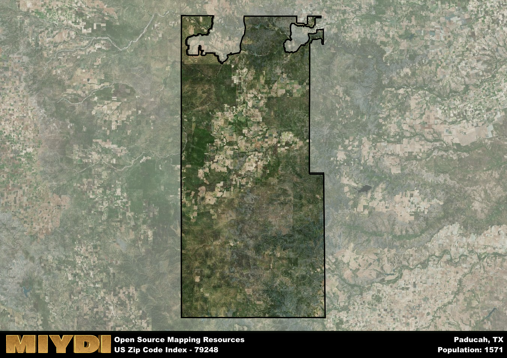

**Area Name:** Paducah

**Zip Code:** 79248

**State:** TX

# Discover the Charming Neighborhood of Paducah, TX (79248)

Located in the southern part of Texas, Paducah (zip code 79248) is a picturesque neighborhood that seamlessly blends rural charm with modern conveniences. Bordered by vast farmlands and rolling plains, Paducah is situated within the larger metropolitan area of the city of Lubbock. This close proximity allows residents to enjoy a peaceful small-town atmosphere while still having access to the amenities and opportunities of a larger urban center.

Paducah has a rich history dating back to its founding in the late 19th century. Originally settled by ranchers and farmers, the area experienced significant growth with the arrival of the railroad in the early 1900s. This led to the development of the town center, which still retains its historic storefronts and buildings. The name Paducah is said to have been inspired by the Native American word for "comanche," paying homage to the indigenous peoples who once roamed the region.

Today, Paducah is a vibrant community known for its agriculture and ranching industries. The town boasts a variety of local businesses, including family-owned restaurants, boutique shops, and service providers. Residents and visitors alike can enjoy outdoor recreational activities such as hiking, fishing, and camping in the nearby state parks. Additionally, Paducah is home to several historic sites, including the Paducah Depot Museum, which offers a glimpse into the area's past. With its friendly atmosphere and strong sense of community, Paducah continues to be a beloved neighborhood within the larger fabric of the Lubbock metropolitan area.

# Paducah Demographics

The population of Paducah is 1571.  
Paducah has a population density of 0.92 per square mile.  
The area of Paducah is 1716.52 square miles.  

## Paducah Income and Economic Data

These demographic numbers are sourced from IRS return data, providing comprehensive insights into the population dynamics and economic trends within Paducah.

**Breakdown of return types for Paducah**

The table offers insight into the composition of tax returns filed with the IRS, categorizing them into three main types. Single returns represent filings by individuals, joint returns by married couples, and head of household returns by individuals who qualify as heads of households, typically having dependents. This breakdown provides an understanding of the different filing statuses adopted by taxpayers when submitting their tax documentation.

| Return Types filed for Paducah                              | Percentage          |
|----------------------------------------------------------|---------------------|
| Single Returns                                            | 0.38 |
| Joint Returns                                             | 0.47 |
| Head Household Returns                                    | 0.14 |

The income and economic data presented here is sourced from the IRS income brackets, utilized for categorizing tax returns by income levels. This table displays income ranges for both single filers and married couples, along with the corresponding number of returns and the percentage within each bracket, providing valuable insight into the distribution of taxes across various income groups.

| Bracket Name       | Single Filer Income Range | Married Couple Range | Number of Returns | Percentage of Returns |
|--------------------|----------------------------|----------------------|-------------------|-----------------------|
| 10% Bracket        | Up to $10,275              | Up to $20,550        | 230 | 0.4% |
| 12% Bracket        | $10,276 - $41,775          | $20,551 - $83,550    | 150 | 0.26% |
| 22% Bracket        | $41,776 - $89,075          | $83,551 - $178,150   | 90 | 0.16% |
| 24% Bracket        | $89,076 - $170,050         | $178,151 - $340,100  | 50 | 0.09% |
| 32% Bracket        | $170,051 - $215,950        | $340,101 - $431,900  | 60 | 0.1% |
| 35% Bracket        | $215,951 - $539,900        | $431,901 - $647,850  | 0 | 0% |

### Exploring Taxpayer Diversity: A Breakdown of Different Types of Tax Returns in Paducah

The table offers insights into various types of tax returns filed, reflecting different aspects of taxpayer activities and demographics. Categories include charitable returns for donations, dependent returns for claimed dependents, educator population, elderly population, real estate returns, self-employment returns, student loan returns, and unemployment returns, providing valuable insights into taxpayer behavior and demographics.

| Paducah Filing Types                    | Count | Percentage |
|--------------------------------------|-------|------------|
| Charitable Donations                 | 0 | 0% |
| Dependents Claimed                   | 0 | 0% |
| Educator Residents                   | 0 | 0% |
| Elderly Population                   | 210 | 0.36% |
| Farming Population                   | 80 | 0.138% |
| Real Estate Transactions             | 0 | 0% |
| Self-Employed Individuals            | 120 | 0.207% |
| Student Loan Cases                   | 20 | 0.034% |
| Unemployment Benefit Filings         | 50 | 0.09% |

## Paducah AI and Census Variables

The values presented in this dataset for Paducah are AI-optimized, streamlined, and categorized into relevant buckets for enhanced utility in AI and mapping programs. These simplified values have been optimized to facilitate efficient analysis and integration into various technological applications, offering users accessible and actionable insights into demographics within the Paducah area.

| AI Variables for Paducah | Value |
|-------------|-------|
| Shape Area | 6458310660.12109 |
| Shape Length | 512538.946402943 |

## How to use this free AI optimized Geo-Spatial Data for Paducah, TX

This data is made freely available under the Creative Commons license, allowing for unrestricted use for any purpose. Users can access static resources directly from GitHub or leverage more advanced functionalities by utilizing the GeoJSON files. All datasets originate from official government or private sector sources and are meticulously compiled into relevant datasets within QGIS. However, the versatility of the data ensures compatibility with any mapping application.

## Data Accuracy Disclaimer
It's important to note that the data provided here may contain errors or discrepancies and should be considered as 'close enough' for business applications and AI rather than a definitive source of truth. This data is aggregated from multiple sources, some of which publish information on wildly different intervals, leading to potential inconsistencies. Additionally, certain data points may not be corrected for Covid-related changes, further impacting accuracy. Moreover, the assumption that demographic trends are consistent throughout a region may lead to discrepancies, as trends often concentrate in areas of highest population density. As a result, dense areas may be slightly underrepresented, while rural areas may be slightly overrepresented, resulting in a more conservative dataset. Furthermore, the focus primarily on areas within US Major and Minor Statistical areas means that approximately 40 million Americans living outside of these areas may not be fully represented. Lastly, the historical background and area descriptions generated using AI are susceptible to potential mistakes, so users should exercise caution when interpreting the information provided.
