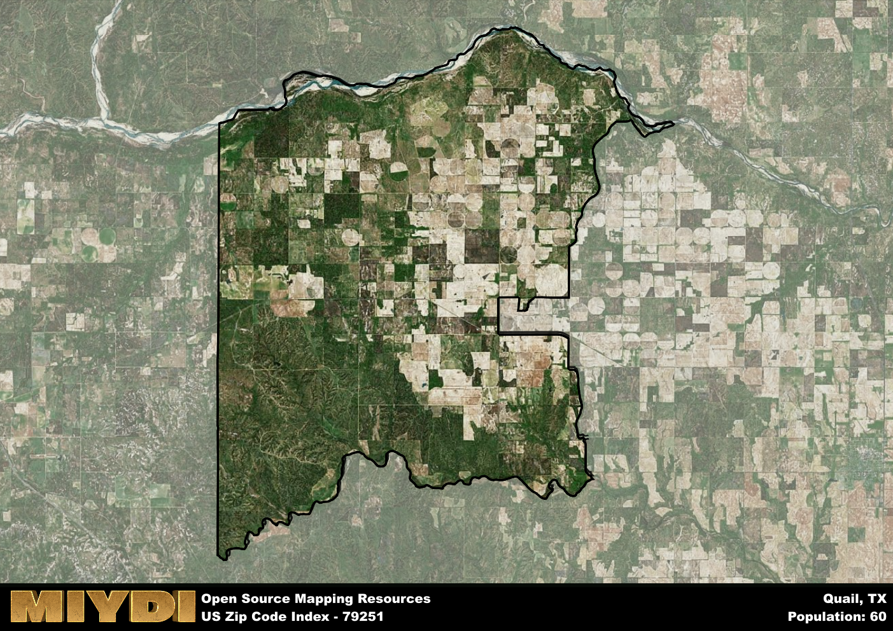

**Area Name:** Quail

**Zip Code:** 79251

**State:** TX

# Quail, TX 79251: A Charming Neighborhood in the Heart of the Texas Panhandle

Located in the Texas Panhandle, zip code 79251 encompasses the quaint neighborhood of Quail. Situated in Collingsworth County, Quail is surrounded by vast stretches of open plains and farmland. The area is within driving distance to major cities like Amarillo and Oklahoma City, making it a convenient yet peaceful retreat from urban life.

Quail has a rich history dating back to its establishment as a farming community in the late 19th century. The town grew steadily as settlers were attracted to the fertile land and abundant wildlife in the area. The town got its name from the plentiful quail that could be found in the surrounding fields. Over the years, Quail has maintained its rural charm while adapting to modern times.

Today, Quail is a close-knit community with a strong agricultural presence. Residents take pride in their farming heritage and celebrate it through annual events and festivals. The town offers essential services such as schools, post offices, and local businesses. Outdoor enthusiasts can enjoy hunting, fishing, and hiking in the nearby countryside, while history buffs can explore the town's historic sites and museums. Quail's friendly atmosphere and scenic surroundings make it a hidden gem in the Texas Panhandle.

# Quail Demographics

The population of Quail is 60.  
Quail has a population density of 0.48 per square mile.  
The area of Quail is 124.7 square miles.  

## Quail AI and Census Variables

The values presented in this dataset for Quail are AI-optimized, streamlined, and categorized into relevant buckets for enhanced utility in AI and mapping programs. These simplified values have been optimized to facilitate efficient analysis and integration into various technological applications, offering users accessible and actionable insights into demographics within the Quail area.

| AI Variables for Quail | Value |
|-------------|-------|
| Shape Area | 481622675.292969 |
| Shape Length | 125278.418222589 |

## How to use this free AI optimized Geo-Spatial Data for Quail, TX

This data is made freely available under the Creative Commons license, allowing for unrestricted use for any purpose. Users can access static resources directly from GitHub or leverage more advanced functionalities by utilizing the GeoJSON files. All datasets originate from official government or private sector sources and are meticulously compiled into relevant datasets within QGIS. However, the versatility of the data ensures compatibility with any mapping application.

## Data Accuracy Disclaimer
It's important to note that the data provided here may contain errors or discrepancies and should be considered as 'close enough' for business applications and AI rather than a definitive source of truth. This data is aggregated from multiple sources, some of which publish information on wildly different intervals, leading to potential inconsistencies. Additionally, certain data points may not be corrected for Covid-related changes, further impacting accuracy. Moreover, the assumption that demographic trends are consistent throughout a region may lead to discrepancies, as trends often concentrate in areas of highest population density. As a result, dense areas may be slightly underrepresented, while rural areas may be slightly overrepresented, resulting in a more conservative dataset. Furthermore, the focus primarily on areas within US Major and Minor Statistical areas means that approximately 40 million Americans living outside of these areas may not be fully represented. Lastly, the historical background and area descriptions generated using AI are susceptible to potential mistakes, so users should exercise caution when interpreting the information provided.
