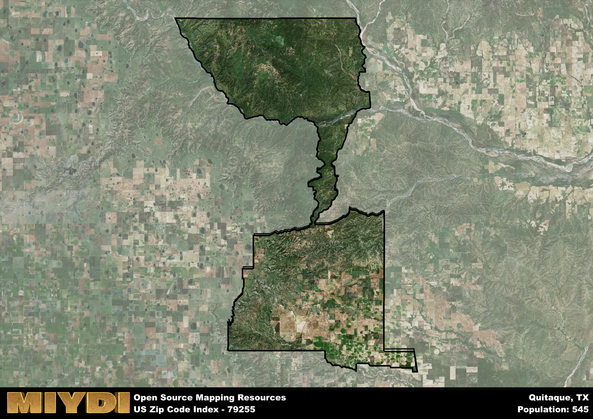

**Area Name:** Quitaque

**Zip Code:** 79255

**State:** TX

Quitaque is a part of the Amarillo - TX Metro Area, and makes up  of the Metro's population.  

# Discover the Charming Neighborhood of Quitaque, TX - Zip Code 79255

Located in the scenic region of West Texas, the zip code area 79255 encompasses the quaint neighborhood of Quitaque. Situated within Briscoe County, Quitaque is surrounded by vast stretches of open land and is in close proximity to the Caprock Canyons State Park. This charming neighborhood seamlessly integrates with the larger rural community and serves as a gateway to the natural beauty of the Texas Panhandle.

Quitaque has a rich historical narrative dating back to its establishment in the late 19th century. Originally settled as a ranching and farming community, Quitaque experienced growth with the arrival of the Fort Worth and Denver City Railway in the early 20th century. The neighborhood's name, derived from the Comanche language meaning "end of the trail," reflects its importance as a stopping point for cattle drives. Today, Quitaque retains its small-town charm and celebrates its Western heritage through annual events and festivals.

Presently, Quitaque offers a blend of local businesses, including family-owned shops and restaurants that cater to both residents and visitors. The neighborhood is known for its outdoor recreational opportunities, with hiking and biking trails in the nearby state park attracting nature enthusiasts. Additionally, Quitaque boasts historical sites such as the restored Hotel Turkey, which provides a glimpse into the area's past. With its friendly community atmosphere and natural beauty, Quitaque stands out as a hidden gem within the West Texas landscape.

# Quitaque Demographics

The population of Quitaque is 545.  
Quitaque has a population density of 1.76 per square mile.  
The area of Quitaque is 310.13 square miles.  

## Quitaque Income and Economic Data

These demographic numbers are sourced from IRS return data, providing comprehensive insights into the population dynamics and economic trends within Quitaque.

**Breakdown of return types for Quitaque**

The table offers insight into the composition of tax returns filed with the IRS, categorizing them into three main types. Single returns represent filings by individuals, joint returns by married couples, and head of household returns by individuals who qualify as heads of households, typically having dependents. This breakdown provides an understanding of the different filing statuses adopted by taxpayers when submitting their tax documentation.

| Return Types filed for Quitaque                              | Percentage          |
|----------------------------------------------------------|---------------------|
| Single Returns                                            | 0.35 |
| Joint Returns                                             | 0.53 |
| Head Household Returns                                    | 0 |

The income and economic data presented here is sourced from the IRS income brackets, utilized for categorizing tax returns by income levels. This table displays income ranges for both single filers and married couples, along with the corresponding number of returns and the percentage within each bracket, providing valuable insight into the distribution of taxes across various income groups.

| Bracket Name       | Single Filer Income Range | Married Couple Range | Number of Returns | Percentage of Returns |
|--------------------|----------------------------|----------------------|-------------------|-----------------------|
| 10% Bracket        | Up to $10,275              | Up to $20,550        | 60 | 0.35% |
| 12% Bracket        | $10,276 - $41,775          | $20,551 - $83,550    | 50 | 0.29% |
| 22% Bracket        | $41,776 - $89,075          | $83,551 - $178,150   | 40 | 0.24% |
| 24% Bracket        | $89,076 - $170,050         | $178,151 - $340,100  | 0 | 0% |
| 32% Bracket        | $170,051 - $215,950        | $340,101 - $431,900  | 20 | 0.12% |
| 35% Bracket        | $215,951 - $539,900        | $431,901 - $647,850  | 0 | 0% |

### Exploring Taxpayer Diversity: A Breakdown of Different Types of Tax Returns in Quitaque

The table offers insights into various types of tax returns filed, reflecting different aspects of taxpayer activities and demographics. Categories include charitable returns for donations, dependent returns for claimed dependents, educator population, elderly population, real estate returns, self-employment returns, student loan returns, and unemployment returns, providing valuable insights into taxpayer behavior and demographics.

| Quitaque Filing Types                    | Count | Percentage |
|--------------------------------------|-------|------------|
| Charitable Donations                 | 0 | 0% |
| Dependents Claimed                   | 0 | 0% |
| Educator Residents                   | 0 | 0% |
| Elderly Population                   | 70 | 0.41% |
| Farming Population                   | 40 | 0.235% |
| Real Estate Transactions             | 0 | 0% |
| Self-Employed Individuals            | 30 | 0.176% |
| Student Loan Cases                   | 0 | 0% |
| Unemployment Benefit Filings         | 0 | 0% |

## Quitaque AI and Census Variables

The values presented in this dataset for Quitaque are AI-optimized, streamlined, and categorized into relevant buckets for enhanced utility in AI and mapping programs. These simplified values have been optimized to facilitate efficient analysis and integration into various technological applications, offering users accessible and actionable insights into demographics within the Quitaque area.

| AI Variables for Quitaque | Value |
|-------------|-------|
| Shape Area | 1186139568.54297 |
| Shape Length | 274475.699717317 |
| CBSA Federal Processing Standard Code | 11100 |

## How to use this free AI optimized Geo-Spatial Data for Quitaque, TX

This data is made freely available under the Creative Commons license, allowing for unrestricted use for any purpose. Users can access static resources directly from GitHub or leverage more advanced functionalities by utilizing the GeoJSON files. All datasets originate from official government or private sector sources and are meticulously compiled into relevant datasets within QGIS. However, the versatility of the data ensures compatibility with any mapping application.

## Data Accuracy Disclaimer
It's important to note that the data provided here may contain errors or discrepancies and should be considered as 'close enough' for business applications and AI rather than a definitive source of truth. This data is aggregated from multiple sources, some of which publish information on wildly different intervals, leading to potential inconsistencies. Additionally, certain data points may not be corrected for Covid-related changes, further impacting accuracy. Moreover, the assumption that demographic trends are consistent throughout a region may lead to discrepancies, as trends often concentrate in areas of highest population density. As a result, dense areas may be slightly underrepresented, while rural areas may be slightly overrepresented, resulting in a more conservative dataset. Furthermore, the focus primarily on areas within US Major and Minor Statistical areas means that approximately 40 million Americans living outside of these areas may not be fully represented. Lastly, the historical background and area descriptions generated using AI are susceptible to potential mistakes, so users should exercise caution when interpreting the information provided.
