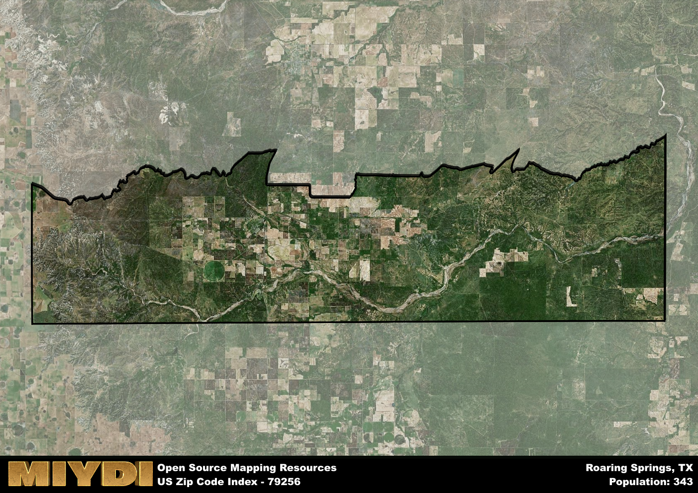

**Area Name:** Roaring Springs

**Zip Code:** 79256

**State:** TX

# Roaring Springs: A Quaint Neighborhood in West Texas  

Located in the heart of West Texas, the zip code area 79256 encompasses the charming neighborhood of Roaring Springs. Bordered by vast stretches of ranchland to the north and south, this area seamlessly integrates with the nearby towns of Matador and Dickens. Situated approximately 70 miles east of Lubbock, Roaring Springs serves as a peaceful retreat for those seeking a slower pace of life while still being connected to larger urban centers.

Roaring Springs has a rich historical narrative, dating back to the late 1800s when settlers were drawn to the area by the natural springs that provided a source of water. Named for the sound of the water rushing through the canyons, Roaring Springs quickly became a hub for ranching and agriculture. Over the years, the community has maintained its small-town charm while embracing modern amenities, making it a desirable place to live for those seeking a close-knit community with a strong sense of history.

Today, Roaring Springs offers a mix of agricultural and ranching activities, along with a variety of neighborhood-specific services such as local shops, restaurants, and schools. Residents and visitors alike can enjoy recreational amenities like fishing and hiking in the nearby canyons, as well as explore the town's historic sites that pay homage to its pioneer roots. With its unique blend of history, nature, and community spirit, Roaring Springs continues to be a hidden gem in the West Texas landscape.

# Roaring Springs Demographics

The population of Roaring Springs is 343.  
Roaring Springs has a population density of 1.63 per square mile.  
The area of Roaring Springs is 211.07 square miles.  

## Roaring Springs Income and Economic Data

These demographic numbers are sourced from IRS return data, providing comprehensive insights into the population dynamics and economic trends within Roaring Springs.

**Breakdown of return types for Roaring Springs**

The table offers insight into the composition of tax returns filed with the IRS, categorizing them into three main types. Single returns represent filings by individuals, joint returns by married couples, and head of household returns by individuals who qualify as heads of households, typically having dependents. This breakdown provides an understanding of the different filing statuses adopted by taxpayers when submitting their tax documentation.

| Return Types filed for Roaring Springs                              | Percentage          |
|----------------------------------------------------------|---------------------|
| Single Returns                                            | 0.54 |
| Joint Returns                                             | 0.46 |
| Head Household Returns                                    | 0 |

The income and economic data presented here is sourced from the IRS income brackets, utilized for categorizing tax returns by income levels. This table displays income ranges for both single filers and married couples, along with the corresponding number of returns and the percentage within each bracket, providing valuable insight into the distribution of taxes across various income groups.

| Bracket Name       | Single Filer Income Range | Married Couple Range | Number of Returns | Percentage of Returns |
|--------------------|----------------------------|----------------------|-------------------|-----------------------|
| 10% Bracket        | Up to $10,275              | Up to $20,550        | 50 | 0.38% |
| 12% Bracket        | $10,276 - $41,775          | $20,551 - $83,550    | 50 | 0.38% |
| 22% Bracket        | $41,776 - $89,075          | $83,551 - $178,150   | 0 | 0% |
| 24% Bracket        | $89,076 - $170,050         | $178,151 - $340,100  | 30 | 0.23% |
| 32% Bracket        | $170,051 - $215,950        | $340,101 - $431,900  | 0 | 0% |
| 35% Bracket        | $215,951 - $539,900        | $431,901 - $647,850  | 0 | 0% |

### Exploring Taxpayer Diversity: A Breakdown of Different Types of Tax Returns in Roaring Springs

The table offers insights into various types of tax returns filed, reflecting different aspects of taxpayer activities and demographics. Categories include charitable returns for donations, dependent returns for claimed dependents, educator population, elderly population, real estate returns, self-employment returns, student loan returns, and unemployment returns, providing valuable insights into taxpayer behavior and demographics.

| Roaring Springs Filing Types                    | Count | Percentage |
|--------------------------------------|-------|------------|
| Charitable Donations                 | 0 | 0% |
| Dependents Claimed                   | 0 | 0% |
| Educator Residents                   | 0 | 0% |
| Elderly Population                   | 50 | 0.38% |
| Farming Population                   | 20 | 0.154% |
| Real Estate Transactions             | 0 | 0% |
| Self-Employed Individuals            | 30 | 0.231% |
| Student Loan Cases                   | 0 | 0% |
| Unemployment Benefit Filings         | 0 | 0% |

## Roaring Springs AI and Census Variables

The values presented in this dataset for Roaring Springs are AI-optimized, streamlined, and categorized into relevant buckets for enhanced utility in AI and mapping programs. These simplified values have been optimized to facilitate efficient analysis and integration into various technological applications, offering users accessible and actionable insights into demographics within the Roaring Springs area.

| AI Variables for Roaring Springs | Value |
|-------------|-------|
| Shape Area | 795275270.359375 |
| Shape Length | 174053.903838893 |

## How to use this free AI optimized Geo-Spatial Data for Roaring Springs, TX

This data is made freely available under the Creative Commons license, allowing for unrestricted use for any purpose. Users can access static resources directly from GitHub or leverage more advanced functionalities by utilizing the GeoJSON files. All datasets originate from official government or private sector sources and are meticulously compiled into relevant datasets within QGIS. However, the versatility of the data ensures compatibility with any mapping application.

## Data Accuracy Disclaimer
It's important to note that the data provided here may contain errors or discrepancies and should be considered as 'close enough' for business applications and AI rather than a definitive source of truth. This data is aggregated from multiple sources, some of which publish information on wildly different intervals, leading to potential inconsistencies. Additionally, certain data points may not be corrected for Covid-related changes, further impacting accuracy. Moreover, the assumption that demographic trends are consistent throughout a region may lead to discrepancies, as trends often concentrate in areas of highest population density. As a result, dense areas may be slightly underrepresented, while rural areas may be slightly overrepresented, resulting in a more conservative dataset. Furthermore, the focus primarily on areas within US Major and Minor Statistical areas means that approximately 40 million Americans living outside of these areas may not be fully represented. Lastly, the historical background and area descriptions generated using AI are susceptible to potential mistakes, so users should exercise caution when interpreting the information provided.
