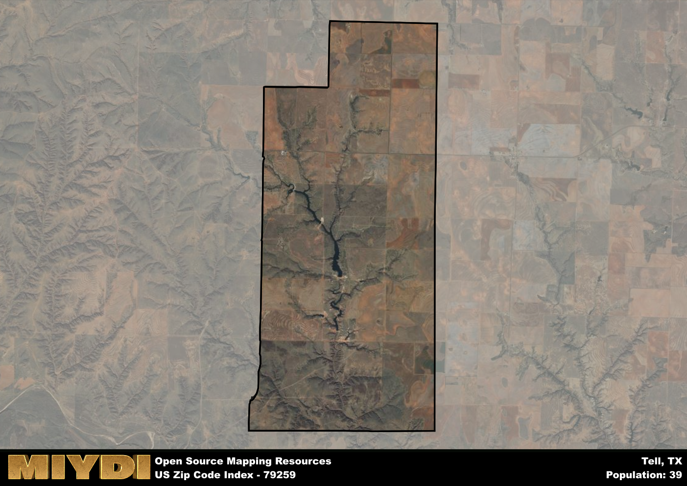

**Area Name:** Tell

**Zip Code:** 79259

**State:** TX

# Historic Tell: A Snapshot of a Charming Zip Code Area

Located in the heart of Texas, zip code 79259 encompasses the picturesque neighborhood of Tell. Situated within close proximity to major cities such as Lubbock and Amarillo, Tell seamlessly integrates with the surrounding districts while maintaining its own unique charm and identity. The area is defined by its rolling plains, scenic landscapes, and a close-knit community that values its rich history and natural beauty.

Tell has a rich historical narrative that dates back to its settlement in the late 19th century. Originally founded as a small farming community, Tell experienced steady growth due to its fertile land and strategic location along important trade routes. The area was named after a local pioneer who played a significant role in the development of the neighborhood. Over the years, Tell has evolved into a vibrant community that celebrates its pioneering spirit and agricultural heritage.

Today, Tell is a thriving neighborhood that offers a mix of residential, commercial, and recreational opportunities. The area is known for its agricultural industry, with farms and ranches dotting the landscape. Residents and visitors alike can enjoy a variety of outdoor activities such as hiking, fishing, and camping in the nearby parks and recreational areas. Tell also boasts a number of local businesses, restaurants, and cultural attractions that add to its unique character and make it a desirable place to live and visit.

# Tell Demographics

The population of Tell is 39.  
Tell has a population density of 2.3 per square mile.  
The area of Tell is 16.97 square miles.  

## Tell AI and Census Variables

The values presented in this dataset for Tell are AI-optimized, streamlined, and categorized into relevant buckets for enhanced utility in AI and mapping programs. These simplified values have been optimized to facilitate efficient analysis and integration into various technological applications, offering users accessible and actionable insights into demographics within the Tell area.

| AI Variables for Tell | Value |
|-------------|-------|
| Shape Area | 64669343.0820313 |
| Shape Length | 36632.5822086951 |

## How to use this free AI optimized Geo-Spatial Data for Tell, TX

This data is made freely available under the Creative Commons license, allowing for unrestricted use for any purpose. Users can access static resources directly from GitHub or leverage more advanced functionalities by utilizing the GeoJSON files. All datasets originate from official government or private sector sources and are meticulously compiled into relevant datasets within QGIS. However, the versatility of the data ensures compatibility with any mapping application.

## Data Accuracy Disclaimer
It's important to note that the data provided here may contain errors or discrepancies and should be considered as 'close enough' for business applications and AI rather than a definitive source of truth. This data is aggregated from multiple sources, some of which publish information on wildly different intervals, leading to potential inconsistencies. Additionally, certain data points may not be corrected for Covid-related changes, further impacting accuracy. Moreover, the assumption that demographic trends are consistent throughout a region may lead to discrepancies, as trends often concentrate in areas of highest population density. As a result, dense areas may be slightly underrepresented, while rural areas may be slightly overrepresented, resulting in a more conservative dataset. Furthermore, the focus primarily on areas within US Major and Minor Statistical areas means that approximately 40 million Americans living outside of these areas may not be fully represented. Lastly, the historical background and area descriptions generated using AI are susceptible to potential mistakes, so users should exercise caution when interpreting the information provided.
