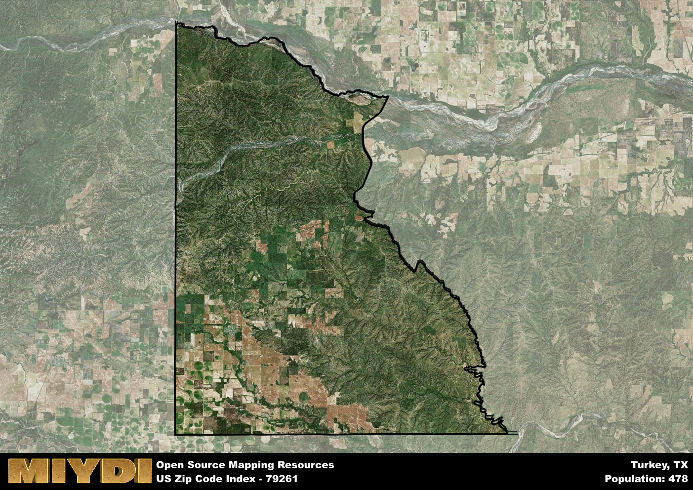

**Area Name:** Turkey

**Zip Code:** 79261

**State:** TX

# Exploring Turkey, Texas - Zip Code 79261

Located in the northwestern part of Texas, the zip code 79261 corresponds to the charming town of Turkey. Nestled within Hall County, Turkey is surrounded by the vast plains of the Texas Panhandle. The town is situated approximately 100 miles southeast of Amarillo and 110 miles northwest of Lubbock, making it a small but integral part of the regional urban fabric.

Turkey, Texas has a rich historical background dating back to the late 19th century when it was founded as a ranching community. The town's growth was spurred by the arrival of the Fort Worth and Denver City Railway in the early 1900s. Turkey gained its unique name from an incident involving a turkey hunt that took place during the town's early days. Today, Turkey is known for its western heritage and annual events such as the Bob Wills Day music festival, celebrating the legacy of the famous western swing musician.

Presently, Turkey maintains a small but vibrant community, with a focus on agriculture and ranching as primary economic activities. The town offers essential services such as schools, healthcare facilities, and local businesses to meet the needs of its residents. Visitors can explore the Turkey Heritage Museum, showcasing the town's history, or enjoy outdoor recreational activities in the surrounding natural landscapes. Turkey, Texas, continues to embody the spirit of the Old West while embracing modern amenities and opportunities for growth.

# Turkey Demographics

The population of Turkey is 478.  
Turkey has a population density of 1.85 per square mile.  
The area of Turkey is 258.3 square miles.  

## Turkey Income and Economic Data

These demographic numbers are sourced from IRS return data, providing comprehensive insights into the population dynamics and economic trends within Turkey.

**Breakdown of return types for Turkey**

The table offers insight into the composition of tax returns filed with the IRS, categorizing them into three main types. Single returns represent filings by individuals, joint returns by married couples, and head of household returns by individuals who qualify as heads of households, typically having dependents. This breakdown provides an understanding of the different filing statuses adopted by taxpayers when submitting their tax documentation.

| Return Types filed for Turkey                              | Percentage          |
|----------------------------------------------------------|---------------------|
| Single Returns                                            | 0.44 |
| Joint Returns                                             | 0.5 |
| Head Household Returns                                    | 0 |

The income and economic data presented here is sourced from the IRS income brackets, utilized for categorizing tax returns by income levels. This table displays income ranges for both single filers and married couples, along with the corresponding number of returns and the percentage within each bracket, providing valuable insight into the distribution of taxes across various income groups.

| Bracket Name       | Single Filer Income Range | Married Couple Range | Number of Returns | Percentage of Returns |
|--------------------|----------------------------|----------------------|-------------------|-----------------------|
| 10% Bracket        | Up to $10,275              | Up to $20,550        | 80 | 0.44% |
| 12% Bracket        | $10,276 - $41,775          | $20,551 - $83,550    | 60 | 0.33% |
| 22% Bracket        | $41,776 - $89,075          | $83,551 - $178,150   | 0 | 0% |
| 24% Bracket        | $89,076 - $170,050         | $178,151 - $340,100  | 40 | 0.22% |
| 32% Bracket        | $170,051 - $215,950        | $340,101 - $431,900  | 0 | 0% |
| 35% Bracket        | $215,951 - $539,900        | $431,901 - $647,850  | 0 | 0% |

### Exploring Taxpayer Diversity: A Breakdown of Different Types of Tax Returns in Turkey

The table offers insights into various types of tax returns filed, reflecting different aspects of taxpayer activities and demographics. Categories include charitable returns for donations, dependent returns for claimed dependents, educator population, elderly population, real estate returns, self-employment returns, student loan returns, and unemployment returns, providing valuable insights into taxpayer behavior and demographics.

| Turkey Filing Types                    | Count | Percentage |
|--------------------------------------|-------|------------|
| Charitable Donations                 | 0 | 0% |
| Dependents Claimed                   | 0 | 0% |
| Educator Residents                   | 0 | 0% |
| Elderly Population                   | 50 | 0.28% |
| Farming Population                   | 40 | 0.222% |
| Real Estate Transactions             | 0 | 0% |
| Self-Employed Individuals            | 40 | 0.222% |
| Student Loan Cases                   | 0 | 0% |
| Unemployment Benefit Filings         | 0 | 0% |

## Turkey AI and Census Variables

The values presented in this dataset for Turkey are AI-optimized, streamlined, and categorized into relevant buckets for enhanced utility in AI and mapping programs. These simplified values have been optimized to facilitate efficient analysis and integration into various technological applications, offering users accessible and actionable insights into demographics within the Turkey area.

| AI Variables for Turkey | Value |
|-------------|-------|
| Shape Area | 986038094.382813 |
| Shape Length | 168254.277727142 |

## How to use this free AI optimized Geo-Spatial Data for Turkey, TX

This data is made freely available under the Creative Commons license, allowing for unrestricted use for any purpose. Users can access static resources directly from GitHub or leverage more advanced functionalities by utilizing the GeoJSON files. All datasets originate from official government or private sector sources and are meticulously compiled into relevant datasets within QGIS. However, the versatility of the data ensures compatibility with any mapping application.

## Data Accuracy Disclaimer
It's important to note that the data provided here may contain errors or discrepancies and should be considered as 'close enough' for business applications and AI rather than a definitive source of truth. This data is aggregated from multiple sources, some of which publish information on wildly different intervals, leading to potential inconsistencies. Additionally, certain data points may not be corrected for Covid-related changes, further impacting accuracy. Moreover, the assumption that demographic trends are consistent throughout a region may lead to discrepancies, as trends often concentrate in areas of highest population density. As a result, dense areas may be slightly underrepresented, while rural areas may be slightly overrepresented, resulting in a more conservative dataset. Furthermore, the focus primarily on areas within US Major and Minor Statistical areas means that approximately 40 million Americans living outside of these areas may not be fully represented. Lastly, the historical background and area descriptions generated using AI are susceptible to potential mistakes, so users should exercise caution when interpreting the information provided.
