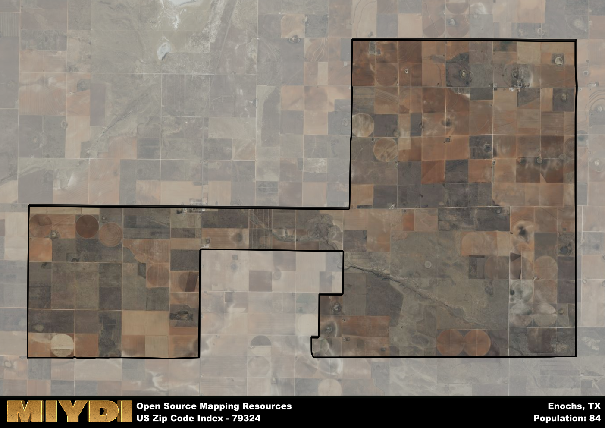

**Area Name:** Enochs

**Zip Code:** 79324

**State:** TX

# Enochs: A Small Community in West Texas  
Enochs, Texas, corresponding to the zip code 79324, is a small rural community located in the western part of the state. Situated in Bailey County, Enochs is surrounded by vast farmlands and ranches, with the nearest city being Lubbock, approximately 90 miles to the northeast. Despite its remote location, Enochs is an integral part of the West Texas region, known for its agricultural production and close-knit community.

The history of Enochs dates back to the early 20th century when the town was first established as a stop along the railroad. Named after one of the early settlers, Enochs has since grown into a small but resilient community. Over the years, the town has faced challenges such as droughts and economic fluctuations, but its residents have persevered, maintaining a strong sense of pride in their heritage and traditions. Today, Enochs remains a symbol of the pioneering spirit that helped shape the West Texas landscape.

As of today, Enochs is primarily an agricultural community, with farming and ranching being the main economic activities. The town is home to a number of small businesses, including local stores and services that cater to the needs of its residents. Enochs also boasts a few recreational amenities, such as parks and community centers, where residents can gather for events and social activities. While small in size, Enochs is rich in history and community spirit, making it a unique and cherished part of West Texas.

# Enochs Demographics

The population of Enochs is 84.  
Enochs has a population density of 1.59 per square mile.  
The area of Enochs is 52.67 square miles.  

## Enochs AI and Census Variables

The values presented in this dataset for Enochs are AI-optimized, streamlined, and categorized into relevant buckets for enhanced utility in AI and mapping programs. These simplified values have been optimized to facilitate efficient analysis and integration into various technological applications, offering users accessible and actionable insights into demographics within the Enochs area.

| AI Variables for Enochs | Value |
|-------------|-------|
| Shape Area | 198356395.007813 |
| Shape Length | 86463.1197964558 |

## How to use this free AI optimized Geo-Spatial Data for Enochs, TX

This data is made freely available under the Creative Commons license, allowing for unrestricted use for any purpose. Users can access static resources directly from GitHub or leverage more advanced functionalities by utilizing the GeoJSON files. All datasets originate from official government or private sector sources and are meticulously compiled into relevant datasets within QGIS. However, the versatility of the data ensures compatibility with any mapping application.

## Data Accuracy Disclaimer
It's important to note that the data provided here may contain errors or discrepancies and should be considered as 'close enough' for business applications and AI rather than a definitive source of truth. This data is aggregated from multiple sources, some of which publish information on wildly different intervals, leading to potential inconsistencies. Additionally, certain data points may not be corrected for Covid-related changes, further impacting accuracy. Moreover, the assumption that demographic trends are consistent throughout a region may lead to discrepancies, as trends often concentrate in areas of highest population density. As a result, dense areas may be slightly underrepresented, while rural areas may be slightly overrepresented, resulting in a more conservative dataset. Furthermore, the focus primarily on areas within US Major and Minor Statistical areas means that approximately 40 million Americans living outside of these areas may not be fully represented. Lastly, the historical background and area descriptions generated using AI are susceptible to potential mistakes, so users should exercise caution when interpreting the information provided.
