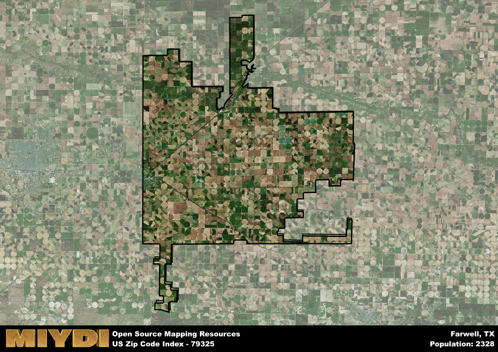

**Area Name:** Farwell

**Zip Code:** 79325

**State:** TX

# Farwell: A Charming Community in Zip Code 79325  

Located in the northeastern corner of Texas, zip code 79325 encompasses the charming community of Farwell. Bordered by the city of Texico to the north and Clovis, New Mexico, to the east, Farwell is an integral part of the surrounding rural landscape. Despite its small size, Farwell serves as a hub for the local agricultural industry and provides essential services for residents in the area.  

Farwell has a rich historical narrative that dates back to its establishment in the late 19th century. Originally settled by pioneers drawn to the fertile land for farming and ranching, the area quickly grew into a bustling community. The town was officially incorporated in 1921, and its growth was further spurred by the arrival of the railroad, facilitating trade and commerce in the region. The name "Farwell" is said to have been inspired by the desire to bid farewell to the challenges of the past and embrace a promising future.  

Today, Farwell remains a close-knit community that prides itself on its strong agricultural heritage and friendly atmosphere. The town's economy is primarily based on agriculture, with farming and ranching playing a crucial role in sustaining the local population. Residents and visitors alike can enjoy a range of recreational amenities, including parks, community events, and local businesses that cater to the needs of the community. Farwell also boasts several historic sites that offer a glimpse into its past, preserving the town's unique character for future generations to appreciate.

# Farwell Demographics

The population of Farwell is 2328.  
Farwell has a population density of 11.25 per square mile.  
The area of Farwell is 206.95 square miles.  

## Farwell Income and Economic Data

These demographic numbers are sourced from IRS return data, providing comprehensive insights into the population dynamics and economic trends within Farwell.

**Breakdown of return types for Farwell**

The table offers insight into the composition of tax returns filed with the IRS, categorizing them into three main types. Single returns represent filings by individuals, joint returns by married couples, and head of household returns by individuals who qualify as heads of households, typically having dependents. This breakdown provides an understanding of the different filing statuses adopted by taxpayers when submitting their tax documentation.

| Return Types filed for Farwell                              | Percentage          |
|----------------------------------------------------------|---------------------|
| Single Returns                                            | 0.39 |
| Joint Returns                                             | 0.48 |
| Head Household Returns                                    | 0.1 |

The income and economic data presented here is sourced from the IRS income brackets, utilized for categorizing tax returns by income levels. This table displays income ranges for both single filers and married couples, along with the corresponding number of returns and the percentage within each bracket, providing valuable insight into the distribution of taxes across various income groups.

| Bracket Name       | Single Filer Income Range | Married Couple Range | Number of Returns | Percentage of Returns |
|--------------------|----------------------------|----------------------|-------------------|-----------------------|
| 10% Bracket        | Up to $10,275              | Up to $20,550        | 260 | 0.3% |
| 12% Bracket        | $10,276 - $41,775          | $20,551 - $83,550    | 240 | 0.27% |
| 22% Bracket        | $41,776 - $89,075          | $83,551 - $178,150   | 150 | 0.17% |
| 24% Bracket        | $89,076 - $170,050         | $178,151 - $340,100  | 90 | 0.1% |
| 32% Bracket        | $170,051 - $215,950        | $340,101 - $431,900  | 100 | 0.11% |
| 35% Bracket        | $215,951 - $539,900        | $431,901 - $647,850  | 40 | 0.05% |

### Exploring Taxpayer Diversity: A Breakdown of Different Types of Tax Returns in Farwell

The table offers insights into various types of tax returns filed, reflecting different aspects of taxpayer activities and demographics. Categories include charitable returns for donations, dependent returns for claimed dependents, educator population, elderly population, real estate returns, self-employment returns, student loan returns, and unemployment returns, providing valuable insights into taxpayer behavior and demographics.

| Farwell Filing Types                    | Count | Percentage |
|--------------------------------------|-------|------------|
| Charitable Donations                 | 30 | 0.034% |
| Dependents Claimed                   | 0 | 0% |
| Educator Residents                   | 40 | 0.045% |
| Elderly Population                   | 230 | 0.26% |
| Farming Population                   | 90 | 0.102% |
| Real Estate Transactions             | 20 | 0.023% |
| Self-Employed Individuals            | 130 | 0.148% |
| Student Loan Cases                   | 20 | 0.023% |
| Unemployment Benefit Filings         | 30 | 0.03% |

## Farwell AI and Census Variables

The values presented in this dataset for Farwell are AI-optimized, streamlined, and categorized into relevant buckets for enhanced utility in AI and mapping programs. These simplified values have been optimized to facilitate efficient analysis and integration into various technological applications, offering users accessible and actionable insights into demographics within the Farwell area.

| AI Variables for Farwell | Value |
|-------------|-------|
| Shape Area | 789472257.1875 |
| Shape Length | 236564.006671947 |

## How to use this free AI optimized Geo-Spatial Data for Farwell, TX

This data is made freely available under the Creative Commons license, allowing for unrestricted use for any purpose. Users can access static resources directly from GitHub or leverage more advanced functionalities by utilizing the GeoJSON files. All datasets originate from official government or private sector sources and are meticulously compiled into relevant datasets within QGIS. However, the versatility of the data ensures compatibility with any mapping application.

## Data Accuracy Disclaimer
It's important to note that the data provided here may contain errors or discrepancies and should be considered as 'close enough' for business applications and AI rather than a definitive source of truth. This data is aggregated from multiple sources, some of which publish information on wildly different intervals, leading to potential inconsistencies. Additionally, certain data points may not be corrected for Covid-related changes, further impacting accuracy. Moreover, the assumption that demographic trends are consistent throughout a region may lead to discrepancies, as trends often concentrate in areas of highest population density. As a result, dense areas may be slightly underrepresented, while rural areas may be slightly overrepresented, resulting in a more conservative dataset. Furthermore, the focus primarily on areas within US Major and Minor Statistical areas means that approximately 40 million Americans living outside of these areas may not be fully represented. Lastly, the historical background and area descriptions generated using AI are susceptible to potential mistakes, so users should exercise caution when interpreting the information provided.
