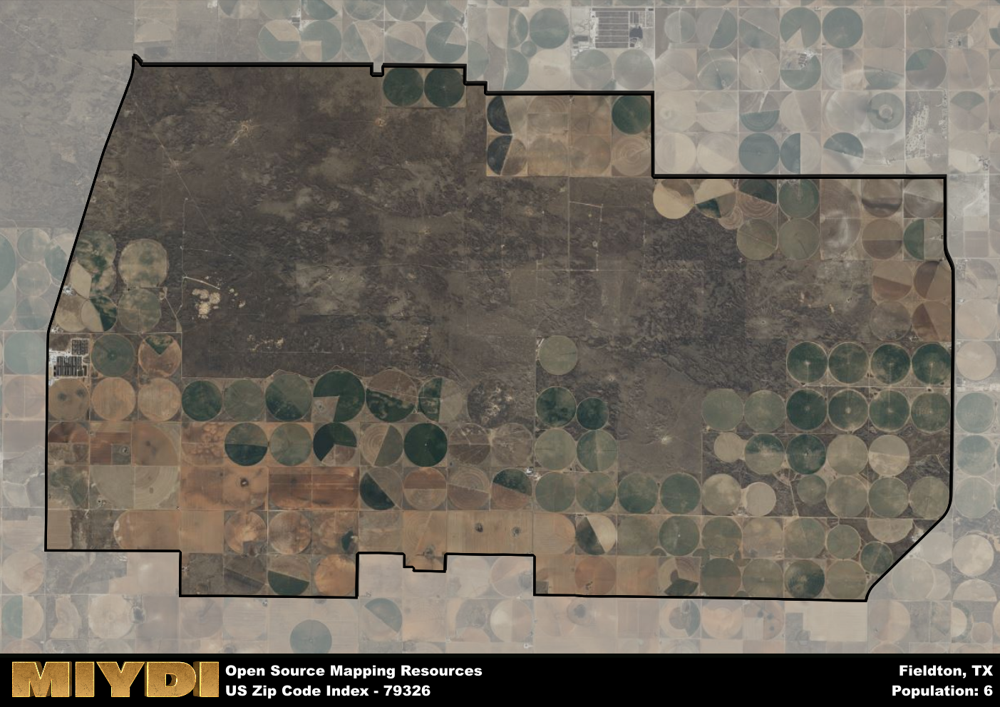

**Area Name:** Fieldton

**Zip Code:** 79326

**State:** TX

# Fieldton: A Small Community in West Texas  
Located in west Texas, zip code 79326 corresponds to the area known as Fieldton. Situated within Lamb County, Fieldton is a small unincorporated community with a population of around 150 residents. It is surrounded by vast farmlands and is approximately 20 miles southwest of the city of Littlefield. Fieldton is a rural area that is primarily accessed via Farm to Market Road 37, which serves as the main thoroughfare connecting it to neighboring towns.

Fieldton was founded in the early 1920s as a farming community, with agriculture serving as the primary economic driver for the area. The community was named after its founder, W. E. Fields. Over the years, Fieldton has maintained its rural charm and close-knit community feel. Despite its small size, Fieldton has a rich history rooted in agriculture, with many families having lived in the area for generations.

Today, Fieldton remains a tight-knit community with a focus on agriculture and rural living. The area is home to several farms and ranches, as well as small businesses that cater to the local population. Fieldton residents enjoy a slower pace of life, with access to outdoor recreational activities such as hunting and fishing. The community also takes pride in its historic sites, such as the Fieldton Cemetery, which serves as a reminder of the area's early settlers and pioneers.

# Fieldton Demographics

The population of Fieldton is 6.  
Fieldton has a population density of 0.1 per square mile.  
The area of Fieldton is 59.62 square miles.  

## Fieldton AI and Census Variables

The values presented in this dataset for Fieldton are AI-optimized, streamlined, and categorized into relevant buckets for enhanced utility in AI and mapping programs. These simplified values have been optimized to facilitate efficient analysis and integration into various technological applications, offering users accessible and actionable insights into demographics within the Fieldton area.

| AI Variables for Fieldton | Value |
|-------------|-------|
| Shape Area | 225780404.589844 |
| Shape Length | 67559.1815932618 |

## How to use this free AI optimized Geo-Spatial Data for Fieldton, TX

This data is made freely available under the Creative Commons license, allowing for unrestricted use for any purpose. Users can access static resources directly from GitHub or leverage more advanced functionalities by utilizing the GeoJSON files. All datasets originate from official government or private sector sources and are meticulously compiled into relevant datasets within QGIS. However, the versatility of the data ensures compatibility with any mapping application.

## Data Accuracy Disclaimer
It's important to note that the data provided here may contain errors or discrepancies and should be considered as 'close enough' for business applications and AI rather than a definitive source of truth. This data is aggregated from multiple sources, some of which publish information on wildly different intervals, leading to potential inconsistencies. Additionally, certain data points may not be corrected for Covid-related changes, further impacting accuracy. Moreover, the assumption that demographic trends are consistent throughout a region may lead to discrepancies, as trends often concentrate in areas of highest population density. As a result, dense areas may be slightly underrepresented, while rural areas may be slightly overrepresented, resulting in a more conservative dataset. Furthermore, the focus primarily on areas within US Major and Minor Statistical areas means that approximately 40 million Americans living outside of these areas may not be fully represented. Lastly, the historical background and area descriptions generated using AI are susceptible to potential mistakes, so users should exercise caution when interpreting the information provided.
