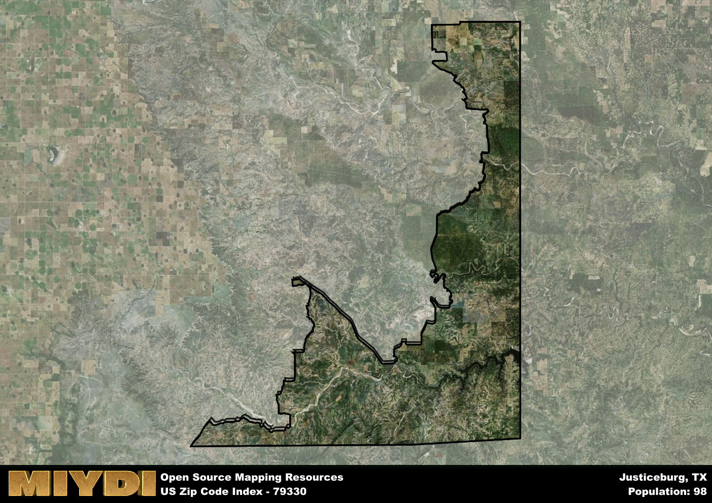

**Area Name:** Justiceburg

**Zip Code:** 79330

**State:** TX

Justiceburg is a part of the Lubbock - TX Metro Area, and makes up  of the Metro's population.  

# Justiceburg: A Hidden Gem in West Texas  

Located in Garza County, zip code 79330 encompasses the quaint community of Justiceburg, nestled in the heart of West Texas. Surrounded by vast stretches of rugged terrain, this area is a peaceful retreat for residents looking to escape the hustle and bustle of nearby cities like Lubbock. Justiceburg is seamlessly integrated into the natural beauty of the region, with Lake Alan Henry to the south offering outdoor recreational opportunities and the Caprock Escarpment providing stunning views to the north.

Justiceburg has a rich historical narrative that dates back to its founding in the late 19th century. Originally a stop on the historic Fort Worth and Denver South Plains Railway, the area flourished as a hub for transportation and commerce. Over the years, Justiceburg has evolved into a close-knit community with a strong sense of pride in its Western heritage. The name "Justiceburg" itself reflects the values of fairness and integrity that have defined the area for generations.

Today, Justiceburg boasts a thriving economy primarily driven by agriculture and tourism. Local businesses cater to residents and visitors alike, offering essential services and unique shopping experiences. The area is also home to a variety of recreational amenities, including fishing, boating, and camping facilities at Lake Alan Henry. Visitors can explore historic sites like the Justiceburg Cemetery, which provides a glimpse into the community's past. With its serene atmosphere and rich history, Justiceburg stands out as a hidden gem in the vast landscape of West Texas.

# Justiceburg Demographics

The population of Justiceburg is 98.  
Justiceburg has a population density of 0.4 per square mile.  
The area of Justiceburg is 246.35 square miles.  

## Justiceburg AI and Census Variables

The values presented in this dataset for Justiceburg are AI-optimized, streamlined, and categorized into relevant buckets for enhanced utility in AI and mapping programs. These simplified values have been optimized to facilitate efficient analysis and integration into various technological applications, offering users accessible and actionable insights into demographics within the Justiceburg area.

| AI Variables for Justiceburg | Value |
|-------------|-------|
| Shape Area | 911848243.707031 |
| Shape Length | 269256.923282834 |
| CBSA Federal Processing Standard Code | 31180 |

## How to use this free AI optimized Geo-Spatial Data for Justiceburg, TX

This data is made freely available under the Creative Commons license, allowing for unrestricted use for any purpose. Users can access static resources directly from GitHub or leverage more advanced functionalities by utilizing the GeoJSON files. All datasets originate from official government or private sector sources and are meticulously compiled into relevant datasets within QGIS. However, the versatility of the data ensures compatibility with any mapping application.

## Data Accuracy Disclaimer
It's important to note that the data provided here may contain errors or discrepancies and should be considered as 'close enough' for business applications and AI rather than a definitive source of truth. This data is aggregated from multiple sources, some of which publish information on wildly different intervals, leading to potential inconsistencies. Additionally, certain data points may not be corrected for Covid-related changes, further impacting accuracy. Moreover, the assumption that demographic trends are consistent throughout a region may lead to discrepancies, as trends often concentrate in areas of highest population density. As a result, dense areas may be slightly underrepresented, while rural areas may be slightly overrepresented, resulting in a more conservative dataset. Furthermore, the focus primarily on areas within US Major and Minor Statistical areas means that approximately 40 million Americans living outside of these areas may not be fully represented. Lastly, the historical background and area descriptions generated using AI are susceptible to potential mistakes, so users should exercise caution when interpreting the information provided.
