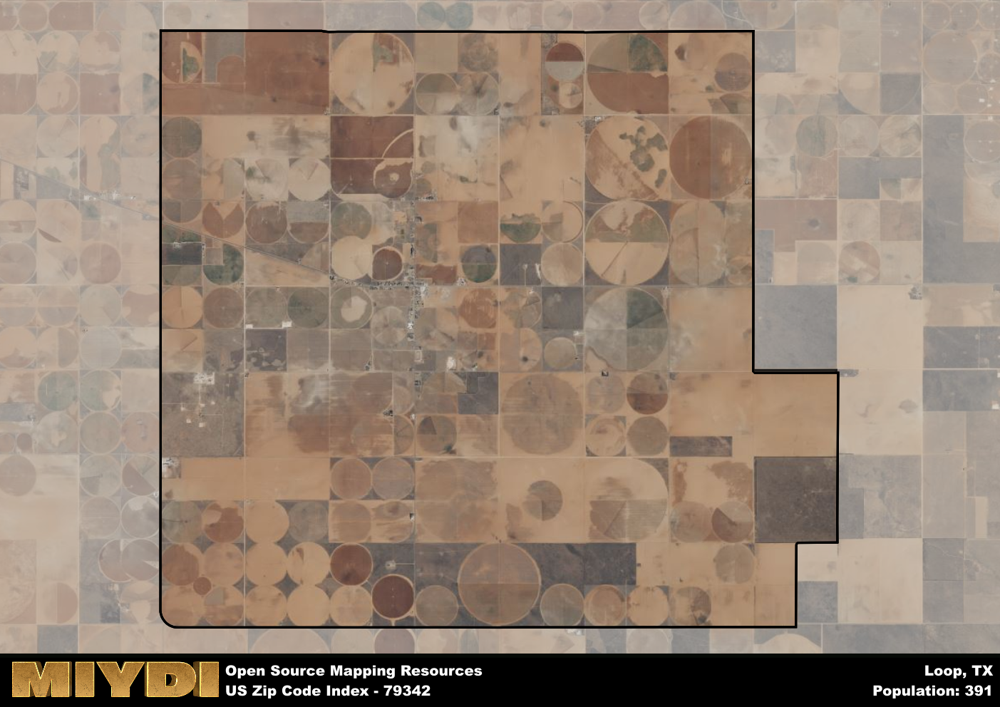

**Area Name:** Loop

**Zip Code:** 79342

**State:** TX

# Loop: A Historic Neighborhood in the Heart of West Texas  

Located in the heart of West Texas, the zip code 79342 corresponds to the neighborhood of Loop. Situated within the larger metropolitan context of Lubbock, Loop is a vibrant community known for its close-knit atmosphere and family-friendly environment. Bordered by Interstate 27 to the east and Highway 84 to the north, Loop seamlessly integrates with neighboring districts such as Ransom Canyon and Buffalo Springs Lake, offering residents easy access to a variety of amenities and services.

Loop has a rich historical narrative that dates back to the early settlement of West Texas. Originally established as a farming community in the late 19th century, Loop experienced rapid growth during the oil boom of the 1920s. The area's name is believed to have originated from the loop-shaped road that encircles the neighborhood, providing a unique layout that distinguishes it from surrounding areas. Over the years, Loop has evolved into a thriving residential enclave with a mix of historic homes and modern developments.

Today, Loop boasts a diverse economy supported by a range of local businesses, including shops, restaurants, and services catering to residents' needs. The neighborhood is also home to several parks and recreational facilities, offering outdoor enthusiasts plenty of opportunities for hiking, biking, and picnicking. Cultural and historic sites, such as the Loop Heritage Museum, provide insight into the area's past and showcase its enduring legacy as a vital part of the Lubbock metropolitan area.

# Loop Demographics

The population of Loop is 391.  
Loop has a population density of 7.57 per square mile.  
The area of Loop is 51.63 square miles.  

## Loop Income and Economic Data

These demographic numbers are sourced from IRS return data, providing comprehensive insights into the population dynamics and economic trends within Loop.

**Breakdown of return types for Loop**

The table offers insight into the composition of tax returns filed with the IRS, categorizing them into three main types. Single returns represent filings by individuals, joint returns by married couples, and head of household returns by individuals who qualify as heads of households, typically having dependents. This breakdown provides an understanding of the different filing statuses adopted by taxpayers when submitting their tax documentation.

| Return Types filed for Loop                              | Percentage          |
|----------------------------------------------------------|---------------------|
| Single Returns                                            | 0.35 |
| Joint Returns                                             | 0.53 |
| Head Household Returns                                    | 0 |

The income and economic data presented here is sourced from the IRS income brackets, utilized for categorizing tax returns by income levels. This table displays income ranges for both single filers and married couples, along with the corresponding number of returns and the percentage within each bracket, providing valuable insight into the distribution of taxes across various income groups.

| Bracket Name       | Single Filer Income Range | Married Couple Range | Number of Returns | Percentage of Returns |
|--------------------|----------------------------|----------------------|-------------------|-----------------------|
| 10% Bracket        | Up to $10,275              | Up to $20,550        | 60 | 0.35% |
| 12% Bracket        | $10,276 - $41,775          | $20,551 - $83,550    | 40 | 0.24% |
| 22% Bracket        | $41,776 - $89,075          | $83,551 - $178,150   | 40 | 0.24% |
| 24% Bracket        | $89,076 - $170,050         | $178,151 - $340,100  | 0 | 0% |
| 32% Bracket        | $170,051 - $215,950        | $340,101 - $431,900  | 30 | 0.18% |
| 35% Bracket        | $215,951 - $539,900        | $431,901 - $647,850  | 0 | 0% |

### Exploring Taxpayer Diversity: A Breakdown of Different Types of Tax Returns in Loop

The table offers insights into various types of tax returns filed, reflecting different aspects of taxpayer activities and demographics. Categories include charitable returns for donations, dependent returns for claimed dependents, educator population, elderly population, real estate returns, self-employment returns, student loan returns, and unemployment returns, providing valuable insights into taxpayer behavior and demographics.

| Loop Filing Types                    | Count | Percentage |
|--------------------------------------|-------|------------|
| Charitable Donations                 | 0 | 0% |
| Dependents Claimed                   | 0 | 0% |
| Educator Residents                   | 0 | 0% |
| Elderly Population                   | 40 | 0.24% |
| Farming Population                   | 20 | 0.118% |
| Real Estate Transactions             | 0 | 0% |
| Self-Employed Individuals            | 40 | 0.235% |
| Student Loan Cases                   | 0 | 0% |
| Unemployment Benefit Filings         | 0 | 0% |

## Loop AI and Census Variables

The values presented in this dataset for Loop are AI-optimized, streamlined, and categorized into relevant buckets for enhanced utility in AI and mapping programs. These simplified values have been optimized to facilitate efficient analysis and integration into various technological applications, offering users accessible and actionable insights into demographics within the Loop area.

| AI Variables for Loop | Value |
|-------------|-------|
| Shape Area | 190237274.570313 |
| Shape Length | 57453.6441572231 |

## How to use this free AI optimized Geo-Spatial Data for Loop, TX

This data is made freely available under the Creative Commons license, allowing for unrestricted use for any purpose. Users can access static resources directly from GitHub or leverage more advanced functionalities by utilizing the GeoJSON files. All datasets originate from official government or private sector sources and are meticulously compiled into relevant datasets within QGIS. However, the versatility of the data ensures compatibility with any mapping application.

## Data Accuracy Disclaimer
It's important to note that the data provided here may contain errors or discrepancies and should be considered as 'close enough' for business applications and AI rather than a definitive source of truth. This data is aggregated from multiple sources, some of which publish information on wildly different intervals, leading to potential inconsistencies. Additionally, certain data points may not be corrected for Covid-related changes, further impacting accuracy. Moreover, the assumption that demographic trends are consistent throughout a region may lead to discrepancies, as trends often concentrate in areas of highest population density. As a result, dense areas may be slightly underrepresented, while rural areas may be slightly overrepresented, resulting in a more conservative dataset. Furthermore, the focus primarily on areas within US Major and Minor Statistical areas means that approximately 40 million Americans living outside of these areas may not be fully represented. Lastly, the historical background and area descriptions generated using AI are susceptible to potential mistakes, so users should exercise caution when interpreting the information provided.
