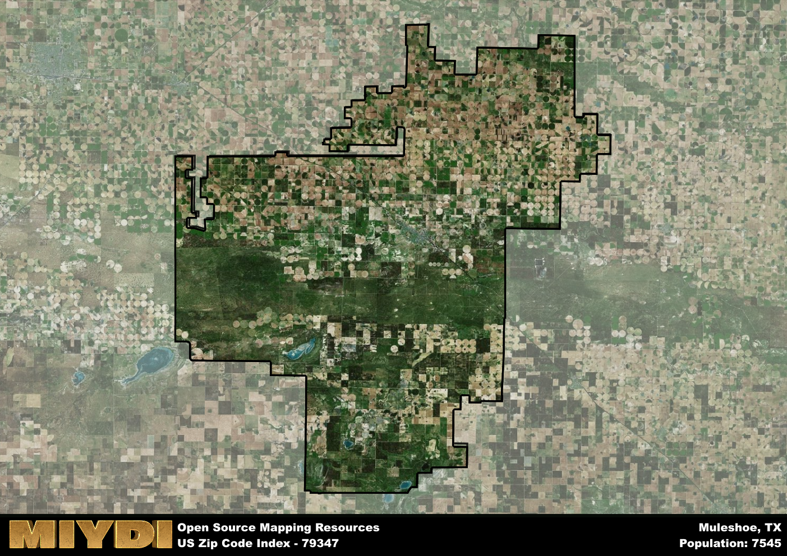

**Area Name:** Muleshoe

**Zip Code:** 79347

**State:** TX

Muleshoe is a part of the Portales - NM Micro Area, and makes up  of the Metro's population.  

# Muleshoe: A Historic and Vibrant Community in West Texas  

Located in West Texas, the zip code area 79347 is situated in the heart of Muleshoe, a small town in Bailey County. The area is bounded by agricultural fields and ranch lands, with the larger city of Lubbock to the northeast and Clovis, New Mexico to the west. Muleshoe serves as a hub for the surrounding rural communities, providing essential services and a sense of community for residents in the region.  

Muleshoe has a rich history dating back to the early 20th century when it was founded as a shipping point for the railroad. The town grew rapidly as settlers moved in to take advantage of the fertile land for farming and ranching. The unique name of Muleshoe is said to have originated from the shape of the crossroads where the town was established. Over the years, Muleshoe has evolved into a close-knit community known for its agricultural heritage and welcoming atmosphere.  

Today, Muleshoe continues to thrive as a center for agriculture and commerce in West Texas. The area boasts a variety of small businesses, restaurants, and community services that cater to the needs of residents and visitors alike. Additionally, Muleshoe is home to several parks, including the Muleshoe National Wildlife Refuge, which offers hiking and birdwatching opportunities. The town also celebrates its history with events and festivals that showcase its unique heritage and culture.

# Muleshoe Demographics

The population of Muleshoe is 7545.  
Muleshoe has a population density of 11.82 per square mile.  
The area of Muleshoe is 638.32 square miles.  

## Muleshoe Income and Economic Data

These demographic numbers are sourced from IRS return data, providing comprehensive insights into the population dynamics and economic trends within Muleshoe.

**Breakdown of return types for Muleshoe**

The table offers insight into the composition of tax returns filed with the IRS, categorizing them into three main types. Single returns represent filings by individuals, joint returns by married couples, and head of household returns by individuals who qualify as heads of households, typically having dependents. This breakdown provides an understanding of the different filing statuses adopted by taxpayers when submitting their tax documentation.

| Return Types filed for Muleshoe                              | Percentage          |
|----------------------------------------------------------|---------------------|
| Single Returns                                            | 0.39 |
| Joint Returns                                             | 0.4 |
| Head Household Returns                                    | 0.2 |

The income and economic data presented here is sourced from the IRS income brackets, utilized for categorizing tax returns by income levels. This table displays income ranges for both single filers and married couples, along with the corresponding number of returns and the percentage within each bracket, providing valuable insight into the distribution of taxes across various income groups.

| Bracket Name       | Single Filer Income Range | Married Couple Range | Number of Returns | Percentage of Returns |
|--------------------|----------------------------|----------------------|-------------------|-----------------------|
| 10% Bracket        | Up to $10,275              | Up to $20,550        | 1020 | 0.38% |
| 12% Bracket        | $10,276 - $41,775          | $20,551 - $83,550    | 810 | 0.3% |
| 22% Bracket        | $41,776 - $89,075          | $83,551 - $178,150   | 400 | 0.15% |
| 24% Bracket        | $89,076 - $170,050         | $178,151 - $340,100  | 190 | 0.07% |
| 32% Bracket        | $170,051 - $215,950        | $340,101 - $431,900  | 220 | 0.08% |
| 35% Bracket        | $215,951 - $539,900        | $431,901 - $647,850  | 60 | 0.02% |

### Exploring Taxpayer Diversity: A Breakdown of Different Types of Tax Returns in Muleshoe

The table offers insights into various types of tax returns filed, reflecting different aspects of taxpayer activities and demographics. Categories include charitable returns for donations, dependent returns for claimed dependents, educator population, elderly population, real estate returns, self-employment returns, student loan returns, and unemployment returns, providing valuable insights into taxpayer behavior and demographics.

| Muleshoe Filing Types                    | Count | Percentage |
|--------------------------------------|-------|------------|
| Charitable Donations                 | 60 | 0.022% |
| Dependents Claimed                   | 50 | 0.019% |
| Educator Residents                   | 70 | 0.026% |
| Elderly Population                   | 600 | 0.22% |
| Farming Population                   | 210 | 0.078% |
| Real Estate Transactions             | 40 | 0.015% |
| Self-Employed Individuals            | 410 | 0.152% |
| Student Loan Cases                   | 80 | 0.03% |
| Unemployment Benefit Filings         | 150 | 0.06% |

## Muleshoe AI and Census Variables

The values presented in this dataset for Muleshoe are AI-optimized, streamlined, and categorized into relevant buckets for enhanced utility in AI and mapping programs. These simplified values have been optimized to facilitate efficient analysis and integration into various technological applications, offering users accessible and actionable insights into demographics within the Muleshoe area.

| AI Variables for Muleshoe | Value |
|-------------|-------|
| Shape Area | 2423157703.38281 |
| Shape Length | 343817.701961326 |
| CBSA Federal Processing Standard Code | 38780 |

## How to use this free AI optimized Geo-Spatial Data for Muleshoe, TX

This data is made freely available under the Creative Commons license, allowing for unrestricted use for any purpose. Users can access static resources directly from GitHub or leverage more advanced functionalities by utilizing the GeoJSON files. All datasets originate from official government or private sector sources and are meticulously compiled into relevant datasets within QGIS. However, the versatility of the data ensures compatibility with any mapping application.

## Data Accuracy Disclaimer
It's important to note that the data provided here may contain errors or discrepancies and should be considered as 'close enough' for business applications and AI rather than a definitive source of truth. This data is aggregated from multiple sources, some of which publish information on wildly different intervals, leading to potential inconsistencies. Additionally, certain data points may not be corrected for Covid-related changes, further impacting accuracy. Moreover, the assumption that demographic trends are consistent throughout a region may lead to discrepancies, as trends often concentrate in areas of highest population density. As a result, dense areas may be slightly underrepresented, while rural areas may be slightly overrepresented, resulting in a more conservative dataset. Furthermore, the focus primarily on areas within US Major and Minor Statistical areas means that approximately 40 million Americans living outside of these areas may not be fully represented. Lastly, the historical background and area descriptions generated using AI are susceptible to potential mistakes, so users should exercise caution when interpreting the information provided.
