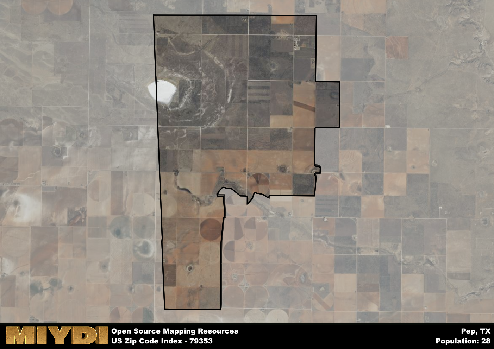

**Area Name:** Pep

**Zip Code:** 79353

**State:** TX

Pep is a part of the Levelland - TX Micro Area, and makes up  of the Metro's population.  

# Pep: A Quaint Community in West Texas  
Located in West Texas, the zip code area 79353 is home to the small community of Pep. Situated within Hockley County, Pep is surrounded by vast expanses of farmland and is a short drive away from larger cities like Lubbock. Despite its rural setting, Pep serves as a close-knit neighborhood within the larger metropolitan context, offering residents a peaceful retreat from the hustle and bustle of urban life.

Pep has a rich history that dates back to its establishment as a farming community in the early 20th century. Originally settled by homesteaders seeking fertile land for agriculture, Pep grew into a thriving community known for its cotton and wheat production. The area's name is said to have originated from the initials of the community's founding families, Payne, Eubanks, and Phillips, highlighting the tight-knit nature of the early settlers.

Today, Pep maintains its agricultural roots while also embracing modern amenities and services. The area is dotted with family-owned farms and ranches, providing a glimpse into traditional West Texas life. Residents can enjoy small-town charm with local businesses, schools, and churches, as well as recreational activities like hunting and fishing. Pep also boasts a strong community spirit, with annual events and festivals that celebrate its heritage and culture.

# Pep Demographics

The population of Pep is 28.  
Pep has a population density of 1.41 per square mile.  
The area of Pep is 19.79 square miles.  

## Pep AI and Census Variables

The values presented in this dataset for Pep are AI-optimized, streamlined, and categorized into relevant buckets for enhanced utility in AI and mapping programs. These simplified values have been optimized to facilitate efficient analysis and integration into various technological applications, offering users accessible and actionable insights into demographics within the Pep area.

| AI Variables for Pep | Value |
|-------------|-------|
| Shape Area | 74380639.3710938 |
| Shape Length | 44986.526640541 |
| CBSA Federal Processing Standard Code | 30220 |

## How to use this free AI optimized Geo-Spatial Data for Pep, TX

This data is made freely available under the Creative Commons license, allowing for unrestricted use for any purpose. Users can access static resources directly from GitHub or leverage more advanced functionalities by utilizing the GeoJSON files. All datasets originate from official government or private sector sources and are meticulously compiled into relevant datasets within QGIS. However, the versatility of the data ensures compatibility with any mapping application.

## Data Accuracy Disclaimer
It's important to note that the data provided here may contain errors or discrepancies and should be considered as 'close enough' for business applications and AI rather than a definitive source of truth. This data is aggregated from multiple sources, some of which publish information on wildly different intervals, leading to potential inconsistencies. Additionally, certain data points may not be corrected for Covid-related changes, further impacting accuracy. Moreover, the assumption that demographic trends are consistent throughout a region may lead to discrepancies, as trends often concentrate in areas of highest population density. As a result, dense areas may be slightly underrepresented, while rural areas may be slightly overrepresented, resulting in a more conservative dataset. Furthermore, the focus primarily on areas within US Major and Minor Statistical areas means that approximately 40 million Americans living outside of these areas may not be fully represented. Lastly, the historical background and area descriptions generated using AI are susceptible to potential mistakes, so users should exercise caution when interpreting the information provided.
