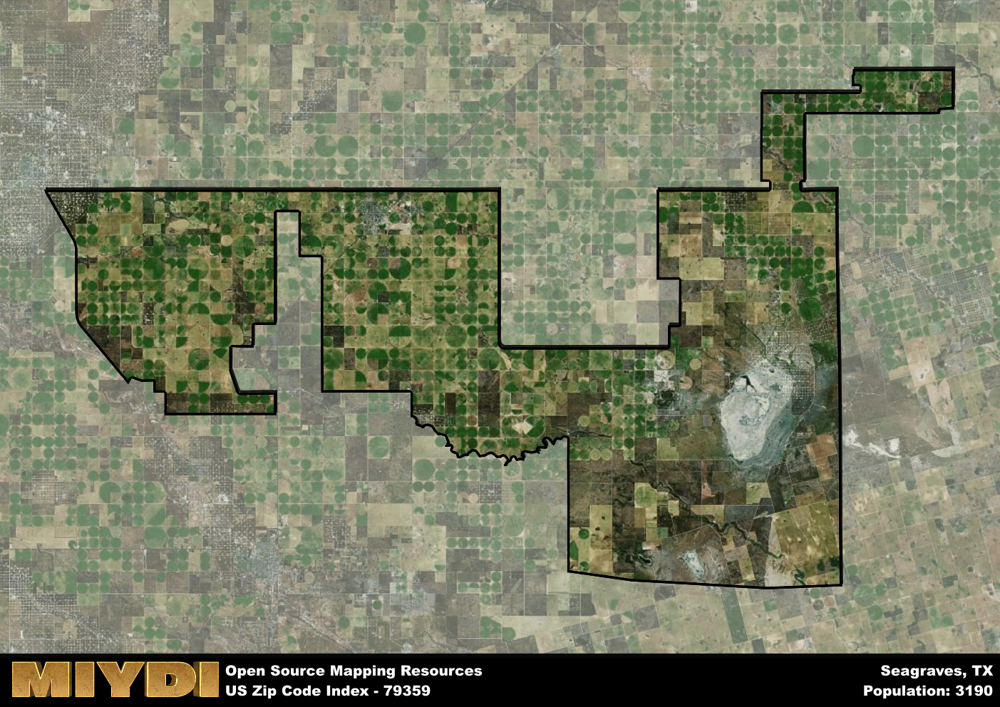

**Area Name:** Seagraves

**Zip Code:** 79359

**State:** TX

Seagraves is a part of the Lamesa - TX Micro Area, and makes up  of the Metro's population.  

# Seagraves: A Historic Community in West Texas

Seagraves, located in zip code 79359, is a small but vibrant community in West Texas. Situated in Gaines County, Seagraves is bordered by the cities of Denver City to the north and Seminole to the south. The zip code area is primarily residential, with some commercial establishments serving the local population. Despite its rural setting, Seagraves is an integral part of the larger West Texas region, contributing to the area's agricultural and oil industries.

Founded in the early 1900s, Seagraves has a rich history rooted in agriculture and ranching. The town was named after W.E. Seagraves, a local landowner who played a significant role in its development. Over the years, Seagraves experienced growth as settlers were drawn to the area for its fertile land and opportunities for farming. The community has preserved its small-town charm and strong sense of community, making it a desirable place to live for residents seeking a peaceful and welcoming environment.

Today, Seagraves continues to thrive as a close-knit community with a strong sense of pride in its heritage. The area's economy is driven by agriculture, with cotton farming being a prominent industry. Residents enjoy local amenities such as parks, schools, and small businesses that cater to their daily needs. Seagraves also boasts a few historic sites, including the Seagraves Heritage Museum, which showcases the town's past and celebrates its cultural identity. Overall, Seagraves remains a hidden gem in West Texas, offering a peaceful retreat for those seeking a slower pace of life.

# Seagraves Demographics

The population of Seagraves is 3190.  
Seagraves has a population density of 8.37 per square mile.  
The area of Seagraves is 381.04 square miles.  

## Seagraves Income and Economic Data

These demographic numbers are sourced from IRS return data, providing comprehensive insights into the population dynamics and economic trends within Seagraves.

**Breakdown of return types for Seagraves**

The table offers insight into the composition of tax returns filed with the IRS, categorizing them into three main types. Single returns represent filings by individuals, joint returns by married couples, and head of household returns by individuals who qualify as heads of households, typically having dependents. This breakdown provides an understanding of the different filing statuses adopted by taxpayers when submitting their tax documentation.

| Return Types filed for Seagraves                              | Percentage          |
|----------------------------------------------------------|---------------------|
| Single Returns                                            | 0.38 |
| Joint Returns                                             | 0.4 |
| Head Household Returns                                    | 0.21 |

The income and economic data presented here is sourced from the IRS income brackets, utilized for categorizing tax returns by income levels. This table displays income ranges for both single filers and married couples, along with the corresponding number of returns and the percentage within each bracket, providing valuable insight into the distribution of taxes across various income groups.

| Bracket Name       | Single Filer Income Range | Married Couple Range | Number of Returns | Percentage of Returns |
|--------------------|----------------------------|----------------------|-------------------|-----------------------|
| 10% Bracket        | Up to $10,275              | Up to $20,550        | 470 | 0.39% |
| 12% Bracket        | $10,276 - $41,775          | $20,551 - $83,550    | 330 | 0.27% |
| 22% Bracket        | $41,776 - $89,075          | $83,551 - $178,150   | 180 | 0.15% |
| 24% Bracket        | $89,076 - $170,050         | $178,151 - $340,100  | 90 | 0.07% |
| 32% Bracket        | $170,051 - $215,950        | $340,101 - $431,900  | 110 | 0.09% |
| 35% Bracket        | $215,951 - $539,900        | $431,901 - $647,850  | 30 | 0.02% |

### Exploring Taxpayer Diversity: A Breakdown of Different Types of Tax Returns in Seagraves

The table offers insights into various types of tax returns filed, reflecting different aspects of taxpayer activities and demographics. Categories include charitable returns for donations, dependent returns for claimed dependents, educator population, elderly population, real estate returns, self-employment returns, student loan returns, and unemployment returns, providing valuable insights into taxpayer behavior and demographics.

| Seagraves Filing Types                    | Count | Percentage |
|--------------------------------------|-------|------------|
| Charitable Donations                 | 0 | 0% |
| Dependents Claimed                   | 0 | 0% |
| Educator Residents                   | 30 | 0.025% |
| Elderly Population                   | 230 | 0.19% |
| Farming Population                   | 50 | 0.041% |
| Real Estate Transactions             | 0 | 0% |
| Self-Employed Individuals            | 190 | 0.157% |
| Student Loan Cases                   | 30 | 0.025% |
| Unemployment Benefit Filings         | 180 | 0.15% |

## Seagraves AI and Census Variables

The values presented in this dataset for Seagraves are AI-optimized, streamlined, and categorized into relevant buckets for enhanced utility in AI and mapping programs. These simplified values have been optimized to facilitate efficient analysis and integration into various technological applications, offering users accessible and actionable insights into demographics within the Seagraves area.

| AI Variables for Seagraves | Value |
|-------------|-------|
| Shape Area | 1402515776.19922 |
| Shape Length | 326964.768503567 |
| CBSA Federal Processing Standard Code | 29500 |

## How to use this free AI optimized Geo-Spatial Data for Seagraves, TX

This data is made freely available under the Creative Commons license, allowing for unrestricted use for any purpose. Users can access static resources directly from GitHub or leverage more advanced functionalities by utilizing the GeoJSON files. All datasets originate from official government or private sector sources and are meticulously compiled into relevant datasets within QGIS. However, the versatility of the data ensures compatibility with any mapping application.

## Data Accuracy Disclaimer
It's important to note that the data provided here may contain errors or discrepancies and should be considered as 'close enough' for business applications and AI rather than a definitive source of truth. This data is aggregated from multiple sources, some of which publish information on wildly different intervals, leading to potential inconsistencies. Additionally, certain data points may not be corrected for Covid-related changes, further impacting accuracy. Moreover, the assumption that demographic trends are consistent throughout a region may lead to discrepancies, as trends often concentrate in areas of highest population density. As a result, dense areas may be slightly underrepresented, while rural areas may be slightly overrepresented, resulting in a more conservative dataset. Furthermore, the focus primarily on areas within US Major and Minor Statistical areas means that approximately 40 million Americans living outside of these areas may not be fully represented. Lastly, the historical background and area descriptions generated using AI are susceptible to potential mistakes, so users should exercise caution when interpreting the information provided.
