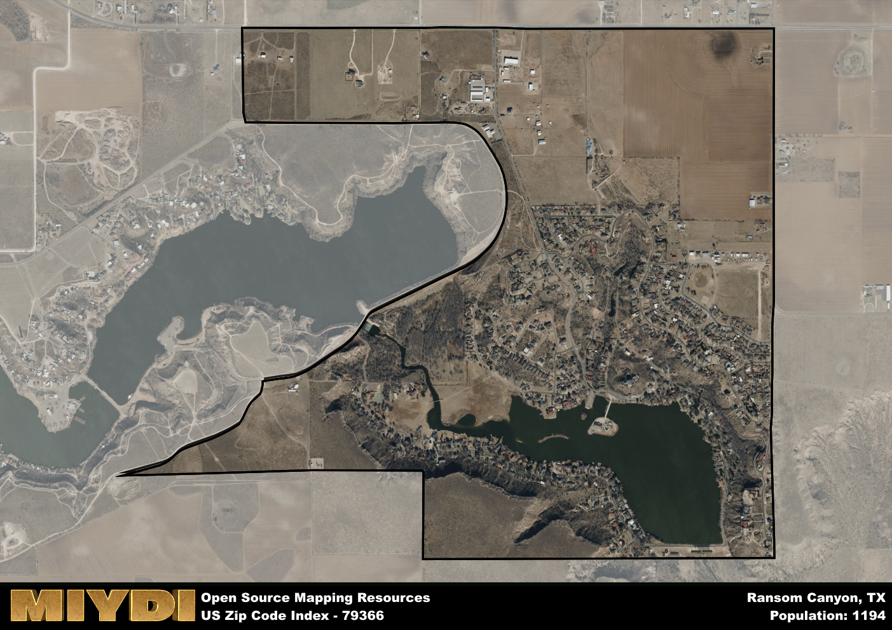

**Area Name:** Ransom Canyon

**Zip Code:** 79366

**State:** TX

Ransom Canyon is a part of the Lubbock - TX Metro Area, and makes up  of the Metro's population.  

# Ransom Canyon: A Charming Oasis in West Texas  

Located in the heart of West Texas, the zip code 79366 corresponds to the picturesque neighborhood of Ransom Canyon. Bordered by the city of Lubbock to the north and the rolling plains of the Llano Estacado to the south, Ransom Canyon seamlessly integrates with the larger metropolitan area while maintaining its own distinct character and charm. The zip code area is known for its stunning canyon views, peaceful atmosphere, and tight-knit community spirit.

Ransom Canyon has a rich historical narrative that dates back to the early 1900s when the area was settled by ranchers and farmers. The construction of Lake Ransom Canyon in the 1960s transformed the region into a sought-after residential area, attracting families and retirees looking for a serene setting away from the bustle of city life. The neighborhood's name is derived from the natural rock formations that resemble the walls of a canyon, adding to its unique appeal.

Today, Ransom Canyon is a thriving community with a mix of residential homes, recreational facilities, and local businesses. Residents enjoy access to scenic walking trails, fishing opportunities at the lake, and community events held throughout the year. The neighborhood is known for its strong sense of community, with residents actively participating in neighborhood associations and volunteer efforts. With its stunning natural beauty and welcoming atmosphere, Ransom Canyon continues to be a hidden gem in West Texas.

# Ransom Canyon Demographics

The population of Ransom Canyon is 1194.  
Ransom Canyon has a population density of 686.21 per square mile.  
The area of Ransom Canyon is 1.74 square miles.  

## Ransom Canyon Income and Economic Data

These demographic numbers are sourced from IRS return data, providing comprehensive insights into the population dynamics and economic trends within Ransom Canyon.

**Breakdown of return types for Ransom Canyon**

The table offers insight into the composition of tax returns filed with the IRS, categorizing them into three main types. Single returns represent filings by individuals, joint returns by married couples, and head of household returns by individuals who qualify as heads of households, typically having dependents. This breakdown provides an understanding of the different filing statuses adopted by taxpayers when submitting their tax documentation.

| Return Types filed for Ransom Canyon                              | Percentage          |
|----------------------------------------------------------|---------------------|
| Single Returns                                            | 0.31 |
| Joint Returns                                             | 0.58 |
| Head Household Returns                                    | 0.05 |

The income and economic data presented here is sourced from the IRS income brackets, utilized for categorizing tax returns by income levels. This table displays income ranges for both single filers and married couples, along with the corresponding number of returns and the percentage within each bracket, providing valuable insight into the distribution of taxes across various income groups.

| Bracket Name       | Single Filer Income Range | Married Couple Range | Number of Returns | Percentage of Returns |
|--------------------|----------------------------|----------------------|-------------------|-----------------------|
| 10% Bracket        | Up to $10,275              | Up to $20,550        | 110 | 0.2% |
| 12% Bracket        | $10,276 - $41,775          | $20,551 - $83,550    | 80 | 0.15% |
| 22% Bracket        | $41,776 - $89,075          | $83,551 - $178,150   | 70 | 0.13% |
| 24% Bracket        | $89,076 - $170,050         | $178,151 - $340,100  | 70 | 0.13% |
| 32% Bracket        | $170,051 - $215,950        | $340,101 - $431,900  | 150 | 0.27% |
| 35% Bracket        | $215,951 - $539,900        | $431,901 - $647,850  | 70 | 0.13% |

### Exploring Taxpayer Diversity: A Breakdown of Different Types of Tax Returns in Ransom Canyon

The table offers insights into various types of tax returns filed, reflecting different aspects of taxpayer activities and demographics. Categories include charitable returns for donations, dependent returns for claimed dependents, educator population, elderly population, real estate returns, self-employment returns, student loan returns, and unemployment returns, providing valuable insights into taxpayer behavior and demographics.

| Ransom Canyon Filing Types                    | Count | Percentage |
|--------------------------------------|-------|------------|
| Charitable Donations                 | 60 | 0.109% |
| Dependents Claimed                   | 0 | 0% |
| Educator Residents                   | 0 | 0% |
| Elderly Population                   | 230 | 0.42% |
| Farming Population                   | 20 | 0.036% |
| Real Estate Transactions             | 60 | 0.109% |
| Self-Employed Individuals            | 100 | 0.182% |
| Student Loan Cases                   | 40 | 0.073% |
| Unemployment Benefit Filings         | 50 | 0.09% |

## Ransom Canyon AI and Census Variables

The values presented in this dataset for Ransom Canyon are AI-optimized, streamlined, and categorized into relevant buckets for enhanced utility in AI and mapping programs. These simplified values have been optimized to facilitate efficient analysis and integration into various technological applications, offering users accessible and actionable insights into demographics within the Ransom Canyon area.

| AI Variables for Ransom Canyon | Value |
|-------------|-------|
| Shape Area | 6504409.73828125 |
| Shape Length | 14838.8277732691 |
| CBSA Federal Processing Standard Code | 31180 |

## How to use this free AI optimized Geo-Spatial Data for Ransom Canyon, TX

This data is made freely available under the Creative Commons license, allowing for unrestricted use for any purpose. Users can access static resources directly from GitHub or leverage more advanced functionalities by utilizing the GeoJSON files. All datasets originate from official government or private sector sources and are meticulously compiled into relevant datasets within QGIS. However, the versatility of the data ensures compatibility with any mapping application.

## Data Accuracy Disclaimer
It's important to note that the data provided here may contain errors or discrepancies and should be considered as 'close enough' for business applications and AI rather than a definitive source of truth. This data is aggregated from multiple sources, some of which publish information on wildly different intervals, leading to potential inconsistencies. Additionally, certain data points may not be corrected for Covid-related changes, further impacting accuracy. Moreover, the assumption that demographic trends are consistent throughout a region may lead to discrepancies, as trends often concentrate in areas of highest population density. As a result, dense areas may be slightly underrepresented, while rural areas may be slightly overrepresented, resulting in a more conservative dataset. Furthermore, the focus primarily on areas within US Major and Minor Statistical areas means that approximately 40 million Americans living outside of these areas may not be fully represented. Lastly, the historical background and area descriptions generated using AI are susceptible to potential mistakes, so users should exercise caution when interpreting the information provided.
